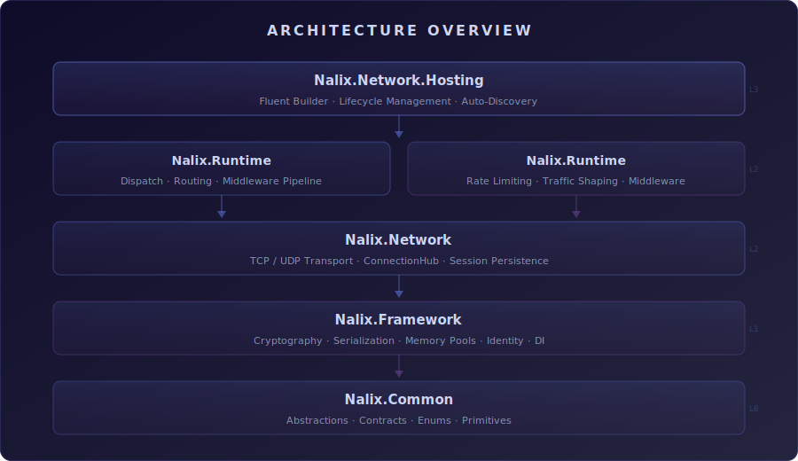

<p align="center">
  
  <br>
</p>

<p align="center">
  <a href="https://dotnet.microsoft.com/"></a>
  <a href="LICENSE"></a>
  <a href="https://www.nuget.org/packages/Nalix.Common"></a>
  <a href="https://www.nuget.org/packages/Nalix.Common"></a>
</p>

<p align="center">
  <a href="https://github.com/ppn-systems/Nalix/issues"></a>
  <a href="https://github.com/ppn-systems/Nalix/pulls"></a>
  <a href="https://github.com/ppn-systems/Nalix"></a>
  <a href="https://github.com/ppn-systems/Nalix/commits/master"></a>
</p>

<p align="center">
  <b><a href="DOCUMENTATION.md">Documentation</a></b> · <b><a href="example/">Examples</a></b> · <b><a href="#-benchmarks">Benchmarks</a></b> · <b><a href="CONTRIBUTING.md">Contributing</a></b>
</p>

---

## 📖 About

**Nalix** is a modular, high-performance networking framework for .NET 10. It provides a complete stack for building real-time server applications — from low-level transport (TCP/UDP) to middleware pipelines, packet routing, and client SDKs — with a focus on zero-allocation hot paths, pluggable protocols, and enterprise-grade security.

---

## 🛠️ Build Status

| Platform | Status |
| :--- | :--- |
|  | [](https://github.com/ppn-systems/Nalix/actions/workflows/ci-linux.yml) |
|  | [](https://github.com/ppn-systems/Nalix/actions/workflows/ci-windows.yml) |

---

## ✨ Features

| Category | Highlights |
| :--- | :--- |
| 🖥️ **Cross-Platform** | Runs on Windows, Linux, and macOS with .NET 10+. |
| ⚡ **High Performance** | Zero-allocation serialization, shard-aware dispatch, and buffer pooling for thousands of concurrent connections. |
| 🔐 **Security-First** | AEAD encryption (ChaCha20-Poly1305, Salsa20-Poly1305), X25519 key exchange, and zero-RTT session resumption. |
| 🔌 **Pluggable Protocols** | Swap network, serialization, or security protocols without modifying core logic. |
| 🛤️ **Middleware Pipeline** | Built-in authentication, rate limiting, traffic shaping, and audit logging — or write your own. |
| 📡 **Real-Time Updates** | Instant messaging, state synchronization, and live event broadcasting. |
| 🛠️ **Extensible** | Attribute-based packet routing, auto-discovered controllers, and fluent builder APIs. |
| 🧩 **SOLID & DDD** | Clean architecture following SOLID principles and Domain-Driven Design patterns. |
| 💻 **Modern C#** | Leverages C# 14 features — `Span<T>`, `ref struct`, pattern matching, and more. |

---

## 🔧 Requirements

| Requirement | Version |
| :--- | :--- |
| .NET SDK | [10.0+](https://dotnet.microsoft.com/download/dotnet/10.0) |
| C# Language | 14+ |
| IDE | [Visual Studio 2026](https://visualstudio.microsoft.com/downloads/) / [VS Code](https://code.visualstudio.com/) / [Rider](https://www.jetbrains.com/rider/) |

---

## 💻 Technologies

<p align="center">
  <a href="https://skillicons.dev"></a>
</p>

- **Language**: C# 14 on .NET 10
- **Testing**: xUnit + BenchmarkDotNet
- **CI/CD**: GitHub Actions (Linux & Windows)
- **Packaging**: NuGet

---

## 📈 Benchmarks

> All benchmarks run on **.NET 10.0**, **Windows 11**, using **BenchmarkDotNet v0.15.8**.

### Environment

- CPU: 13th Gen Intel Core i7-13620H (10C/16T)
- Runtime: .NET `10.0.5` (X64 RyuJIT, Server GC)
- SDK: .NET SDK `10.0.201`
- Job config: `IterationCount=15`, `LaunchCount=3`, `WarmupCount=10`, `RunStrategy=Throughput`

### 🔒 Envelope Encryption

| Method | Payload (B) | Algorithm | Mean | Allocated |
| :--- | :---: | :---: | ---: | ---: |
| Encrypt | 128 | SALSA20 | 356 ns | — |
| Decrypt | 128 | SALSA20 | 281 ns | 48 B |
| Encrypt | 8192 | CHACHA20_POLY1305 | 48,649 ns | — |
| Decrypt | 8192 | CHACHA20_POLY1305 | 26,153 ns | 48 B |

### 🏎️ X25519 ECC

| Method | Keys | Mean | Allocated |
| :--- | :---: | ---: | ---: |
| GenerateKeyPair (CSPRNG + scalar mult) | 1 | 65.36 μs | 112 B |
| GenerateKeyFromPrivateKey (scalar only) | 1 | 67.35 μs | 112 B |
| Agreement (shared secret) | 1 | 66.59 μs | 56 B |

### 🔄 Serialization

| Method | Item Count | Mean (ns) | Allocated |
| :--- | ---: | ---: | ---: |
| LiteSerializer Serialize | 16 | 148.4 | 152 B |
| LiteSerializer Serialize | 128 | 298.2 | 600 B |
| LiteSerializer Deserialize | 16 | 165.0 | 392 B |
| LiteSerializer Deserialize | 1024 | 1,048.9 | 4,424 B |
| MessagePack Serialize | 128 | 262.0 | 240 B |
| MessagePack Deserialize | 128 | 851.4 | 840 B |
| System.Text.Json Serialize | 128 | 1,266.8 | 856 B |
| System.Text.Json Deserialize | 128 | 3,695.8 | 2,584 B |

> **More details:** See the [`docs/benchmarks`](docs/benchmarks/) folder for full data and additional test cases.

---

## 📦 NuGet Packages

Nalix is composed of several modular packages — install only what you need.

### 🏗️ Foundation

| Package | Description |
| :--- | :--- |
| **[Nalix.Common](src/Nalix.Common)** | Base abstractions, enums, and shared contracts for the Nalix ecosystem. |
| **[Nalix.Framework](src/Nalix.Framework)** | High-performance core: cryptography, identity, DI, serialization, and task orchestration. |
| **[Nalix.Runtime](src/Nalix.Runtime)** | Packet dispatching, middleware pipelines, and handler compilation. |

### 📡 Networking & Hosting

| Package | Description |
| :--- | :--- |
| **[Nalix.Network](src/Nalix.Network)** | High-performance TCP/UDP transport, connection management, and session persistence. |
| **[Nalix.Network.Hosting](src/Nalix.Network.Hosting)** | Microsoft-style host and builder APIs for quick bootstrapping. |
| **[Nalix.Network.Pipeline](src/Nalix.Network.Pipeline)** | Reusable middleware: rate limiting, traffic shaping, and time-keeping primitives. |

### 🛠️ Utilities & Tooling

| Package | Description |
| :--- | :--- |
| **[Nalix.Logging](src/Nalix.Logging)** | Asynchronous logging with pluggable sinks and high-throughput batching. |
| **[Nalix.SDK](src/Nalix.SDK)** | Client-side SDK: transport sessions, request/response patterns, and encryption. |
| **[Nalix.Analyzers](src/Nalix.Analyzers)** | Roslyn analyzers and code fixes to enforce Nalix best practices. |

---

## 🚀 Quick Start

Build a high-performance network application in minutes:

```csharp
using Nalix.Network.Hosting;

// Initialize and configure the application host
using var host = NetworkApplication.CreateBuilder()
    .AddTcp<MyPacketProtocol>()
    .AddHandler<MyPacketHandler>()
    .Configure<NetworkSocketOptions>(opt => opt.Port = 8080)
    .Build();

// Run the server
await host.RunAsync();
```

> See the [examples](example/) directory for complete implementation details.

---

## 📦 Installation

```bash
# Core server setup
dotnet add package Nalix.Network.Hosting

# Optional: structured logging
dotnet add package Nalix.Logging

# Optional: client SDK
dotnet add package Nalix.SDK

# Optional: Roslyn analyzers
dotnet add package Nalix.Analyzers
```

---

## 🏗️ Architecture Overview

<p align="center">
  
</p>

---

## 🛠️ Contributing

Please read [CONTRIBUTING.md](CONTRIBUTING.md) for the development workflow, commit conventions, and pull request guidelines. Follow our [Code of Conduct](CODE_OF_CONDUCT.md) and submit PRs with proper documentation and tests.

## 🛡️ Security

Please review our [Security Policy](SECURITY.md) for supported versions and vulnerability reporting procedures.

## 📜 License

Nalix is copyright &copy; PhcNguyen — provided under the [Apache License, Version 2.0](http://apache.org/licenses/LICENSE-2.0.html).

## 📬 Contact

For questions, suggestions, or support, open an issue on [GitHub](https://github.com/ppn-systems/Nalix/issues) or contact the maintainers at [ppn.system@gmail.com](mailto:ppn.system@gmail.com).

---

<p align="center">
  Give a ⭐️ if this project helped you!
  
</p>


