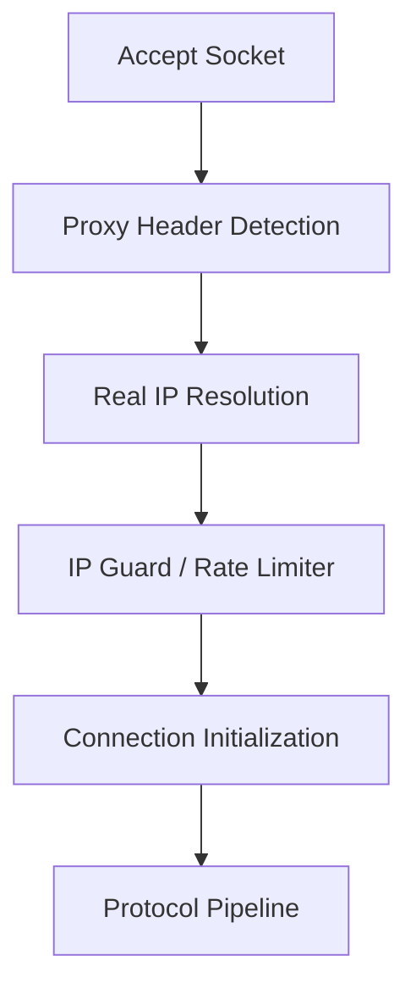

# System Protocol & Network Control — Expansion Roadmap

> **Status:** Draft  
> **Audience:** Core Network Engineers, Framework Maintainers  
> **Context:** Strategic implementation plan for extending the Nalix System Protocol Handlers. This roadmap focuses on deep integration with Nalix's existing high-performance architecture — `ConnectionHub`, zero-allocation `SocketConnection`, and O(1) `TimingWheel`.

---

## Implementation Milestones

### 1. Resilient Error Logging & Spoofing Prevention

**Status:** 🔲 Not Started  
**Objective:** Handle client-originated `ControlType.ERROR` / `FAIL` packets securely without exposing the server to log spam or disk I/O exhaustion (DDoS).

**Architectural Guidelines:**

- **Drop-on-Fail:** When a `FAIL` packet is received, the client state is considered corrupted. The pipeline MUST log the event exactly once, then immediately call `connection.Close(force: true)` to sever the connection and block further spam at the socket level.

- **Trust-Level Diagnostics:**

  | Connection Type | Log Level | Rationale |
  | :--- | :--- | :--- |
  | Anonymous | `Trace` / `Debug` | Prevents log pollution from unauthenticated bot sweeps. |
  | Authenticated | `Warn` | Captures `packet.Reason` and `connection.ID` for admin tracing. |

- **Duplicate Mitigation:** Set `connection.Attributes["IsErrorLogged"] = true` on first encounter. Subsequent error packets from the same physical socket are silently dropped before logging.

---

### 2. Dedicated Throttle Feedback Pipeline

**Status:** 🔲 Not Started  
**Objective:** Provide adaptive backpressure signaling (UX feedback) without violating the Single Responsibility Principle of inbound security blocks like `RateLimitMiddleware`.

**Architectural Guidelines:**

- **Decoupling:** `RateLimitMiddleware` drops malicious traffic. Combining outbound feedback within it risks "Outbound Amplification" (e.g., 10,000 inbound spam packets triggering 10,000 outbound `THROTTLE` packets).

- **Dedicated Layer:** Introduce `ThrottleFeedbackMiddleware` as a distinct entity operating behind the primary limiters.

- **Cooldown Tracker:** Issue exactly **one** `ControlType.THROTTLE` packet to an exceeding client, then record the timestamp in `connection.Attributes["LastThrottleSent"]`. Enforce a strict minimum cooldown (e.g., 5000 ms) before any subsequent throttle notifications.

- **Client Contract:** The Nalix SDK listens for `THROTTLE` packets to temporarily lock UI/App inputs (`IsDelay = true`), enforcing a smooth "slow down" experience.

---

### 3. Graceful Shutdown & Multi-Cast Broadcasting

**Status:** 🔲 Not Started  
**Objective:** Safely terminate server instances without memory corruption or data loss using `ConnectionHub.BroadcastAsync`.

**Architectural Guidelines:**

- **Maintenance Broadcast:** During a server update trigger, use `BroadcastAsync` to push `ControlType.NOTICE` (Maintenance Warning) to all concurrent clients seamlessly across internal sharding dictionaries.

- **Completion Barrier:** Enforce an intentional delay (`Task.Delay(5000)`) post-broadcast, enabling in-flight operations (database transactions, payment completions) to flush properly.

- **Clean Teardown:** Finalize the lifecycle by invoking `_connectionHub.CloseAllConnections("Server shutting down")`, dropping all remaining references, and returning socket allocations to the pool manager.

---

### 4. Zero-RTT Session Resumption (Advanced Strategy)

**Status:** ✅ Completed  
**Objective:** Bypass compute-heavy Diffie-Hellman handshakes for authenticated clients on unstable networks (e.g., cellular dropping/reconnecting).

**Architectural Guidelines:**

- **Token Integration:** Extend `SystemControlHandlers` to parse `ControlType.RESUME` appending a previously established `SessionToken`.

- **Session Manager (`ISessionManager`):** A dedicated module governing the lifecycle of `SessionSnapshot` records. Provides a unified abstraction over `MemoryCache` or distributed `Redis` instances, handling token generation, secure storage, and strict TTL expiration (e.g., 5-minute automatic eviction).

- **Caching Strategy (TCP Half-Open Mitigation):** The `SessionSnapshot` MUST be generated and committed to cache **immediately** upon a successful handshake. Waiting for the socket `Dispose` event is a fatal anti-pattern — dead mobile connections (TCP Half-Open without FIN flags) may take 30+ seconds to trigger a disconnect, breaking the ultra-fast reconnect flow if the cache isn't pre-warmed.

- **Hydration:** Validate the token via `ISessionManager` to retrieve the active `IConnection` cipher state.

- **Instant Recovery:** Re-attach encryption algorithms and authentication stages dynamically, restoring the transport pipeline without allocating a new handshake sequence.

---

### 5. Real IP Resolution & Proxy Protocol Support (L4 Protection Integration)

**Status:** 🔲 Not Started  
**Objective:** Accurately resolve the real client IP when the TCP server is deployed behind L4 proxies (e.g., Cloudflare Spectrum, HAProxy, NGINX stream) while preserving security guarantees against spoofing and rate-limit bypass.

**Architectural Guidelines:**

- **Early-Stage Processing (Pre-Pipeline):**  
  Real IP resolution MUST occur **immediately after socket accept** and **before any security checks** (e.g., IP rate limiting, banning, connection guards).  
  This logic belongs strictly to the **Listener Layer**, not the Protocol or Application layer.

- **Pipeline Insertion Point:**



#### PROXY Protocol Support

##### Supported Formats

The server MUST support both industry-standard formats:

###### PROXY v1 (Text-based)

```
PROXY TCP4 1.2.3.4 5.6.7.8 12345 80\r\n
```

###### PROXY v2 (Binary)

- Magic header:

```
\r\n\r\n\0\r\nQUIT\n
```

- Followed by structured metadata:
  - Address family
  - Transport protocol
  - Source/Destination address
  - Ports

---

#### Minimal Read Strategy

- Perform a **single small read (32–64 bytes)** from the socket.
- Detect and parse the PROXY header within this buffer.

### Requirements

- MUST avoid large allocations
- SHOULD use `stackalloc` or pooled buffers
- MUST NOT enter full receive pipeline before this step

---

#### Trusted Proxy Enforcement

The server MUST validate the source before accepting any PROXY header.

##### Rules

- Maintain a whitelist: `TrustedProxyList`
- Check: `socket.RemoteEndPoint`

##### If NOT trusted

- Ignore PROXY header **OR**
- Drop connection immediately (**RECOMMENDED**)

---

#### Spoofing Protection

Never trust client-provided IP data unless:

- Source is verified as trusted proxy
- Header format is fully validated

---

#### Integration with Rate Limiter

After successful parsing:

- Replace `socket.RemoteEndPoint` with `RealEndPoint`
- ALL security modules MUST use the resolved IP

---

#### Failure Handling

- Invalid header → **Drop connection**
- Missing header (when required) → **Reject**
- Partial read → **Retry once or drop**

---

#### Performance Considerations

- MUST be zero-allocation
- Avoid heavy branching
- Detect via magic bytes first
- MUST NOT slow down accept loop

---

#### Security Note

This is a **critical transport-layer trust boundary**.

Incorrect implementation can lead to:

- IP spoofing
- Rate limit bypass
- Ban evasion
- Attack amplification

---

### 6. LOH Optimization & Segmented Serialization Support

**Status:** 🔲 Not Started  
**Objective:** Eliminate Large Object Heap (LOH) fragmentation by supporting non-contiguous memory segments (`ReadOnlySequence<byte>`) across the entire serialization pipeline.

**Architectural Guidelines:**

- **Segmented Writing (LOH Avoidance):**  
  The `DataWriter` MUST be upgraded to support an `IBufferWriter<byte>` backend. When serializing objects larger than the 85KB LOH threshold, the writer will distribute data across multiple pinned Slabs (e.g., 16KB each) instead of renting a single contiguous large array.

- **Non-Contiguous Reading:**  
  The `DataReader` MUST integrate `SequenceReader<byte>` to enable seamless parsing across segment boundaries. This allows the framework to deserialize incoming data directly from `System.IO.Pipelines` or pooled slab chains without intermediate "consolidation" copies.

- **Unified API Surface:**

  | Component | New Capability | Rationale |
  | :--- | :--- | :--- |
  | `DataWriter` | `ctor(IBufferWriter<byte>)` | Enables streaming serialization to pooled segments. |
  | `DataReader` | `ctor(ReadOnlySequence<byte>)` | Enables zero-copy parsing from segmented network buffers. |
  | `LiteSerializer` | `Serialize<T>(T, IBufferWriter)` | Entry point for LOH-safe large packet generation. |

- **Zero-Copy Forwarding:**  
  Support a dedicated `ReadOnlySequenceFormatter`. When a POCO contains a `ReadOnlySequence<byte>` property, the serializer should "link" or copy the segments directly into the output stream, preserving the segmented nature of the payload.

- **Performance Mandate:**  
  All segmented operations MUST remain zero-allocation on the hot path. Use `ref struct` fields (C# 11+) and stack-allocated small buffers for boundary-spanning primitive reads.

---

*Prepared for Nalix Open-Source Enterprise Development*
