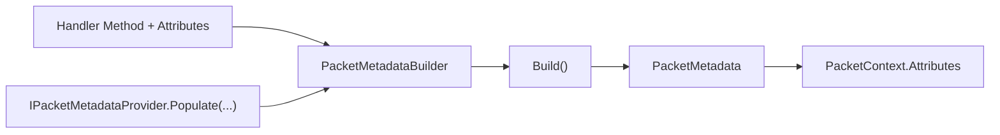

# Packet Metadata

`PacketMetadata` represents the resolved handler metadata used during packet dispatch and middleware execution.

## Audit Summary

- Existing page included accurate concepts but needed clearer separation between public APIs and internal compilation details.
- Needed explicit emphasis that `PacketMetadataProviders` exposes registration API only.

## Missing Content Identified

- Stronger mapping from attributes/provider population to immutable `PacketMetadata` output.
- Clarification of extension points for custom metadata.

## Improvement Rationale

This makes metadata customization safer for contributors and easier to reason about in production debugging.

## Source Mapping

- `src/Nalix.Abstractions/Networking/Packets/PacketMetadata.cs`
- `src/Nalix.Runtime/Dispatching/PacketMetadataBuilder.cs`
- `src/Nalix.Runtime/Dispatching/PacketMetadataProviders.cs`
- `src/Nalix.Runtime/Dispatching/IPacketMetadataProvider.cs`

## Why Metadata Exists

Handler behavior (timeout, permission, encryption, rate/concurrency limits) must be resolved once during registration, then consumed cheaply on hot dispatch paths.

## Build Flow



## Core Types

### `PacketMetadataBuilder`

Mutable aggregation step used at registration time.

Key members:

- `Opcode`
- `Timeout`
- `Permission`
- `Encryption`
- `RateLimit`
- `ConcurrencyLimit`
- `Add(Attribute)`
- `Get<TAttribute>()`
- `Build()`

`Build()` requires non-null `Opcode` and throws if missing.

### `IPacketMetadataProvider`

```csharp
void Populate(MethodInfo method, PacketMetadataBuilder builder)
```

Use providers to add conventions or custom attributes without modifying every handler.

### `PacketMetadataProviders`

Public API:

- `Register(IPacketMetadataProvider provider)`

Providers are appended in registration order.

## Practical Example

```csharp
public sealed class MyMetadataProvider : IPacketMetadataProvider
{
    public void Populate(MethodInfo method, PacketMetadataBuilder builder)
    {
        if (method.Name.EndsWith("Critical", StringComparison.Ordinal))
        {
            builder.Timeout = new PacketTimeoutAttribute(2000);
        }
    }
}

PacketMetadataProviders.Register(new MyMetadataProvider());
```

## Related APIs

- [Packet Attributes](./packet-attributes.md)
- [Packet Context](../runtime/routing/packet-context.md)
- [Packet Dispatch](../runtime/routing/packet-dispatch.md)

