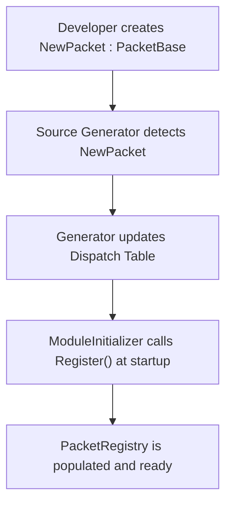

# Packet Registry Generator
 
The Packet Registry Generator automates the discovery and registration of all packet types in the system, enabling O(1) dispatch without manual configuration.
 
## Source Mapping
 
- `analyzers/Nalix.Analyzers.Generators/PacketRegistryGenerator.cs`
 
## Overview
 
In a large networking project, manually registering every packet type is error-prone and tedious. This generator scans your entire project for any class inheriting from `PacketBase<TSelf>` and generates a centralized "bootstrapper" that registers them all during the application startup.
 
## How it works
 
1. **Discovery**: Scans for non-abstract classes that inherit from `PacketBase<TSelf>` and have the `[Packet]` attribute (or metadata).
2. **Hash Table Optimization**: It calculates an optimal hash table size and a mask to ensure O(1) lookup of packets by their magic number (OpCode).
3. **Dispatch Logic**: It generates a high-performance `TryDeserialize` method that avoids dictionary lookups and delegate overhead.
4. **Auto-Initialization**: Uses a `[ModuleInitializer]` to call the registration logic automatically as soon as the assembly is loaded.
 
## Key Benefits
 
- **Zero Configuration**: Just inherit from `PacketBase<TSelf>`, and your packet is ready to be sent and received.
- **O(1) Dispatch**: Uses a generated perfect-hash-like lookup table to find the correct deserializer in constant time.
- **Allocation-Free Hot Path**: The dispatch logic works entirely on `ReadOnlySpan<byte>` and doesn't allocate memory.
- **AOT-Friendly**: No reflection is used to find or instantiate packet types.
 
## Example Workflow
 

 
## Related APIs
 
- [Packet Registry](../../codec/packets/packet-registry.md)
- [Frame Model](../../codec/packets/frame-model.md)
- [Built-in Frames](../../codec/packets/built-in-frames.md)
- [Analyzers](../index.md)
