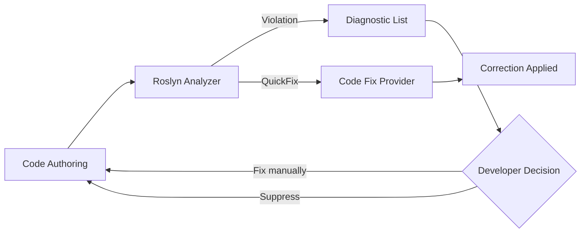

# Nalix.Analyzers

`Nalix.Analyzers` provides Roslyn diagnostics that help catch invalid packet, serialization, middleware, configuration, and SDK usage at compile time.

## Workflow

## Source mapping

- `src/Nalix.Analyzers/Analyzers/NalixUsageAnalyzer.cs`
- `src/Nalix.Analyzers/Diagnostics/DiagnosticDescriptors.cs`

## Role and Design

The Nalix analyzer suite is the first line of defense for the framework's strict performance and safety requirements. It ensures that complex features like zero-copy serialization and high-concurrency dispatch are implemented correctly before a single byte of traffic is sent.

- **Non-Invasive**: Runs in the background as you type in IDEs (VS, Rider, VS Code).
- **Instructional**: Diagnostics include detailed explanations of *why* a pattern is preferred.
- **Automated**: Integrated with `Nalix.Analyzers.CodeFixes` for one-click resolution of common issues.

## Diagnostic Summary

### Serialization & Layout
| ID | Title | Summary |
|---|---|---|
| `NALIX013` | Missing `SerializeOrder` | Layout is explicit but member has no order. |
| `NALIX014` | Duplicate `SerializeOrder` | Two members share the same order index. |
| `NALIX015` | Attribute Conflict | Member has both `SerializeIgnore` and `SerializeOrder`. |
| `NALIX022` | Header Overlap | Member order overlaps reserved header region. |
| `NALIX034` | Header Conflict | Member has both `SerializeHeader` and `SerializeOrder`. |

### Dispatch & Routing
| ID | Title | Summary |
|---|---|---|
| `NALIX001` | Duplicate Opcode | Two handlers in a controller share an opcode. |
| `NALIX035` | Reserved Opcode | Opcode is in the system range (0x00 - 0xFF). |
| `NALIX036` | Global Duplicate | Opcode is duplicated across different controllers. |
| `NALIX038` | Doc Mismatch | XML summary opcode differs from attribute value. |

### Performance & Safety
| ID | Title | Summary |
|---|---|---|
| `NALIX037` | Hot Path Allocation | Allocation (`new`) detected in a high-frequency method. |
| `NALIX039` | `IBufferLease` Leak | Pooled lease may not be disposed on all paths. |
| `NALIX040` | Missing Pool Config | Host built without `ConfigureBufferPoolManager`. |

## Related APIs

- [Full Diagnostic Codes](./diagnostic-codes.md)
- [Code Fixes Reference](./code-fixes.md)
- [Network Application Builder](../network/hosting/network-application.md)
- [Serialization Basics](../framework/serialization/serialization-basics.md)
- [Packet Registry](../framework/packets/packet-registry.md)
