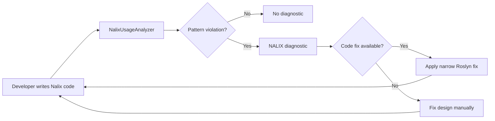

# Nalix.Analyzers

`Nalix.Analyzers` provides Roslyn diagnostics that catch invalid packet,
serialization, middleware, configuration, SDK, hosting, and pooled-resource usage
at compile time.

The source of truth for diagnostic metadata is
`src/Nalix.Analyzers/Diagnostics/DiagnosticDescriptors.cs`.

## Source Mapping

- `src/Nalix.Analyzers/Diagnostics/DiagnosticDescriptors.cs`
- `src/Nalix.Analyzers/Analyzers/NalixUsageAnalyzer.cs`
- `src/Nalix.Analyzers/Analyzers/NalixUsageAnalyzer.InvocationAnalysis.cs`
- `src/Nalix.Analyzers/Analyzers/NalixUsageAnalyzer.SymbolSet.cs`
- `src/Nalix.Analyzers.CodeFixes/*.cs`

## Analyzer Workflow

## Diagnostic Surface

The current descriptor set covers `NALIX001` through `NALIX058`, with `NALIX049`
intentionally unused in the current source snapshot.

| Area | Codes | Purpose |
| --- | --- | --- |
| Controller dispatch and packet registration | `NALIX001`-`NALIX012`, `NALIX017`-`NALIX018`, `NALIX035`-`NALIX036`, `NALIX047`-`NALIX048`, `NALIX050`, `NALIX052`, `NALIX054`-`NALIX056`, `NALIX058` | Validates controller attributes, handler signatures, opcode uniqueness, dispatch-loop range, packet deserializer shape, and middleware registration inputs. |
| Middleware and routing metadata | `NALIX006`-`NALIX007`, `NALIX019`, `NALIX025`-`NALIX026`, `NALIX030`-`NALIX033`, `NALIX038` | Keeps middleware registration, ordering, metadata providers, and opcode documentation consistent. |
| Serialization layout | `NALIX013`-`NALIX016`, `NALIX021`-`NALIX022`, `NALIX034`, `NALIX046`, `NALIX051` | Validates explicit layout, `SerializeOrder`, header conflicts, dynamic members, and fixed-size contracts. |
| Configuration, SDK, hosting, and lifecycle | `NALIX020`, `NALIX023`-`NALIX024`, `NALIX027`-`NALIX029`, `NALIX037`, `NALIX039`-`NALIX045`, `NALIX053`, `NALIX057` | Catches config binding issues, request-option pitfalls, hot-path allocations, buffer lease leaks, hosting omissions, and pooling lifecycle mistakes. |

For the complete source-synchronized list, see
[Diagnostic Codes](./diagnostic-codes.md).

## Code Fix Coverage

`Nalix.Analyzers.CodeFixes` intentionally provides small, targeted fixes rather
than broad rewrites. Current providers cover these workflows:

| Workflow | Representative providers |
| --- | --- |
| Packet/controller shape | `PacketControllerCodeFixProvider`, `PacketOpcodeCodeFixProvider`, `PacketDeserializeCodeFixProvider`, `PacketRegistryDeserializerCodeFixProvider`, `PacketSelfTypeCodeFixProvider`, `GenericPacketHandlerCodeFixProvider` |
| Serialization attributes | `SerializeOrderMissingCodeFixProvider`, `DuplicateSerializeOrderCodeFixProvider`, `SerializationConflictCodeFixProvider` |
| Middleware and dispatch setup | `MiddlewareCodeFixProvider`, `NullMiddlewareCodeFixProvider`, `DispatchLoopCountCodeFixProvider` |
| Configuration and SDK options | `ConfigurationIgnoreCodeFixProvider`, `RequestOptionsConsistencyCodeFixProvider` |
| Lifecycle and cleanup | `ResetForPoolCodeFixProvider`, `RedundantPacketCastCodeFixProvider` |

Not every diagnostic has a code fix. Some diagnostics require a design decision,
such as choosing the correct handler signature, opcode allocation, or ownership
boundary for an `IBufferLease`.

## Practical Guidance

- Treat warning diagnostics as compile-time protection for runtime dispatch,
  serialization, and resource-safety invariants.
- Treat info diagnostics as low-risk improvements unless your project policy
  elevates analyzer severity.
- Prefer fixing the underlying Nalix pattern over suppressing diagnostics.
- When applying code fixes, review the result; providers make the smallest safe
  local correction and do not redesign surrounding architecture.

## Related APIs

- [Diagnostic Codes](./diagnostic-codes.md)
- [Code Fixes Reference](./code-fixes.md)
- [Network Application Builder](../hosting/network-application.md)
- [Serialization Basics](../codec/serialization/serialization-basics.md)
- [Packet Registry](../codec/packets/packet-registry.md)
