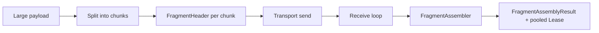

# Fragmentation

This page covers the chunking and reassembly helpers in `Nalix.Framework.DataFrames.Chunks`.

## Source mapping

- `src/Nalix.Codec/DataFrames/Chunks/FragmentHeader.cs`
- `src/Nalix.Codec/DataFrames/Chunks/FragmentAssembler.cs`
- `src/Nalix.Codec/Options/FragmentOptions.cs`
- `src/Nalix.Codec/DataFrames/Chunks/FragmentStreamId.cs`

## Main types

- `FragmentHeader`
- `FragmentAssembler`
- `FragmentOptions`
- `FragmentStreamId`

## Public members at a glance

| Type | Public members |
| --- | --- |
| `FragmentHeader` | `Magic`, `WireSize`, `StreamId`, `ChunkIndex`, `TotalChunks`, `Flags`, `IsLast`, `WriteTo(...)` |
| `FragmentAssembler` | `IsFragmentedFrame(...)`, `Add(...)`, `EvictExpired()`, `Clear()`, `Dispose()` |
| `FragmentOptions` | `MaxPayloadSize`, `ChunkThreshold`, `ChunkBodySize`, `MaxReassemblyBytes`, `ReassemblyTimeoutMs`, `Validate()` |
| `FragmentStreamId` | `Next()` |

## Why this exists

Nalix supports large payload flows that do not fit comfortably inside a single framed packet.

The chunking layer gives you:

- a compact wire header per chunk
- stable stream IDs for grouping fragments
- bounded reassembly memory
- timeout-based eviction for incomplete streams

## FragmentHeader

`FragmentHeader` is the small payload prefix attached to each fragment.

Important source facts:

- `Magic = 0xF0`
- `WireSize = 8`
- fields: `StreamId`, `ChunkIndex`, `TotalChunks`, `Flags`
- `IsLast` is derived from the flags byte

## Basic usage

```csharp
ushort streamId = FragmentStreamId.Next();
FragmentHeader header = new(streamId, 0, 3, false);
header.WriteTo(buffer);
```

## FragmentAssembler

`FragmentAssembler` collects chunks for one connection-side receive path and yields a `FragmentAssemblyResult` when the final fragment arrives.

### Key behavior

- designed for a single-threaded receive loop
- tracks one `StreamState` per `StreamId`
- starts a stream only when chunk `0` arrives
- evicts timed-out or inconsistent streams
- returns a small result struct whose `Lease` is the pooled accumulation buffer
- throws for invalid headers, inconsistent chunk counts, and out-of-order delivery

## Basic usage

```csharp
if (FragmentAssembler.IsFragmentedFrame(payload, out FragmentHeader header))
{
    FragmentAssemblyResult? assembled = assembler.Add(
        header,
        payload[FragmentHeader.WireSize..],
        out bool evicted);

    if (assembled is not null)
    {
        using (assembled.Value.Lease)
        {
            // Process the full payload
        }
    }
}
```

### Operational notes

- `Add(...)` returns `null` while the assembler is still waiting for more chunks.
- `Add(...)` also returns `null` for normal timeout or size-based eviction paths and reports that through `streamEvicted`.
- `Add(...)` throws `InvalidDataException` when the fragment header is invalid, `TotalChunks` changes mid-stream, or a chunk arrives out of order.
- `EvictExpired()` is meant to be called periodically by the receive loop.
- `Clear()` and `Dispose()` release every in-flight stream buffer.

### Common pitfalls

- starting a fragment stream from a chunk other than `0`
- forgetting to call `EvictExpired()` in a long-lived receive loop
- reusing the returned `Lease` after it was already disposed

## FragmentOptions

`FragmentOptions` is the typed configuration object for large-payload chunking.

### Main settings

- `MaxPayloadSize`
- `ChunkThreshold`
- `ChunkBodySize`
- `MaxReassemblyBytes`
- `ReassemblyTimeoutMs`

`Validate()` ensures the chunk body plus framing overhead stays within `PacketConstants.PacketSizeLimit` and that thresholds are internally consistent.

## FragmentStreamId

`FragmentStreamId` allocates 16-bit stream IDs in a thread-safe way.

Important behavior:

- wraps after `65535`
- never returns `0`
- uses `Interlocked.Increment(...)`

## Suggested mental model



## Related APIs

- [Frame Model](./frame-model.md)
- [Packet Registry](./packet-registry.md)
- [Built-in Frames](./built-in-frames.md)
- [Buffer Management](../../framework/memory/buffer-management.md)
- [Object Pooling](../../framework/memory/object-pooling.md)
- [LZ4](../lz4.md)
