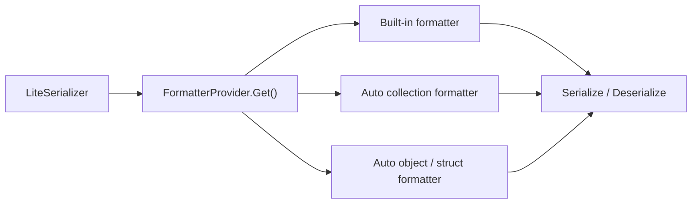

# Serialization

This page covers the public serialization surface in `Nalix.Framework.Serialization`.

## Source mapping

- `src/Nalix.Codec/Serialization/IFormatter.cs`
- `src/Nalix.Codec/Serialization/FormatterProvider.cs`
- `src/Nalix.Codec/Serialization/LiteSerializer.cs`
- `src/Nalix.Abstractions/Primitives`
- `src/Nalix.Codec/Serialization/Formatters/Collections`
- `src/Nalix.Codec/Serialization/Formatters/Automatic`

## Main types

- `IFormatter<T>`
- `FormatterProvider`
- `LiteSerializer`

## What it does

This layer provides:

- primitive, collection, and memory formatters
- automatic object and struct formatters
- a provider that resolves the right formatter
- a lightweight serializer entry point

## Supported type groups

The current source supports these groups directly:

- unmanaged primitives and value types
- `string` and `string[]`
- nullable value types such as `int?`, `Guid?`, `DateTime?`
- unmanaged arrays such as `int[]`, `Guid[]`, `DateTime[]`
- nullable arrays such as `int?[]`, `Guid?[]`
- enum values, enum arrays, and enum lists
- `List<T>`
- `Dictionary<TKey, TValue>`
- `Queue<T>`
- `Stack<T>`
- `HashSet<T>`
- `Memory<T>` and `ReadOnlyMemory<T>` for unmanaged element types
- `ValueTuple` arity 2 through 5
- automatic class and struct serialization through generated formatters

## Built-in primitive coverage

The provider registers built-in formatters for:

- `char`, `byte`, `sbyte`
- `short`, `int`, `long`
- `ushort`, `uint`, `ulong`
- `float`, `double`, `decimal`
- `bool`
- `Guid`
- `DateOnly`, `DateTime`, `TimeOnly`, `TimeSpan`, `DateTimeOffset`

## Collection behavior

Collection support is broader than the old docs implied:

- arrays support unmanaged, enum, nullable-value, and reference-type elements
- `List<T>` supports value, nullable-value, enum, and reference-type elements
- `Dictionary<TKey, TValue>` is supported through a dedicated formatter
- `Queue<T>`, `Stack<T>`, and `HashSet<T>` currently reject most class element types except `string`

## Automatic object and struct serialization

When no explicit formatter is registered, the provider can create formatters for:

- classes through `ObjectFormatter<T>` or `NullableObjectFormatter<T>`
- structs through `StructFormatter<T>`

Types marked with `SerializePackableAttribute` are treated as explicitly packable and skip the nullable-object wrapper path.

## Member discovery rules

Automatic object and struct serialization is field-based.

- instance fields are the real serialization targets
- public and non-public instance fields are discovered
- static fields are ignored
- const fields are not part of instance state and are not serialized
- properties are not serialized directly
- auto-properties work because the serializer can target their compiler-generated backing fields
- custom or computed properties without a compiler-generated backing field are not serialized as standalone members

In practice, the safest member shapes are:

- instance fields
- auto-properties with a backing field such as `get; set;`, `get; private set;`, or similar compiler-backed forms

The less predictable shapes are:

- getter-only or `init`-only auto-properties, because their backing fields are typically readonly
- custom properties that forward to other fields or compute values on demand

If a model depends on constructor-only initialization or immutable invariants, prefer a custom `IFormatter<T>` instead of relying on automatic member discovery.

## Attributes and properties

The serialization attributes can be applied to either fields or properties:

- `SerializeOrder`
- `SerializeHeader`
- `SerializeIgnore`

For automatic serialization, those attributes are most reliable on:

- fields
- auto-properties with compiler-generated backing fields

Applying serialization attributes to a property does not make the serializer call the property's getter or setter directly. The property metadata is used to influence field discovery, usually by mapping the property attribute to its backing field when one exists.

## Important limits

!!! note "Some collection shapes are intentionally restricted"
    `Memory<T>` and `ReadOnlyMemory<T>` only support unmanaged element types.
    `Queue<T>`, `Stack<T>`, and `HashSet<T>` do not support arbitrary class elements today.
    `ValueTuple` support currently stops at arity 5.

!!! note "Readonly and immutable members"
    Automatic deserialization currently writes field values during object reconstruction.
    Mutable fields and standard auto-properties are the safest shapes.
    If a type relies on strict readonly or constructor-only semantics, document that intent with a custom formatter instead of depending on generated field assignment.

## Basic usage

```csharp
byte[] bytes = LiteSerializer.Serialize(model);
MyModel clone = LiteSerializer.Deserialize<MyModel>(bytes);
```

## Resolution flow



## FormatterProvider

`FormatterProvider` is the registry/resolution layer for formatters.

Use it when you need lower-level control than `LiteSerializer`.

## Example

```csharp
IFormatter<MyModel> formatter = FormatterProvider.Get<MyModel>();
```

If you need to override the default behavior for one type, register your formatter first:

```csharp
LiteSerializer.Register(new MyCustomFormatter());
```

## Related APIs

- [Serialization Attributes](../../abstractions/serialization-attributes.md)
- [Framework Serialization Basics](../serialization/serialization-basics.md)
- [Packet Registry](../packets/packet-registry.md)
- [Built-in Frames](../packets/built-in-frames.md)

