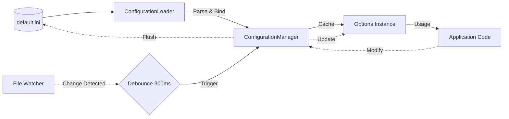

# Configuration

The `Nalix.Environment` configuration system is a high-performance, INI-based runtime that supports typed option binding, automatic reloading, and multi-thread safety.

## Configuration Lifecycle

The following diagram illustrates how configuration flows from disk to your application code.



## Source Mapping

- `src/Nalix.Environment/Configuration/ConfigurationManager.cs`
- `src/Nalix.Environment/Configuration/Binding/ConfigurationLoader.cs`
- `src/Nalix.Environment/Configuration/Binding/ConfigurationLoader.Metadata.cs`
- `src/Nalix.Environment/Configuration/Binding/ConfigurationLoader.SectionName.cs`
- `src/Nalix.Environment/Configuration/Binding/ConfigurationLoader.ValueParser.cs`
- `src/Nalix.Environment/Configuration/Internal/IniConfig.cs`

## ConfigurationManager

`ConfigurationManager` is the central singleton orchestrator. It manages the active file path, handles file-system watches, and maintains a thread-safe cache of bound configuration objects.

### Core Features

- **Exclusive Access**: Uses a `SemaphoreSlim` gate and `ReaderWriterLockSlim` to ensure that reloads and path changes do not conflict with active reads.
- **Debounced Watcher**: Automatically detects file changes and reloads configurations after a 300ms silence period to avoid processing partial writes.
- **Lazy Initialization**: Config instances are created and bound only when first requested via `Get<T>()`.
- **Atomic Rollback**: If an auto-reload fails (e.g., due to a malformed INI), the manager rolls back to the previous stable state.

### Key API Members

| Method | Description |
| :--- | :--- |
| `Get<T>()` | Resolves or creates a cached configuration instance. |
| `ReloadAll()` | Forcefully re-reads the active INI file and updates all loaded instances. |
| `SetConfigFilePath(...)` | Switches the active configuration source and optionally reloads immediately. |
| `Flush()` | Commits any in-memory changes back to the physical INI file. |
| `IsLoaded<T>()` | Checks if a specific config type is currently in the cache. |

### Usage Example

```csharp
// Simple resolution
var network = ConfigurationManager.Instance.Get<NetworkSocketOptions>();

// Changing source at runtime
ConfigurationManager.Instance.SetConfigFilePath("prod.ini", autoReload: true);
```

!!! important "Persistence"
    Changes made to configuration properties in code are **not** automatically saved to disk. You must call `ConfigurationManager.Instance.Flush()` to persist updates.

## ConfigurationLoader

Custom configuration sections are created by inheriting from `ConfigurationLoader`. The binder automatically maps INI sections and keys to your class properties.

### Section Naming Convention

By default, the section name is derived from the class name by removing standard suffixes like `Options`, `Config`, or `Settings`.

- `ConnectionHubOptions` -> `[ConnectionHub]`
- `SecuritySettings` -> `[Security]`

### Binding Attributes

- `[IniComment("...")]`: Adds a descriptive comment above the section or key in the generated INI file.
- `[ConfiguredIgnore]`: Prevents a property from being bound to or from the INI file.

```csharp
public sealed class ServerOptions : ConfigurationLoader
{
    [IniComment("The port the server will listen on")]
    public int Port { get; set; } = 57206;

    [ConfiguredIgnore]
    public string InternalId { get; set; } = "internal-use-only";
}
```

### Supported Data Types

The binder supports a wide range of types natively:

- **Primitives**: `bool`, `int`, `long`, `float`, `double`, `string`, etc.
- **Specialized**: `DateTime`, `TimeSpan`, `Guid`, and `Enum` types.

!!! warning "Collection Support"
    Arrays and generic collections (e.g., `List<T>`) are currently **not** supported for automatic binding.

## Related APIs

- [Instance Manager (DI)](../framework/instance-manager.md)
- [Task Manager](../framework/task-manager.md)
- [Directories](./directories.md)
- [Network Options](../options/network/options.md)

