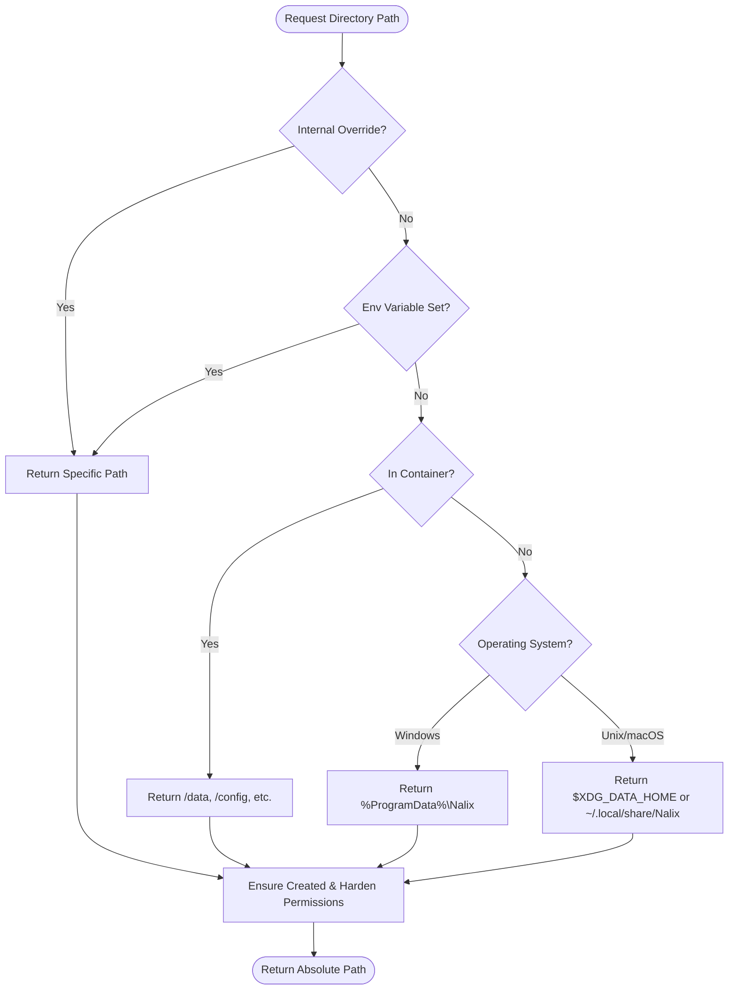

# Directories

`Directories` is the shared path-resolution helper in `Nalix.Environment`. It provides a centralized, platform-aware mechanism for resolving and hardening essential application directories.

## Path Resolution Logic

The following diagram illustrates the priority-based resolution chain used by the `Directories` helper.



## Source Mapping

- `src/Nalix.Environment/IO/Directories.Lazy.cs`
- `src/Nalix.Environment/IO/Directories.Properties.cs`
- `src/Nalix.Environment/IO/Directories.PublicMethods.cs`
- `src/Nalix.Environment/IO/Directories.UnixDirPerms.cs`

## Key Capabilities

- **Lazy Creation**: Directories are created automatically upon the first property access.
- **Environment Aware**: Automatically detects Docker/Kubernetes environments and adapts fallbacks.
- **Security-First**: Applies restricted permissions (e.g., `0700` or `0750` on Unix) depending on the directory's purpose.
- **Safety Guards**: Prevents path traversal via safe combination routines.
- **Auto-Cleanup**: The `TemporaryDirectory` automatically removes files older than a retention period (default: 7 days).

## Main Properties

| Property | Default Purpose | Default Subdirectory |
| :--- | :--- | :--- |
| `BaseAssetsDirectory` | Application root for all assets | `Nalix/` |
| `DataDirectory` | Core persistent application data | `data/` |
| `LogsDirectory` | Application execution logs | `logs/` |
| `ConfigurationDirectory` | INI and security configuration files | `config/` |
| `TemporaryDirectory` | Transient files with auto-cleanup | `tmp/` |
| `DatabaseDirectory` | Database and WAL files | `db/` |
| `StorageDirectory` | Large file storage | `storage/` |
| `CacheDirectory` | Non-critical cache files | `caches/` |
| `UploadsDirectory` | Incoming user-uploaded files | `uploads/` |
| `BackupsDirectory` | System and data backups | `backups/` |

## Resolution Behavior

Paths are resolved using the following priority:

1. **Internal Override**: Primarily used for unit testing.
2. **Explicit Environment Variable**: Variables like `NALIX_BASE_PATH`, `NALIX_DATA_PATH`, `NALIX_LOGS_PATH`, etc.
3. **Container Defaults**: Prefers mounted volumes like `/data`, `/logs`, `/config`.
4. **OS Fallback**: Platform-specific user/system data directories.

!!! note "Container Detection"
    The helper detects containers via heuristics including `DOTNET_RUNNING_IN_CONTAINER`, `KUBERNETES_SERVICE_HOST`, presence of `/.dockerenv`, and `/proc/1/cgroup` markers.

## Manual Path Resolution

The helper provides several methods for building safe sub-paths:

- `GetFilePath(string directoryPath, string fileName)`: Returns a full file path under a given directory, ensuring the directory exists.

## Management Methods

- `DeleteOldFiles(string directoryPath, TimeSpan maxAge, string searchPattern = "*")`: Removes files older than the specified duration. Returns the number of files deleted.
- `CanAccessAllDirectories()`: Diagnostic check for read/write permissions across all managed paths.
- `SetBasePathOverride(string path)`: Overrides the base path for testing. The override is not persisted across process restarts.

## Additional Properties

- `IsRunningInContainer`: Gets a value indicating whether the current process appears to be running inside a container.

## Typical usage

```csharp
// Override base path for testing
Directories.SetBasePathOverride("/tmp/test-root");

// Get a file path under a specific directory
string dataFile = Directories.GetFilePath(Directories.DataDirectory, "app.dat");
```

## Related APIs

- [Configuration](./configuration.md)
- [Instance Manager (DI)](../framework/instance-manager.md)
- [Logging Targets](../logging/targets.md)
- [Installation](../../installation.md)

