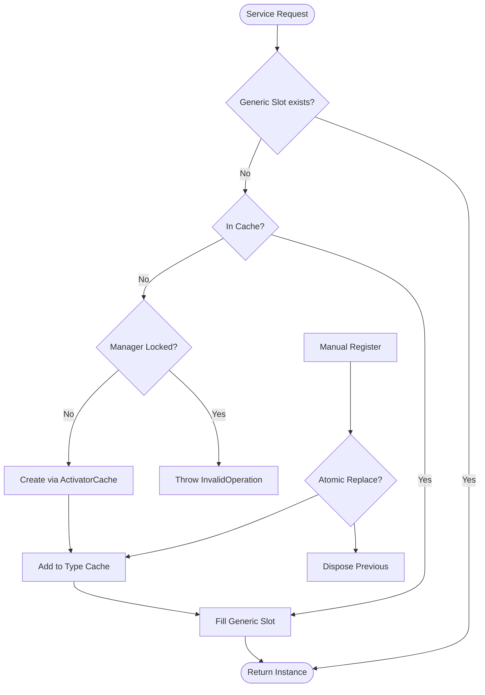

# Instance Manager (DI)

`InstanceManager` is a high-performance, lightweight dependency injection (DI) service registry. Unlike heavy IoC containers, it is optimized for zero-allocation resolution on networking hot paths using generic slots and type-handle caching.

## Lifecycle and Resolution

The following diagram illustrates how services are registered and resolved within the manager.



## Source Mapping

- `src/Nalix.Framework/Injection/InstanceManager.cs`
- `src/Nalix.Framework/Injection/DI/SingletonBase.cs`

## Key Capabilities

- **Zero-Allocation Hot Path**: Uses `GenericSlot<T>` and `ThreadStatic` L1 cache to avoid dictionary lookups after the first resolution.
- **Interface Mapping**: Automatically registers an instance for all its implemented interfaces unless restricted.
- **Lockdown Security**: Prevents "service hijacking" after startup by freezing the registry.
- **Atomic Replacements**: Safe to register or replace services at runtime; replaced `IDisposable` instances are automatically disposed.
- **Activator Caching**: Dynamically creates instances with constructor arguments, caching optimized activators for subsequent calls.

## Key Members

### Registration

| Method | Signature | Description |
| :--- | :--- | :--- |
| `Register<T>` | `void Register<T>(T instance, bool registerInterfaces = true)` | Adds an instance to the registry. If `registerInterfaces` is `true`, also registers for all implemented interfaces. |
| `RegisterForClassOnly<T>` | `void RegisterForClassOnly<T>(T instance)` | Registers only for the concrete class type (ignores interfaces). |
| `Lockdown` | `void Lockdown()` | Freezes the manager state. No more registrations or dynamic creations allowed. |

### Resolution

| Method | Signature | Description |
| :--- | :--- | :--- |
| `GetExistingInstance<T>` | `T? GetExistingInstance<T>()` | Fast resolution of an already registered service. Returns `null` if not found. |
| `GetOrCreateInstance<T>` | `T GetOrCreateInstance<T>(params object?[] args)` | Resolves or dynamically creates a service (singleton-like). |
| `GetOrCreateInstance` | `object GetOrCreateInstance(Type type, params object?[] args)` | Non-generic resolution by `Type`. |
| `CreateInstance` | `object CreateInstance(Type type, params object?[] args)` | Creates a new instance without caching it. |
| `HasInstance<T>` | `bool HasInstance<T>()` | Determines whether an instance of the specified type is cached. |

### Removal & Cleanup

| Method | Signature | Description |
| :--- | :--- | :--- |
| `RemoveInstance` | `bool RemoveInstance(Type type)` | Removes and disposes a cached service. Returns `true` if removed. |
| `Clear` | `void Clear(bool dispose = true)` | Purges the entire registry. Disposes instances if `dispose` is `true`. |
| `Dispose` | `void Dispose()` | Disposes all cached `IDisposable` instances and releases resources. |

### Diagnostics

| Method / Property | Description |
| :--- | :--- |
| `GenerateReport()` | Produces a human-readable report of all cached instances. |
| `GetReportData()` | Returns a key-value summary for diagnostics/monitoring. |
| `CachedInstanceCount` | Gets the number of cached instances. |
| `EntryAssembly` | Gets the assembly that started the application. |
| `ApplicationMutexName` | The OS mutex name used for single-instance detection. |
| `IsTheOnlyInstance` | Checks if this application is the only instance currently running. |

## Basic Usage

```csharp
// Startup
var logger = new MyLogger();
InstanceManager.Instance.Register<ILogger>(logger);

// Shared logic (No allocation)
var taskManager = InstanceManager.Instance.GetOrCreateInstance<TaskManager>();
ILogger? sharedLogger = InstanceManager.Instance.GetExistingInstance<ILogger>();
```

## Runtime Details

1.  **Fast Path**: `GetExistingInstance<T>` first checks a static generic field (`GenericSlot<T>`). If empty, it checks a `ThreadStatic` L1 cache, then falls back to a thread-safe `RuntimeTypeHandle` dictionary.
2.  **Tracking**: Disposables are tracked in a dedicated `ConcurrentDictionary` to ensure they are cleaned up exactly once during `Clear` or `Dispose`.
3.  **Atomic Updates**: `Register` uses a retry loop with `TryUpdate` to ensure thread-safety during service replacement without long-held locks.

## Startup Blueprint

In typical Nalix applications, service registration follows this order:

1.  **Infrastructure**: Resolve directories and load configuration.
2.  **Core Services**: Register logging, packet registries, and telemetry.
3.  **App Logic**: Register handlers, managers, and specific domain services.
4.  **Security**: Call `InstanceManager.Instance.Lockdown()`.

## Related APIs

- [Configuration](../environment/configuration.md)
- [Task Manager](./task-manager.md)
- [SingletonBase](./singleton-base.md)
- [Server Blueprint](../../guides/getting-started/server-blueprint.md)
