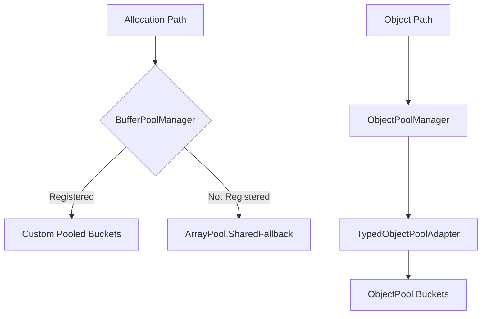

# Buffer and Pooling

This page covers the shared lease and pooling APIs used across networking and dispatch code.

## Source mapping

- `src/Nalix.Common/Abstractions/IBufferLease.cs`
- `src/Nalix.Framework/Memory/Buffers/BufferLease.cs`
- `src/Nalix.Framework/Memory/Pools/ObjectPool.cs`
- `src/Nalix.Framework/Memory/Objects/ObjectPoolManager.cs`
- `src/Nalix.Framework/Memory/Objects/TypedObjectPoolAdapter.cs`

## Architecture



## Main types

- `IBufferLease`
- `BufferLease`
- `BufferPoolManager`
- `ObjectPool`
- `ObjectPoolManager`
- `TypedObjectPoolAdapter<T>`

## Public members at a glance

| Type | Public members |
|---|---|
| `BufferLease` | `Span`, `SpanFull`, `Memory`, `CommitLength(...)`, `Retain()`, `ReleaseOwnership(...)`, `Dispose()`, `Rent(...)`, `CopyFrom(...)`, `FromRented(...)`, `TakeOwnership(...)` |
| `BufferPoolManager` | `Rent(...)`, `Return(...)`, `RentSegment(...)`, `RentForSaea(...)`, `ReturnFromSaea(...)`, `GenerateReport()`, `GetReportData()` |
| `ObjectPool` | `Get<T>()`, `Return<T>(...)`, `Prealloc<T>(...)`, `SetMaxCapacity<T>(...)`, `GetTypeInfo<T>()`, `GetStatistics()`, `Clear()`, `ClearType<T>()`, `Trim(...)`, `GetMultiple<T>(...)`, `ReturnMultiple<T>(...)` |
| `ObjectPoolManager` | `Get<T>()`, `Return<T>(...)`, `GetTypedPool<T>()`, `Prealloc<T>(...)`, `SetMaxCapacity<T>(...)`, `GetTypeInfo<T>()`, `ClearPool<T>()`, `ClearAllPools()`, `TrimAllPools(...)`, `PerformHealthCheck()`, `ResetStatistics()`, `ScheduleRegularTrimming(...)`, `GenerateReport()`, `GetReportData()` |
| `TypedObjectPoolAdapter<T>` | typed get/return/prealloc/trim/clear helpers and manager-backed statistics access |

## IBufferLease and BufferLease

`IBufferLease` is the shared contract. `BufferLease` is the main concrete implementation used by listeners, dispatch, and SDK receive paths.

## Basic usage

```csharp
using BufferLease lease = BufferLease.Rent(1024);

payload.CopyTo(lease.SpanFull);
lease.CommitLength(payload.Length);

ReadOnlyMemory<byte> memory = lease.Memory;
```

### When to use BufferLease

Use it when:

- a receive or send path wants pooled byte storage
- you need a disposable wrapper around raw buffer ownership
- you want to avoid allocating new arrays on every packet

Avoid it when:

- the data is tiny and only used once
- the call path is already short-lived and allocation cost is not meaningful
- you do not control the disposal boundary

### Performance guidance

- prefer `Rent(...)` and pooled flows on hot network paths
- call `CommitLength(...)` only after you know the final written length
- release ownership only when another component truly needs the raw array
- treat buffer reuse as a throughput optimization, not a correctness requirement

### Public methods that matter

- `Retain()`
- `CommitLength(length)`
- `ReleaseOwnership(out buffer, out start, out length)`
- `Dispose()`
- `Rent(capacity, zeroOnDispose)`
- `CopyFrom(span, zeroOnDispose)`
- `FromRented(buffer, length, zeroOnDispose)`
- `TakeOwnership(buffer, start, length, zeroOnDispose)`

## ByteArrayPool

`BufferLease.ByteArrayPool` is the static byte-array rent/return facade used by `BufferLease`.

## Source mapping

- `src/Nalix.Framework/Memory/Buffers/BufferLease.cs`

It resolves the backing implementation once:

- if `BufferPoolManager` is registered, calls are routed there
- otherwise it falls back to `ArrayPool<byte>.Shared`

This makes it the lowest-level pooled byte-array abstraction used by manual buffer workflows.

Useful methods:

- `Rent(capacity)`
- `Return(array)`

### Common pitfalls

- holding onto a rented array after returning it
- renting a larger buffer than your actual payload path needs
- mixing `BufferLease` ownership with direct array ownership without a clear handoff

## BufferPoolManager

`BufferPoolManager` is the high-level manager for pooled byte buffers. it organizes memory into size-aligned buckets (pools) and provides diagnostic reporting, adaptive trimming, and specialized helpers for `SocketAsyncEventArgs` flows.

## Source mapping

- `src/Nalix.Framework/Memory/Buffers/BufferPoolManager.cs`

### Role and Lifecycle

`BufferPoolManager` is typically registered as a singleton in the `InstanceManager`. It monitors memory pressure and periodically trims idle buffers based on `BufferConfig`.

### Public API

- `Rent(minimumLength)`: Rents a buffer of at least the requested size from the most suitable bucket.
- `Return(buffer)`: Returns a buffer to its origin bucket.
- `RentSegment(size)`: Rents a buffer and wraps it as an `ArraySegment<byte>` with `Offset=0` and `Count=size`.
- `RentForSaea(saea, size)`: Rents a buffer and assigns it to the `SocketAsyncEventArgs` via `SetBuffer`.
- `ReturnFromSaea(saea)`: Detaches the buffer from the SAEA and returns it to the pool.
- `GenerateReport()`: Produces a human-readable text report of all pool states and metrics.
- `GetReportData()`: Produces a dictionary-based diagnostic snapshot for telemetry.

### Trimming and Safety

Trimming is controlled by `BufferConfig.EnableMemoryTrimming`. It uses a conservative `ShrinkSafetyPolicy` to ensure the pool does not collapse during short idle periods, maintaining a retention floor for efficiency.

## BufferPoolState

`BufferPoolState` is the lightweight diagnostic snapshot for one pool bucket.

## Source mapping

- `src/Nalix.Framework/Memory/Buffers/BufferPoolState.cs`

It exposes:

- `BufferSize`
- `TotalBuffers`
- `FreeBuffers`
- `Misses`
- `CanShrink`
- `NeedsExpansion`
- `GetUsageRatio()`
- `GetMissRate()`

Use it when you need structured pool telemetry instead of just a string report. It is especially useful for dashboards, health checks, and tuning `BufferConfig`.

## ObjectPool

`ObjectPool` is the low-level reusable object store for `IPoolable` instances.

## Basic usage

```csharp
MyPoolable item = ObjectPool.Default.Get<MyPoolable>();
ObjectPool.Default.Return(item);
```

Useful public methods:

- `Get<T>()`
- `Return<T>(obj)`
- `Prealloc<T>(count)`
- `SetMaxCapacity<T>(maxCapacity)`
- `GetTypeInfo<T>()`
- `GetStatistics()`
- `Clear()`
- `ClearType<T>()`
- `Trim(percentage)`
- `GetMultiple<T>(count)`
- `ReturnMultiple<T>(objects)`

### When to use ObjectPool

Use it when:

- you have `IPoolable` instances that are expensive to create repeatedly
- you need a global shared pool for reusable runtime objects
- you want to trim or preallocate for predictable server load

Avoid it when:

- the object is cheap and short-lived
- the object holds external resources that are better managed explicitly
- the type cannot be safely reset for reuse

## ObjectPoolManager

`ObjectPoolManager` is the higher-level manager with reporting, health checks, typed adapters, and multi-pool statistics.

## Example

```csharp
var adapter = objectPoolManager.GetTypedPool<MyPoolable>();

MyPoolable item = adapter.Get();
adapter.Return(item);

string report = objectPoolManager.GenerateReport();
```

Useful public methods:

- `Get<T>()`
- `Return<T>(obj)`
- `GetTypedPool<T>()`
- `Prealloc<T>(count)`
- `SetMaxCapacity<T>(maxCapacity)`
- `GetTypeInfo<T>()`
- `ClearPool<T>()`
- `ClearAllPools()`
- `TrimAllPools(percentage)`
- `PerformHealthCheck()`
- `ResetStatistics()`
- `ScheduleRegularTrimming(interval, percentage, ct)`
- `GenerateReport()`
- `GetReportData()`

### Performance guidance

- preallocate during startup if you know the steady-state shape
- trim during low-traffic windows rather than on a hot path
- use `PerformHealthCheck()` when tuning pool behavior under real load

## BufferConfig

`BufferConfig` is the configuration object for pool sizing, trimming, adaptive growth, and memory limits.

## Source mapping

- `src/Nalix.Framework/Memory/Buffers/BufferConfig.cs`

It is the place to tune:

- total buffer count across pools
- trim cadence and deep-trim cadence
- adaptive pool growth and shrink thresholds
- hard memory caps and percentage-based caps
- secure clearing on return
- allocation layout through `BufferAllocations`

Important properties include:

- `TotalBuffers`
- `EnableMemoryTrimming`
- `TrimIntervalMinutes`
- `DeepTrimIntervalMinutes`
- `AdaptiveGrowthFactor`
- `MaxMemoryPercentage`
- `MaxMemoryBytes`
- `SecureClear`
- `ExpandThresholdPercent`
- `ShrinkThresholdPercent`
- `MinimumIncrease`
- `MaxBufferIncreaseLimit`
- `BufferAllocations`

### Allocation pattern format

`BufferAllocations` uses `size,ratio` pairs separated by semicolons:

```ini
BufferAllocations = 256,0.10; 512,0.15; 1024,0.20; 2048,0.20
```

Rules enforced by `Validate()`:

- sizes must be strictly increasing
- each ratio must be in `(0, 1]`
- total ratio must stay at or below the configured limit
- expand threshold must be lower than shrink threshold

### When clients should care

Reach for `BufferConfig` when you are tuning:

- long-running servers under varying payload sizes
- memory-sensitive deployments
- secure workloads that require zeroing returned buffers
- adaptive pool behavior under burst traffic

### Common pitfalls

- over-allocating just to avoid thinking about pool sizes
- turning on secure clearing everywhere without measuring the cost
- using the same buffer sizing profile for wildly different traffic patterns

## Related APIs

- [Packet Dispatch](../../runtime/routing/packet-dispatch.md)
- [Packet Context](../../runtime/routing/packet-context.md)
- [Packet Registry](../packets/packet-registry.md)
- [Pooling Options](../../network/options/pooling-options.md)
- [Object Map and Typed Pools](./object-map-and-typed-pools.md)
- [Reader, Writer, and Header Extensions](../packets/reader-writer-and-header-extensions.md)
