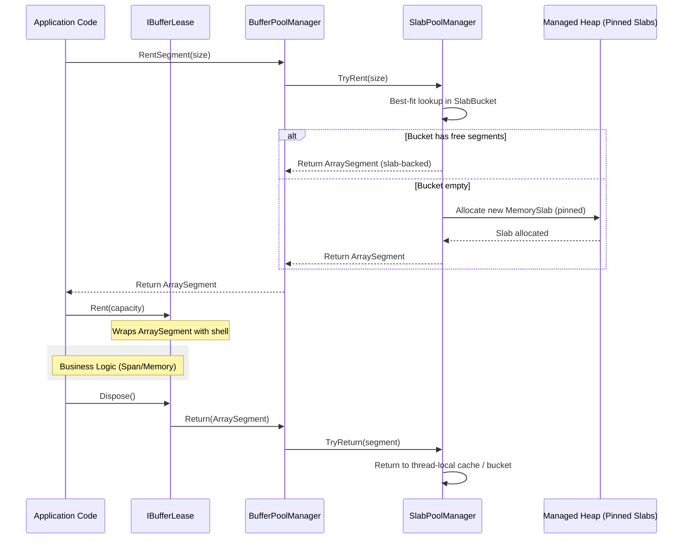

# Buffer Management

`Nalix.Framework.Memory` provides a high-performance byte buffer management system designed to minimize GC pressure and maximize throughput in networking hot paths.

## Buffer Rental & Disposal Lifecycle

The following diagram illustrates how raw byte arrays are managed through the `BufferLease` and `BufferPoolManager` abstraction.



## Source Mapping

- `src/Nalix.Common/Abstractions/IBufferLease.cs`
- `src/Nalix.Framework/Memory/Buffers/BufferLease.cs`
- `src/Nalix.Framework/Memory/Buffers/BufferPoolManager.cs`
- `src/Nalix.Framework/Options/BufferConfig.cs`
- `src/Nalix.Framework/Memory/Internal/Buffers/MemorySlab.cs`
- `src/Nalix.Framework/Memory/Internal/Buffers/SlabBucket.cs`
- `src/Nalix.Framework/Memory/Internal/Buffers/SlabPoolManager.cs`

## IBufferLease and BufferLease

`IBufferLease` is the primary interface for managing temporary byte storage. It encapsulates the ownership and lifetime of a pooled byte array.

### Core Features

- **Ownership Tracking**: Ensures buffers are returned to the correct pool upon disposal.
- **Span/Memory Integration**: High-performance access to the underlying byte array via `Span<byte>` or `Memory<byte>`.
- **Commit Pattern**: Allows marking only a portion of the rented buffer as "active data".
- **Shell Pooling**: `BufferLease` instances themselves are pooled using a lock-free free-list with an **O(1) atomic counter** to eliminate Gen 0 churn.
- **Zero-Allocation**: Designed to be used on the stack (as a `using` variable) to avoid any heap allocation during messaging.

### Key Members

| Member | Description |
| :--- | :--- |
| `Span` / `Memory` | Provides access to the *committed* portion of the buffer. |
| `SpanFull` | Provides access to the *entire* rented capacity. |
| `CommitLength(int)` | Sets the length of data actually written to the buffer. |
| `Retain()` | Increments the internal reference count (advanced use). |
| `ReleaseOwnership()` | Detaches the underlying array from the lease (transferring ownership). |

## BufferPoolManager

`BufferPoolManager` is the high-level orchestrator that manages two distinct pooling strategies:

1.  **Slab-Based Pooling (Primary)**: Optimized for `RentSegment` calls. Uses large pinned slabs to serve `ArraySegment<byte>`.
2.  **Per-Buffer Pooling (Legacy)**: Serves `Rent(int)` calls for backward compatibility, returning standalone `byte[]`.

### Slab-Based Architecture

To eliminate POH (Pinned Object Heap) fragmentation, Nalix uses a slab allocation strategy. Instead of allocating thousands of small pinned arrays, it allocates large **Memory Slabs** (typically several MBs) and carves them into segments.

- **SlabPoolManager**: Manages multiple `SlabBucket` instances, one for each size class.
- **SlabBucket**: Implements a lock-free segment stack with thread-local caching for ultra-low latency in the hot path.
- **Best-Fit Lookup**: Uses binary search to find the smallest bucket that satisfies a requested size, minimizing internal fragmentation.

### Adaptive Trimming

The manager includes a background job that monitors pool utilization. It uses a **Shrink Safety Policy** to ensure that memory is returned to the OS during idle periods without causing churn when traffic spikes resume.

- **Trim Interval**: Frequency of routine memory checks.
- **Deep Trim**: A more aggressive cleanup cycle for long-term idle pools.
- **Safety Floor**: Always retains a minimum percentage of buffers to ensure readiness.

### Socket Excellence (SAEA Support)

Specialized APIs are provided to integrate directly with .NET's `SocketAsyncEventArgs`:

- `RentForSaea(saea, size)`: Rents a buffer and binds it to the SAEA.
- `ReturnFromSaea(saea)`: Unbinds and returns the buffer automatically.

## BufferConfig

Global tuning for the buffer system is managed via `BufferConfig`.

### Allocation Profiles

You can define the pool structure using the `BufferAllocations` string format: `size,ratio; size,ratio`.

```ini
BufferAllocations = 512,0.40; 2048,0.40; 8192,0.20
```

- **Size**: The maximum bytes this bucket can hold.
- **Ratio**: The percentage of `TotalBuffers` allocated to this bucket.

## Monitoring & Metrics

The `BufferPoolManager` provides deep insights into memory health:

- **MissRate**: If misses occur, it indicates the pool is too small or bucket sizes don't match your traffic.
- **UsageRatio**: Helps identify if you are over-provisioned or near capacity.

!!! tip "Reporting"
    Call `manager.GenerateReport()` to get a detailed text summary of all pool buckets and their current efficiency.

## Related APIs

- [Object Pooling](./object-pooling.md)
- [Network Options](../../network/options/options.md)
- [Zero-Allocation Path](../../../concepts/internals/zero-allocation.md)
