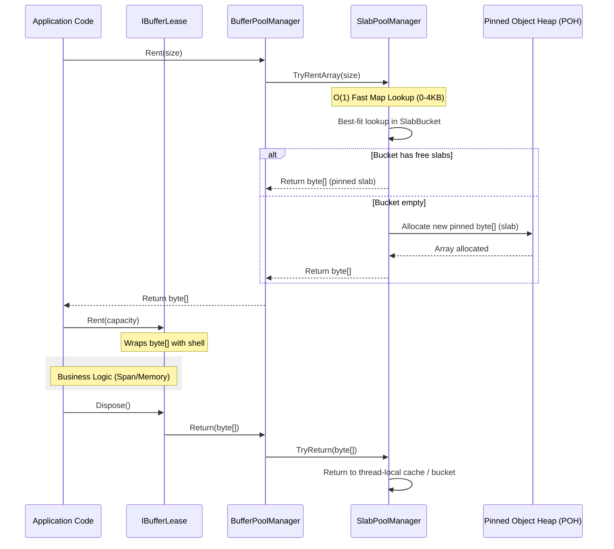

# Buffer Management

`Nalix.Framework.Memory` provides a high-performance byte buffer management system designed to minimize GC pressure and maximize throughput in networking hot paths.

## Buffer Rental & Disposal Lifecycle

The following diagram illustrates how raw byte arrays are managed through the `BufferLease` and `BufferPoolManager` abstraction.



## Source Mapping

- `src/Nalix.Common/Abstractions/IBufferLease.cs`
- `src/Nalix.Framework/Memory/Buffers/BufferLease.cs`
- `src/Nalix.Framework/Memory/Buffers/BufferPoolManager.cs`
- `src/Nalix.Framework/Options/BufferConfig.cs`
- `src/Nalix.Framework/Memory/Internal/Buffers/SlabBucket.cs`
- `src/Nalix.Framework/Memory/Internal/Buffers/SlabPoolManager.cs`

## IBufferLease and BufferLease

`IBufferLease` is the primary interface for managing temporary byte storage. It encapsulates the ownership and lifetime of a pooled byte array.

### Core Features

- **Ownership Tracking**: Ensures buffers are returned to the correct pool upon disposal.
- **Span/Memory Integration**: High-performance access to the underlying byte array via `Span<byte>` or `Memory<byte>`.
- **Commit Pattern**: Allows marking only a portion of the rented buffer as "active data".
- **Shell Pooling**: `BufferLease` instances themselves are pooled using a lock-free free-list with an **O(1) atomic counter** to eliminate Gen 0 churn.
- **Zero-Allocation**: Designed to be used on the stack (as a `using` variable) to avoid any heap allocation during messaging.

### Key Members

| Member | Description |
| :--- | :--- |
| `Span` / `Memory` | Provides access to the *committed* portion of the buffer. |
| `SpanFull` | Provides access to the *entire* rented capacity. |
| `CommitLength(int)` | Sets the length of data actually written to the buffer. |
| `Retain()` | Increments the internal reference count (advanced use). |
| `ReleaseOwnership()` | Detaches the underlying array from the lease (transferring ownership). |

## BufferPoolManager

`BufferPoolManager` is the high-level orchestrator that manages the **Standalone Slab Pool**. It is designed for high-frequency rental of byte arrays with zero-offset access, leveraging the Pinned Object Heap (POH) to eliminate GC movement.

The manager provides a unified API for renting both raw `byte[]` arrays and `IBufferLease` wrappers.

### Standalone Slab Architecture

To achieve maximum performance and eliminate slicing overhead, Nalix uses a **Standalone Slab** strategy. Instead of carving segments from a shared large array, each bucket manages a collection of independent pinned `byte[]` arrays of exactly the bucket's size.

- **Zero-Offset Access**: All rented buffers are independent pinned arrays. This ensures `Offset = 0` and `index 0` compatibility with legacy APIs and high-performance memory operations.
- **POH Placement**: Buffers are allocated on the **Pinned Object Heap (POH)** using `GC.AllocateArray(pinned: true)`. They remain pinned for their entire lifetime, eliminating GC movement and fragmentation.
- **O(1) Fast Size Lookup**: For common sizes up to **4096 bytes**, the manager uses a direct-mapping array to resolve the correct bucket in constant time.
- **SlabBucket**: Implements a two-level cache (L1: Thread-Local, L2: Shared Ring) for ultra-low contention.

### Adaptive Trimming & Shrink Safety

The manager includes a background job that monitors pool utilization. It uses a **Shrink Safety Policy** to balance memory footprint and performance.

- **Safety Floor**: Buckets are strictly prevented from shrinking below their **InitialCapacity**. This ensures that the system always has a "warm" baseline of buffers available for sudden traffic bursts.
- **Step-Limit**: Shrinking happens in controlled steps to avoid massive deallocations in a single cycle.
- **Deep Trim**: An optional aggressive cleanup cycle for long-term idle pools (while still respecting the safety floor).

### Dual-API Support

`BufferPoolManager` provides two optimized paths for renting memory:

`BufferPoolManager` provides an optimized path for renting memory:

- **`Rent(size)`**: The primary API, returning a standalone `byte[]`. Optimized for maximum speed and simplicity. All buffers have a zero offset.

The API is backed by the high-performance **SlabBucket** infrastructure and benefits from the same O(1) optimizations.


## BufferConfig

Global tuning for the buffer system is managed via `BufferConfig`.

### Allocation Profiles

You can define the pool structure using the `BufferAllocations` string format: `size,ratio; size,ratio`.

```ini
BufferAllocations = 512,0.40; 2048,0.40; 8192,0.20
```

- **Size**: The maximum bytes this bucket can hold.
- **Ratio**: The percentage of `TotalBuffers` allocated to this bucket.

## Monitoring & Metrics

The `BufferPoolManager` provides deep insights into memory health via the `GenerateReport()` or `GetReportData()` APIs:

- **Expands / Shrinks**: Tracks the actual growth and contraction events of each bucket.
- **Initial Capacity**: Shows the configured "floor" that the pool will never shrink below.
- **HitRate / MissRate**: Measures the efficiency of the cache layers (L1/L2) vs. new allocations.
- **Overall Hit Rate**: A high-level summary of how many rent requests were satisfied by pooled buffers.

!!! tip "Enterprise Reporting"
    Call `manager.GenerateReport()` for a human-readable text summary, or `manager.GetReportData()` to get a structured `IDictionary` for monitoring dashboards (e.g., Prometheus/Grafana).

## Related APIs

- [Object Pooling](./object-pooling.md)
- [Network Options](../../network/options/options.md)
- [Zero-Allocation Path](../../../concepts/internals/zero-allocation.md)
