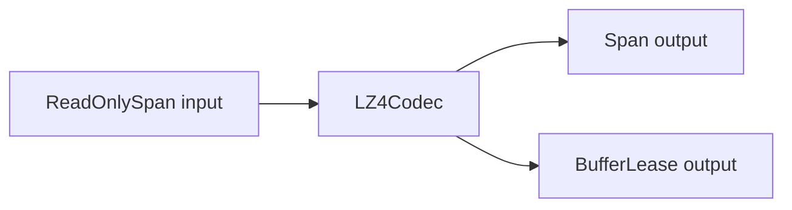

# LZ4

This page covers the public compression surface in `Nalix.Framework.LZ4`.

## Source mapping

- `src/Nalix.Framework/LZ4/LZ4Codec.cs`
- `src/Nalix.Framework/LZ4/LZ4BlockHeader.cs`
- `src/Nalix.Framework/LZ4/Encoders`
- `src/Nalix.Framework/LZ4/Engine`

## Main types

- `LZ4Codec`
- `LZ4BlockHeader`

## What it does

This layer provides:

- block compression into a caller-supplied span
- block compression into a pooled `BufferLease`
- block decompression into a caller-supplied span
- block decompression into a rented `BufferLease`

## Public members at a glance

| Type | Public members |
|---|---|
| `LZ4Codec` | `Encode(...)`, `Decode(...)`, `GetMaxCompressedSize(...)`, `GetMaxDecompressedSize(...)`, `GetCompressionRatio(...)` and related span / lease overloads |
| `LZ4BlockHeader` | block header fields and wire-size helpers used by the codec |

## Runtime shape



## Block format

Compressed payloads include an `LZ4BlockHeader` before the body.

The header stores:

- `OriginalLength`
- `CompressedLength`

`LZ4BlockHeader.Size` is currently `8` bytes.

## LZ4CompressionConstants

`LZ4CompressionConstants` exposes the implementation-level constants used by the encoder.

## Source mapping

- `src/Nalix.Framework/LZ4/Encoders/LZ4CompressionConstants.cs`

Important values include:

- `MinMatchLength`
- `MaxOffset`
- `MaxBlockSize`
- `LastLiteralSize`
- `TokenMatchMask`
- `TokenLiteralMask`

Two of these matter most when reasoning about behavior:

- `MaxOffset` is the hard backward-reference limit defined by the LZ4 format
- `MaxBlockSize` is the implementation cap chosen by Nalix for safety and practicality, not a protocol-wide LZ4 hard limit

## Encode overloads

`LZ4Codec.Encode(...)` supports:

- `Encode(ReadOnlySpan<byte> input, Span<byte> output)`
- `Encode(ReadOnlySpan<byte> input, out BufferLease lease, out int bytesWritten)`

Use the span overload when you already own the destination buffer.

Use the `BufferLease` overload when you want a pooled, zero-copy-friendly path.

## When to use LZ4

Use LZ4 when:

- payloads are large enough that compression overhead can pay for itself
- you are sending repetitive or highly structured packet bodies
- you want to reduce network bandwidth or buffer pressure on the receive side

Avoid LZ4 when:

- payloads are tiny and already close to the minimum frame size
- the data is random, encrypted, or already compressed
- latency is more important than payload size

## Decode overloads

`LZ4Codec.Decode(...)` supports:

- `Decode(ReadOnlySpan<byte> input, Span<byte> output)`
- `Decode(ReadOnlySpan<byte> input, out BufferLease? lease, out int bytesWritten)`

Use the `BufferLease` overload on hot paths where you want pooled output.

## Performance guidance

- benchmark your real payloads before turning compression on by default
- prefer pooled overloads on live network paths
- keep compression disabled for traffic that does not benefit from it
- treat compression as a throughput tool, not a universal win

## Example

```csharp
ReadOnlySpan<byte> input = payload;

LZ4Codec.Encode(input, out BufferLease compressed, out int written);
using (compressed)
{
    LZ4Codec.Decode(compressed.Span, out BufferLease? restored, out int restoredBytes);
using (restored)
    {
        Console.WriteLine(restoredBytes);
    }
}
```

## Common pitfalls

- compressing already-compressed or encrypted payloads
- using compression for very small packets where header overhead dominates
- forgetting that a pooled output lease must be disposed
- assuming the same compression ratio across all payload types

## Important notes

!!! tip "Prefer pooled paths on hot routes"
    The `BufferLease` overloads are the best default when compression is part of a high-throughput network path.

!!! note "Failures now throw"
    The public LZ4 APIs no longer use boolean success/failure flow. Invalid buffers, malformed payloads, and unexpected codec failures surface as exceptions, while pooled leases are disposed on failing paths.

## Related APIs

- [Buffer and Pooling](./buffer-and-pooling.md)
- [Serialization](../packets/serialization.md)
- [Compression Options](../../network/options/compression-options.md)
