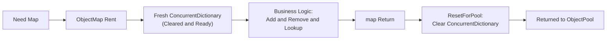

# Object Map

`ObjectMap<TKey, TValue>` is a high-performance, thread-safe pooled dictionary built on top of `ConcurrentDictionary`. It is designed for scenarios where you need temporary lookup tables without the overhead of repeated allocations and garbage collection.

## ObjectMap Rent/Release Flow

The following diagram illustrates how an `ObjectMap` is retrieved from the global pool, used, and safely returned.



## Source Mapping

- `src/Nalix.Framework/Memory/Objects/ObjectMap.cs`

## Core Features

- **Concurrent Access**: Thread-safe operations inherited from `ConcurrentDictionary`.
- **Pooled Architecture**: Instances are recycled through the `ObjectPoolManager`.
- **Zero-Allocation Utility**: Avoids `new Dictionary<K,V>` or `new ConcurrentDictionary<K,V>` on hot paths.
- **Snapshot Support**: Efficient enumeration using the underlying concurrent implementation.

## Key Members

| Member | Description |
| :--- | :--- |
| `Rent()` | Static method to retrieve a fresh, cleared map from the pool. |
| `Return()` | Returns the map to the pool. **Must** be called to prevent memory leaks. |
| `Add(key, value)` | Adds or updates an entry. |
| `TryGetValue(key, out val)` | Safely retrieves a value if the key exists. |
| `Clear()` | Manually clears the map (also called automatically during `Return`). |

## Basic Usage

Always use the `try-finally` pattern to ensure the map is returned to the pool even if an exception occurs.

```csharp
var users = ObjectMap<string, UserSession>.Rent();
try
{
    users.Add("user_1", session);
    // ... process users ...
}
finally
{
    users.Return();
}
```

!!! danger "Usage Guard"
    Never store a reference to an `ObjectMap` after `Return()` has been called. The instance will be cleared and potentially handed to another thread immediately.

## Related APIs

- [Object Pooling](./object-pooling.md)
- [Typed Object Pools](./typed-object-pools.md)
- [Buffer Management](./buffer-management.md)
