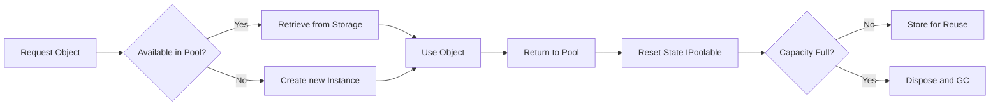

# Object Pooling

The Object Pooling system in `Nalix.Framework` provides a thread-safe, high-performance mechanism for recycling expensive class instances, reducing the frequency of garbage collection.

## Object Pool Interaction Flow

The following diagram illustrates the lifecycle of a poolable object from creation to reuse.



## Source Mapping

- `src/Nalix.Common/Abstractions/IPoolable.cs`
- `src/Nalix.Framework/Memory/Pools/ObjectPool.cs`
- `src/Nalix.Framework/Memory/Objects/ObjectPoolManager.cs`
- `src/Nalix.Framework/Memory/Objects/TypedObjectPoolAdapter.cs`

## IPoolable Interface

Any class intended for pooling must implement `IPoolable`.

```csharp
public interface IPoolable
{
    /// <summary>
    /// Resets the object state to its default values before being returned to the pool.
    /// </summary>
    void Reset();
}
```

!!! important "State Management"
    Correctly implementing `Reset()` is critical. Failure to clear collections or reset properties can lead to "polluted" objects being served in future requests.

## ObjectPoolManager

`ObjectPoolManager` is the central registry for all typed pools. It maintains statistics, performs health checks, and handles background trimming.

### Key Features

- **Dynamic Creation**: Pools are created lazily for each type as needed.
- **Typed Adapters**: Provides `TypedObjectPoolAdapter<T>` for high-performance, type-safe access.
- **Health Monitoring**: Tracks cache hits, misses, and "outstanding" counts (objects that were retrieved but not yet returned).
- **Trimming**: Supports scheduled or manual trimming to release objects back to the GC during low-load periods.

### Key API Members

| Method | Description |
| :--- | :--- |
| `Get<T>()` | Retrieves an item from the pool for type `T`. Creates a new one if the pool is empty. |
| `Return<T>(obj)` | Resets and returns an object to the pool. |
| `Prealloc<T>(count)` | Force-fills the pool with a specific number of instances (useful at startup). |
| `PerformHealthCheck()` | Identifies "unhealthy" pools (those with consistently high miss rates or leaks). |
| `GenerateReport()` | Produces a detailed text summary of all managed pools and their metrics. |

## TypedObjectPoolAdapter<T>

For performance-critical code, it is recommended to cache a `TypedObjectPoolAdapter<T>` rather than calling the manager directly.

```csharp
// Recommended performance pattern
private readonly TypedObjectPoolAdapter<MyPacket> _pool = 
    ObjectPoolManager.Instance.GetTypedPool<MyPacket>();

public void Process()
{
    var item = _pool.Get();
    try { /* ... */ }
    finally { _pool.Return(item); }
}
```

## Monitoring and Health

The manager tracks several critical metrics to help tune pool capacities:

- **Hit Rate**: The percentage of requests satisfied by the pool without creating a new object.
- **Outstanding**: Number of objects currently held by application code. If this grows indefinitely, it indicates a pool leak.
- **Consecutive Failures**: High number of cache misses in sequence, suggesting the pool capacity is too low for the current load.

!!! tip "Diagnostic Insight"
    Use `ScheduleRegularTrimming` to keep memory usage balanced. Trimming runs `PerformHealthCheck` automatically to log warnings about unhealthy pools.

## Related APIs

- [Buffer Management](./buffer-management.md)
- [Object Map](./object-map.md)
- [Typed Object Pools](./typed-object-pools.md)
- [Zero-Allocation Hot Path](../../../guides/zero-allocation-hot-path.md)
