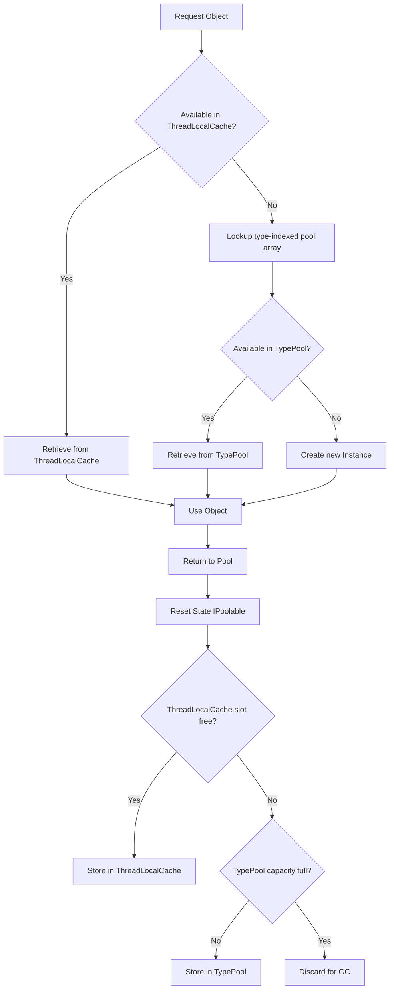

# Object Pooling

The Object Pooling system in `Nalix.Framework` provides a thread-safe, high-performance mechanism for recycling expensive class instances, reducing the frequency of garbage collection.

## Object Pool Interaction Flow

The following diagram illustrates the lifecycle of a poolable object from creation to reuse, featuring the optimized thread-local and type-indexed fast paths.


```mermaid
flowchart TD
    Start[Request Object] --> TLC{Available in ThreadLocalCache?}
    TLC -- Yes --> PopTLC[Retrieve from ThreadLocalCache]
    TLC -- No --> TypeIndex[Lookup type-indexed pool array]
    TypeIndex --> TypeBucket{Available in TypePool?}
    TypeBucket -- Yes --> PopTB[Retrieve from TypePool]
    TypeBucket -- No --> Build[Create new Instance]
    
    PopTLC --> Use[Use Object]
    PopTB --> Use
    Build --> Use
    
    Use --> Return[Return to Pool]
    Return --> Reset[Reset State IPoolable]
    Reset --> PushTLC{ThreadLocalCache slot free?}
    
    PushTLC -- Yes --> StoreTLC[Store in ThreadLocalCache]
    PushTLC -- No --> PushBucket{TypePool capacity full?}
    PushBucket -- No --> StoreTB[Store in TypePool]
    PushBucket -- Yes --> GC[Discard for GC]
```

## Source Mapping

- `src/Nalix.Abstractions/IPoolable.cs`
- `src/Nalix.Framework/Memory/Internal/PoolTypes/PoolType.cs`
- `src/Nalix.Framework/Memory/Internal/PoolTypes/PoolTypeRegistry.cs`
- `src/Nalix.Framework/Memory/Internal/PoolTypes/ThreadLocalCache.cs`
- `src/Nalix.Framework/Memory/Internal/PoolTypes/TypePool.cs`
- `src/Nalix.Framework/Memory/Pools/ObjectPool.cs`
- `src/Nalix.Framework/Memory/Objects/ObjectPoolManager.cs`
- `src/Nalix.Framework/Memory/Objects/TypedObjectPool.cs`

## IPoolable Interface

Any class intended for pooling must implement `IPoolable`.

```csharp
public interface IPoolable
{
    /// <summary>
    /// Resets the object state to its default values before being returned to the pool.
    /// </summary>
    void ResetForPool();
}
```

### IPoolRentable Interface

For objects that need to perform logic specifically when they are taken *out* of the pool (e.g., generating a unique ID or starting a stopwatch), implement `IPoolRentable`.

```csharp
public interface IPoolRentable
{
    /// <summary>
    /// Invoked immediately after the object is retrieved from the pool.
    /// </summary>
    void OnRent();
}
```

!!! important "State Management"
    Correctly implementing `Reset()` is critical. Failure to clear collections or reset properties can lead to "polluted" objects being served in future requests.

## ObjectPoolManager

`ObjectPoolManager` is the central registry for all typed pools. It maintains statistics, performs health checks, and handles background trimming.

### Key Features

- **Thread-Local Caching**: Integrates a lock-free, single-slot cache (`ThreadLocalCache<T>`) per poolable type on the active thread, delivering ultra-low-latency reuse on the thread hot path.
- **Type-Indexed Buckets**: Allocates unique numeric identifiers for each pooled type (`PoolType<T>.Id`), routing lookups via a flat index-lookup array to avoid thread contention, lock acquisitions, and dictionary hashing during renting and returning.
- **Dynamic Creation**: Pools are created lazily for each type as needed.
- **Typed Pools**: Provides `TypedObjectPool<T>` for high-performance, type-safe access.
- **Health Monitoring**: Tracks cache hits, misses, and **Peak Concurrent Usage**.
- **Advanced Diagnostics**: Optional deep tracking for object lifetimes (avg/p95/max), outstanding counts, suspicious long-lived objects, and GC leak detection.
- **Trimming**: Supports scheduled or manual trimming to release objects back to the GC during low-load periods.

### Key API Members

| Member | Description |
| :--- | :--- |
| `Get<T>()` | Retrieves an item from the pool for type `T`. Creates a new one if the pool is empty. |
| `Return<T>(obj)` | Resets and returns an object to the pool. |
| `GetTypedPool<T>()` | Gets or creates a type-specific `TypedObjectPool<T>` adapter. |
| `Prealloc<T>(count)` | Force-fills the pool with a specific number of instances (useful at startup). |
| `SetMaxCapacity<T>(maxCapacity)` | Sets the maximum capacity for a specific type's pool. |
| `ResetMetrics()` | Resets all global and per-pool metrics to baseline (zero). |
| `ClearPool<T>()` | Clears all objects from a specific type's pool. |
| `ClearAllPools()` | Clears all objects from all pools. |
| `TrimAllPools(percentage = 50)` | Trims all pools to their target sizes. |
| `ScheduleRegularTrimming(interval, percentage = 50, ct)` | Schedules a background trimming loop. |
| `PerformHealthCheck()` | Identifies "unhealthy" pools (those with consistently high miss rates). |
| `ResetStatistics()` | Resets all statistics for the pool manager and all pools. |
| `GetTypeInfo<T>()` | Gets detailed information about a specific type's pool. |
| `GenerateReport()` | Produces a detailed text summary of all managed pools and their metrics. |
| `WriteReportData(Utf8JsonWriter)` | Writes structured diagnostic data to a JSON writer for zero-allocation reporting. |

### Properties

| Property | Type | Description |
| :--- | :--- | :--- |
| `DefaultMaxPoolSize` | `int` | Default maximum size for new pools (default 1024). |
| `PoolCount` | `int` | Total number of pools currently managed. |
| `PeakPoolCount` | `int` | Peak number of pools at any time. |
| `TotalGetOperations` | `long` | Total number of get operations performed. |
| `TotalReturnOperations` | `long` | Total number of return operations performed. |
| `TotalCacheHits` | `long` | Total number of cache hits. |
| `TotalCacheMisses` | `long` | Total number of cache misses. |
| `CacheHitRate` | `double` | Overall cache hit rate as a percentage (0-100). |
| `Uptime` | `TimeSpan` | Uptime of the pool manager. |
| `UnhealthyPoolCount` | `int` | Number of unhealthy pools. |

## Configuring for Server

To enable global object pooling for packets and internal components, register the `ObjectPoolManager` with the builder.

### Using the Hosting Builder

```csharp
using Nalix.Hosting;
using Nalix.Framework.Memory.Objects;

var app = NetworkApplication.CreateBuilder()
    // 1. Initialize the global object pool manager
    .ConfigureObjectPoolManager(new ObjectPoolManager(logger))
    
    // 2. Optional: Pre-configure pool sizes for specific hot types
    .Configure<ObjectPoolOptions>(opt => 
    {
        opt.DefaultMaxPoolSize = 2048;
    })
    .Build();
```

## TypedObjectPool<`T`>

For performance-critical code, it is recommended to cache a `TypedObjectPool<T>` rather than calling the manager directly.

```csharp
// Recommended performance pattern
private readonly TypedObjectPool<MyPacket> _pool = 
    ObjectPoolManager.Instance.GetTypedPool<MyPacket>();

public void Process()
{
    var item = _pool.Get();
    try { /* ... */ }
    finally { _pool.Return(item); }
}
```

## Monitoring and Health

The manager tracks several critical metrics to help tune pool capacities:

- **Hit Rate**: The percentage of requests satisfied by the pool without creating a new object.
- **Outstanding**: Number of objects currently held by application code (requires `EnableDiagnostics`).
- **Peak Outstanding**: The high-water mark of concurrent objects active at any time (requires `EnableDiagnostics`).
- **Consecutive Failures**: High number of cache misses in sequence, suggesting the pool capacity is too low for the current load.

## Advanced Diagnostics

Advanced diagnostics can be enabled via `ObjectPoolOptions` (usually in `server.ini` under `[ObjectPool]`). These features provide deep insight at a slight performance cost.

### Statistics Collected

- **Lifetime (Avg/p95/Max)**: How long objects stay rented. High values might indicate slow processing segments.
- **Suspicious Objects**: Objects held longer than a configurable threshold (e.g., 30s) are listed in reports with their allocation stack trace.
- **GC Leak Detection**: Uses sentinel finalizers to detect and report objects that were garbage collected without being returned to the pool.

### Configuration Example

[ObjectPool]
# Overall diagnostics toggle
EnableDiagnostics = true

# Capture stack traces on Get() for leak tracking (slow)
CaptureStackTraces = true

# Detect objects collected by GC without being returned
EnableLeakDetection = true

# Threshold for marking an object as "Suspiciously long-lived"
SuspiciousThresholdSeconds = 30

# Background trimming configuration
EnableObjectTrimming = true
TrimIntervalMinutes = 5
```

!!! note "Performance Impact"
    While `EnableDiagnostics` provides invaluable insight during development and load testing, it is recommended to disable `CaptureStackTraces` in extreme production environments to save CPU cycles on every `Get<T>()` call.

!!! tip "Diagnostic Insight"
    Use `ScheduleRegularTrimming` to keep memory usage balanced. Trimming runs `PerformHealthCheck` automatically to log warnings about unhealthy pools.

## Related APIs

- [Buffer Management](../../environment/memory/buffer-management.md)
- [Object Map](./object-map.md)
- [Typed Object Pools](./typed-object-pools.md)
- [Zero-Allocation Path](../../../concepts/internals/zero-allocation.md)
