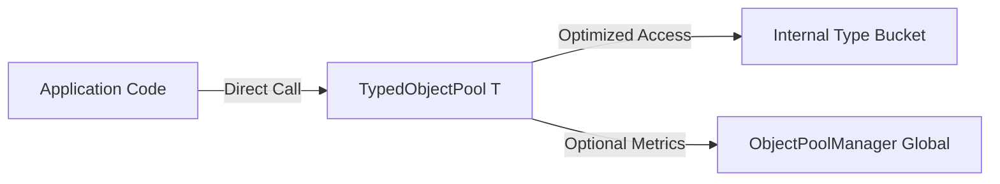

# Typed Object Pools

Typed Object Pools provide a high-performance, type-safe facade for interacting with object pools. They eliminate generic dispatch overhead and provide direct access to specific object buckets.

## Architecture

The `TypedObjectPool<T>` sits between your application and either a central `ObjectPoolManager` or a standalone `ObjectPool`.



## Source Mapping

- `src/Nalix.Framework/Memory/Objects/TypedObjectPool.cs`

## Main Types

### TypedObjectPool<T>
The primary high-performance wrapper for pools. It can operate in two modes:
1. **Managed**: Connected to `ObjectPoolManager` (Preferred). Provides full metrics and global management.
2. **Standalone**: Connected directly to an `ObjectPool`. Best for local, isolated pooling.

## Key API Members

| Member | Description |
| :--- | :--- |
| `Get()` | Retrieves a fresh instance of `T`. |
| `Return(obj)` | Resets and returns an instance to the pool. |
| `Prealloc(count)` | Warm up the pool by pre-creating instances. |
| `GetMultiple(count)` | Batch retrieval of objects into a list. |
| `ReturnMultiple(objs)` | Batch return of objects to the pool. |
| `Trim(percentage)` | Releases a percentage of idle objects to the GC. |

## Recommended Performance Pattern

For maximum throughput, store the pool in a `static readonly` or `private readonly` field to avoid repeated manager lookups.

```csharp
private static readonly TypedObjectPool<DataPacket> _packetPool = 
    ObjectPoolManager.Instance.GetTypedPool<DataPacket>();

public void SendData()
{
    var packet = _packetPool.Get();
    try 
    { 
        // Use packet...
    }
    finally 
    { 
        _packetPool.Return(packet); 
    }
}
```

## Metrics and Diagnostics

When a `TypedObjectPool<T>` is created via `ObjectPoolManager`, it automatically inherits the manager's diagnostic capabilities:
- **Outstanding Tracking**: Tracks objects rented but not yet returned (requires `EnableDiagnostics`).
- **Cache Statistics**: Tracks hits, misses, and throughput.
- **Leak Detection**: Integrated with `PoolSentinel` for GC-based leak reporting.


## Related APIs

- [Object Pooling](./object-pooling.md)
- [Object Map](./object-map.md)
- [Buffer Management](./buffer-management.md)
