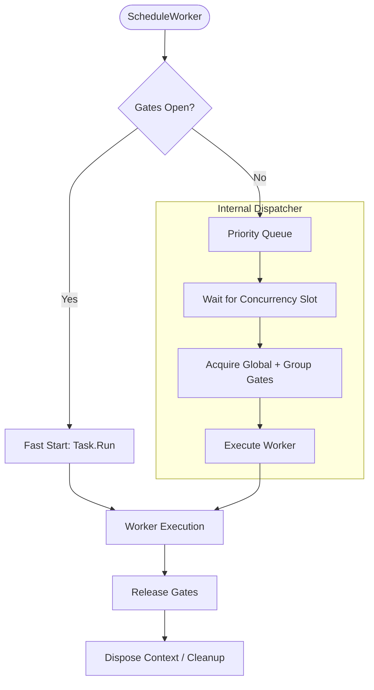

# Task Manager

`TaskManager` is the core background worker engine for Nalix. It provides prioritized task scheduling, concurrency gating, and comprehensive diagnostics for both transient workers and recurring jobs.

## Task Scheduling & Concurrency Model

Nalix uses a sophisticated multi-gate concurrency model to ensure that background tasks do not saturate the system while maintaining relative priorities.

## Concurrency Layer (Source-Verified)

The `TaskManager` manages three layers of execution control:

### 1. Global Concurrency Gate
Controlled by `TaskManagerOptions.MaxWorkers`. This is a global semaphore that limits the total number of parallel workers running across the entire application.

### 2. Group-Level Gates
Each worker can belong to a named `Group`. You can configure per-group capacity limits to ensure a specific workload (e.g., "database-sync") doesn't starve other critical tasks (e.g., "network-heartbeats").

### 3. Priority Dispatching
Workers with higher `WorkerPriority` values are automatically moved to the front of the queue by the internal `PriorityQueue`. This ensures that high-priority system maintenance tasks execute before low-priority analytical tasks.

## Workers vs. Recurring Tasks

| Feature | Worker Task | Recurring Task |
|---|---|---|
| **Lifecycle** | Runs once and completes. | Runs indefinitely at a set interval. |
| **Scheduling** | Pushed into priority queue. | Dedicated timer-based loop. |
| **Reentrancy** | Manual. | Configurable via `NonReentrant` option. |
| **Common Use** | File I/O, Database Updates. | Health Checks, Cache Cleanup. |

## Operational APIs

### `ScheduleWorker`
Adds a one-time task to the system. Returns an `IWorkerHandle` for tracking progress or cancellation.

### `ScheduleRecurring`
Starts a background loop. You can monitor the `LastRunUtc` and `ConsecutiveFailures` through the returned `IRecurringHandle`.

### `GenerateReport()`
Produces a comprehensive diagnostic report (text-based) detailing CPU usage, memory footprint, and the top-50 most active/aged workers.

## Best Practices

- **Always use Groups**: Grouping workers allows for fine-grained monitoring and group-level cancellation.
- **Set Timeouts**: Use `WorkerOptions.Timeout` to prevent "zombie" workers from holding onto concurrency slots indefinitely.
- **Monitor Reports**: Regularly check `AverageWorkerExecutionTime` to detect performance regressions in your background logic.

## Related APIs

- [Worker Options](../options/worker-options.md)
- [Recurring Options](../options/recurring-options.md)
- [Concurrency Contracts](../../common/concurrency-contracts.md)
