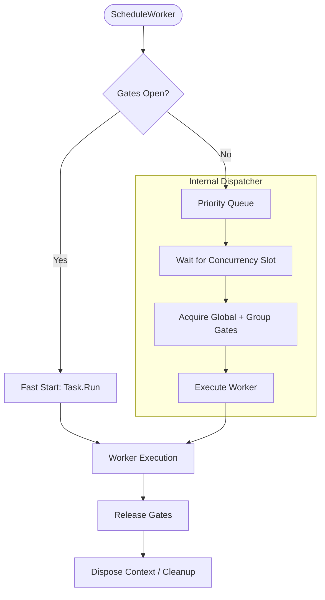

# Task Manager

`TaskManager` is the core background worker engine for Nalix. It provides prioritized task scheduling, concurrency gating, and comprehensive diagnostics for both transient workers and recurring jobs.

## Task Scheduling & Concurrency Model

Nalix uses a sophisticated multi-gate concurrency model to ensure that background tasks do not saturate the system while maintaining relative priorities.

## Concurrency Layer (Source-Verified)

The `TaskManager` manages three layers of execution control:

### 1. Global Concurrency Gate

Controlled by `TaskManagerOptions.MaxWorkers`. This is a global semaphore that limits the total number of parallel workers running across the entire application.

### 2. Group-Level Gates

Each worker can belong to a named `Group`. You can configure per-group capacity limits to ensure a specific workload (e.g., "database-sync") doesn't starve other critical tasks (e.g., "network-heartbeats").

### 3. Priority Dispatching

Workers with higher `WorkerPriority` values are automatically moved to the front of the queue by the internal `PriorityQueue`. This ensures that high-priority system maintenance tasks execute before low-priority analytical tasks.

## Workers vs. Recurring Tasks

| Feature | Worker Task | Recurring Task |
|---|---|---|
| **Lifecycle** | Runs once and completes. | Runs indefinitely at a set interval. |
| **Scheduling** | Pushed into priority queue. | Dedicated timer-based loop. |
| **Reentrancy** | Manual. | Configurable via `NonReentrant` option. |
| **Common Use** | File I/O, Database Updates. | Health Checks, Cache Cleanup. |

## Operational APIs

### Scheduling

| Method | Signature | Description |
| :--- | :--- | :--- |
| `ScheduleWorker` | `IWorkerHandle ScheduleWorker(string name, string group, Func<IWorkerContext, CancellationToken, ValueTask> work, IWorkerOptions? options = null)` | Adds a one-time task to the system. Returns an `IWorkerHandle` for tracking progress or cancellation. |
| `ScheduleRecurring` | `IRecurringHandle ScheduleRecurring(string name, TimeSpan interval, Func<CancellationToken, ValueTask> work, IRecurringOptions? options = null)` | Starts a background loop. Returns an `IRecurringHandle` for monitoring. |
| `RunOnceAsync` | `ValueTask RunOnceAsync(string name, Func<CancellationToken, ValueTask> work, CancellationToken ct = default)` | Executes a single inline work delegate without scheduling. |

### Cancellation

| Method | Signature | Description |
| :--- | :--- | :--- |
| `CancelAllWorkers` | `int CancelAllWorkers()` | Cancels all active workers. Returns the number of workers cancelled. |
| `CancelWorker` | `void CancelWorker(ISnowflake id)` | Cancels a specific worker by its identifier. |
| `CancelGroup` | `int CancelGroup(string group)` | Cancels all workers in a named group. Returns the count cancelled. |
| `CancelRecurring` | `void CancelRecurring(string? name)` | Cancels and removes a recurring task by name. |

### Queries

| Method | Signature | Description |
| :--- | :--- | :--- |
| `GetWorkers` | `IReadOnlyCollection<IWorkerHandle> GetWorkers(bool runningOnly = true, string? group = null)` | Returns workers, optionally filtered by running state and group. |
| `GetRecurring` | `IReadOnlyCollection<IRecurringHandle> GetRecurring()` | Returns all recurring tasks. |
| `TryGetWorker` | `bool TryGetWorker(ISnowflake id, out IWorkerHandle? handle)` | Attempts to retrieve a worker by ID. |
| `TryGetRecurring` | `bool TryGetRecurring(string name, out IRecurringHandle? handle)` | Attempts to retrieve a recurring task by name. |
| `WaitGroupAsync` | `Task WaitGroupAsync(string group, CancellationToken ct = default)` | Waits for all workers in a group to complete. Supports prefix matching with `*` suffix. |

### Properties

| Property | Type | Description |
| :--- | :--- | :--- |
| `Title` | `string` | Compact status line for consoles and diagnostics. |
| `AverageWorkerExecutionTime` | `double` | Average execution time for workers in milliseconds. |
| `AverageRecurringExecutionTime` | `double` | Average execution time for recurring tasks in milliseconds. |
| `WorkerErrorCount` | `int` | Total worker errors observed. |
| `RecurringErrorCount` | `int` | Total recurring task errors observed. |
| `PeakRunningWorkerCount` | `int` | Peak number of concurrently running workers observed. |
| `AverageWorkerWaitTime` | `double` | Average time workers spent in the queue before starting, in milliseconds. |
| `P95WorkerExecutionTime` | `double` | 95th percentile worker execution time in milliseconds (approximation). |
| `P99WorkerExecutionTime` | `double` | 99th percentile worker execution time in milliseconds (approximation). |

### Diagnostics & Lifecycle

| Method | Signature | Description |
| :--- | :--- | :--- |
| `GetWorkerPercentile` | `double GetWorkerPercentile(double percentile)` | Calculates an approximate percentile for worker execution time based on histogram buckets. |
| `GenerateReport` | `string GenerateReport()` | Produces a comprehensive diagnostic report (text-based). |
| `GetReportData` | `IDictionary<string, object> GetReportData()` | Generates report data as key-value pairs. |
| `Dispose` | `void Dispose()` | Disposes the manager, cancelling all workers and recurring tasks. |

### `GenerateReport()`

Produces a comprehensive diagnostic report (text-based) detailing:

- **Throughput**: Workers and recurring tasks processed per second (TPS).
- **Latency**: Approximate P95 and P99 execution percentiles based on internal histogram buckets.
- **Congestion**: `AverageWorkerWaitTime` and `PeakRunningWorkerCount` to identify queue pressure and resource saturation.
- **Errors**: Real-time error counts and consecutive failure tracking.
- **Top Activity**: Breakdown of the top-50 most active or aged workers.

## Best Practices

- **Always use Groups**: Grouping workers allows for fine-grained monitoring and group-level cancellation.
- **Set Timeouts**: Use `WorkerOptions.ExecutionTimeout` to prevent "zombie" workers from holding onto concurrency slots indefinitely.
- **Monitor Reports**: Regularly check `AverageWorkerExecutionTime` to detect performance regressions in your background logic.

## Related APIs

- [Worker Options](./options/worker-options.md)
- [Recurring Options](./options/recurring-options.md)
- [Concurrency Contracts](../abstractions/concurrency-contracts.md)
