# Network Application

`Nalix.Hosting` provides a Microsoft-style builder and host for Nalix servers. It simplifies the setup of protocols, listeners, dispatchers, and dependency injection into a single fluent flow.

## Why use the Hosting Builder?

While you can instantiate listeners and protocols manually, the `NetworkApplicationBuilder` is **highly recommended** for production applications.

- **Unified Lifecycle**: Ensures that the memory pool, handler registry, dispatcher, and listeners are activated and deactivated in the correct order.
- **Automatic Service Injection**: Automatically registers critical shared services (Logger, ConnectionHub, BufferPool) into the `InstanceManager`.
- **Handler Discovery**: Scans assemblies for `[PacketController]` classes and performs high-performance **Handler Compilation** (Expression Trees) to eliminate reflection overhead.
- **Coexistence**: Easily manages multiple listeners (e.g., TCP and UDP) within the same application process.

The public API surface revolves around two main types:

- `NetworkApplication` is the runnable host.
- `INetworkApplicationBuilder` is the fluent configuration contract.

## Source mapping

- `src/Nalix.Hosting/NetworkApplication.cs`
- `src/Nalix.Hosting/INetworkApplicationBuilder.cs`
- `src/Nalix.Hosting/NetworkApplicationBuilder.cs`

## Startup Flow

```mermaid
graph LR
    subgraph Configuration ["Phase 1: Configuration"]
        Create["CreateBuilder()"] --> Config["Configure Loggers, Options, Hubs"]
        Config --> Discover["AddPacket()/AddPacketNamespace() & AddHandlers()"]
        Discover --> Bind["AddTcp() / AddUdp()"]
    end

    subgraph Composition ["Phase 2: Composition"]
        Bind --> Build["Build()"]
        Build --> Prep["Initialize Context"]
    end

    subgraph Activation ["Phase 3: Activation"]
        Prep --> Services["Register logger, options, registry, hub, buffers, identity"]
        Services --> Dispatch["Create and activate packet dispatch"]
        Dispatch --> Listeners["Create and start TCP/UDP listeners"]
        Listeners --> Hosted["Activate hosted services"]
    end
```



## Public members at a glance

| Type | Public members |
|---|---|
| `NetworkApplication` | `CreateBuilder()`, `ActivateAsync(...)`, `DeactivateAsync(...)`, `RunAsync(...)`, `Dispose()` |
| `INetworkApplicationBuilder` | `ConfigureLogging(...)`, `ConfigureConnectionHub(...)`, `ConfigureBufferPoolManager(...)`, `ConfigureObjectPoolManager(...)`, `ConfigureCertificate(...)`, `Configure<TOptions>(...)`, `ConfigurePacketRegistry(...)`, `AddPacket(...)`, `AddPacketNamespace(...)`, `AddHandlers(...)`, `AddHandler(...)`, `AddMetadataProvider(...)`, `ConfigureDispatch(...)`, `AddTcp(...)`, `AddUdp(...)`, `Build()` |

## Builder composition details

`Build()` captures the fluent configuration into activation-time callbacks. The host does not create listener instances during fluent configuration; listener bindings are materialized during `ActivateAsync(...)` after packet dispatch has been created.

During activation, the builder preparation callback performs this source-defined setup order:

1. register the configured `ILogger` in `InstanceManager`
2. apply all `Configure<TOptions>(...)` delegates, then call public `Validate()` when the options type exposes one
3. create or register the packet registry
4. ensure an `IConnectionHub` exists, creating `ConnectionHub(logger)` when missing
5. ensure a `BufferPoolManager` exists and bind `BufferLease.ByteArrayPool` to it
6. configure `HandshakeHandlers` with `ConfigureCertificate(...)` when provided, otherwise initialize the default identity path
7. register metadata providers once

Listener factories then resolve the shared `IConnectionHub` from `InstanceManager` and construct `TcpServerListener` or `UdpServerListener` with the protocol instance, optional explicit port, and optional UDP authentication predicate.

## `NetworkApplication`

`NetworkApplication` manages the lifecycle of the server runtime. It handles the activation and deactivation of the packet dispatcher, protocols, and listeners in the correct order.
The hosted pipeline remains generic-friendly, so the same builder flow works for built-in packets and custom packet types.

### Lifecycle methods

- `ActivateAsync(...)`: Acquires the lifecycle gate, runs builder preparation callbacks, creates packet dispatch, best-effort registers it as `IPacketDispatch`, activates packet dispatch, creates and starts each TCP/UDP listener, activates hosted services, then marks the application started.
!!! note
    Middleware in context is registered globally but executed in the sharded dispatch loop. Ensure your custom middleware is thread-safe or uses localized state.
- `RunAsync(...)`: Calls `ActivateAsync(...)`, waits until cancellation, then calls `DeactivateAsync(CancellationToken.None)` in a `finally` block.
- `DeactivateAsync(...)`: Stops and disposes listeners in reverse order, disposes protocols in reverse order, deactivates hosted services in reverse order, deactivates the packet dispatcher, waits for background task groups (`net/*` and `time/*`) via `ITaskManager.WaitGroupAsync`, clears runtime lists, then marks the application stopped.
- `Dispose()`: Starts `DeactivateAsync(CancellationToken.None)`, logs deferred failures, disposes the lifecycle gate, and suppresses finalization.

## `INetworkApplicationBuilder`

The builder uses a fluent API to configure the host before it is built.

### Logging and Options

- `ConfigureLogging(ILogger)`: Registers the logger into the `InstanceManager` immediately and stores it for later host construction.
- `ConfigureConnectionHub(IConnectionHub)`: Registers the shared connection hub into the `InstanceManager`. If omitted, the builder creates a default `ConnectionHub` during activation.
- `ConfigureBufferPoolManager(BufferPoolManager)`: Explicitly registers a custom buffer pool manager and binds `BufferLease.ByteArrayPool` to that manager for pooled receive/send paths. If omitted, the builder creates and binds a default manager during activation.
- `ConfigureObjectPoolManager(ObjectPoolManager)`: Explicitly registers a custom object pool manager for pooled object paths. If omitted, the builder creates and binds a default manager during activation.
- `ConfigureCertificate(string path)`: Stores the certificate path for activation; the path is passed to `HandshakeHandlers.SetCertificatePath(...)` during builder preparation.
- `Configure<TOptions>(Action<TOptions>)`: Configures a specific options type during activation by mutating `ConfigurationManager.Instance.Get<TOptions>()`.

!!! note
    The builder automatically registers built-in `SessionHandlers`, `HandshakeHandlers`, and `SystemControlHandlers` in its constructor before user-defined handler discovery runs.
    `Configure<TOptions>(...)` applies delegates during host activation, not at the fluent call site. Use it for options that must be loaded into `ConfigurationManager` before dispatch and listeners start.

### Packet and Handler Discovery

- `AddPacket(assembly, requirePacketAttribute)`: Scans an assembly for packet types.
- `AddPacket(assemblyPath, requirePacketAttribute)`: Loads a `.dll` path and scans it for packet types.
- `AddPacket<TMarker>(...)`: Marker-type shortcut for scanning packets.
- `AddPacketNamespace(packetNamespace, recursive)`: Scans currently loaded assemblies and includes matching packet namespaces.
- `AddPacketNamespace(assemblyPath, packetNamespace, recursive)`: Scopes namespace discovery to one assembly path.
- `ConfigurePacketRegistry(IPacketRegistry)`: Uses a pre-built registry and skips hosting auto-registration.
- `AddHandlers(assembly)`: Scans an assembly for `[PacketController]` classes. Handler-scanned assemblies are also registered for packet discovery with `requireAttribute: false`.
- `AddHandlers<TMarker>()`: Marker-type shortcut for scanning handlers.
- `AddHandler<THandler>()`: Manually registers a handler type.
- `AddHandler<THandler>(Func<THandler> factory)`: Registers a handler type with a custom factory.

Manual handler registrations override assembly-scanned registrations for the same handler type because the builder resolves handlers into a type-keyed dictionary before configuring dispatch.

### Metadata and Dispatch

- `AddMetadataProvider<TProvider>()`: Registers a packet metadata provider.
- `AddMetadataProvider<TProvider>(Func<TProvider> factory)`: Registers a metadata provider with a custom factory.
- `ConfigureDispatch(Action<PacketDispatchOptions<IPacket>>)`: Configures the `PacketDispatchChannel` options, including middleware and custom logic for built-in and custom packet pipelines.

When dispatch is created, the builder applies logging first, then all `ConfigureDispatch(...)` callbacks, then resolved handler registrations.

### Server Bindings

- `AddTcp<TProtocol>()`: Registers a TCP server for the specified protocol using the configured `NetworkSocketOptions.Port`.
- `AddTcp<TProtocol>(Func<IPacketDispatch, TProtocol> factory)`: Registers a TCP server with a custom protocol factory.
- `AddTcp<TProtocol>(ushort port)`: Registers a TCP server for an explicit port, overriding the socket option for that binding.
- `AddTcp<TProtocol>(ushort port, Func<IPacketDispatch, TProtocol> factory)`: Registers an explicit-port TCP server with a custom protocol factory.
- `AddUdp<TProtocol>()`: Registers a UDP server for the specified protocol using the configured `NetworkSocketOptions.Port`.
- `AddUdp<TProtocol>(Func<IConnection, EndPoint, ReadOnlySpan<byte>, bool> authen)`: Registers a UDP server with a custom authentication predicate.
- `AddUdp<TProtocol>(Func<IPacketDispatch, TProtocol> factory)`: Registers a UDP server with a custom protocol factory.
- `AddUdp<TProtocol>(Func<IPacketDispatch, TProtocol> factory, Func<IConnection, EndPoint, ReadOnlySpan<byte>, bool> authen)`: Registers a UDP server with both a custom factory and an authentication predicate.
- `AddUdp<TProtocol>(ushort port)`: Registers a UDP server for an explicit port.
- `AddUdp<TProtocol>(ushort port, Func<IConnection, EndPoint, ReadOnlySpan<byte>, bool> authen)`: Registers an explicit-port UDP server with an authentication predicate.
- `AddUdp<TProtocol>(ushort port, Func<IPacketDispatch, TProtocol> factory)`: Registers an explicit-port UDP server with a custom protocol factory.
- `AddUdp<TProtocol>(ushort port, Func<IPacketDispatch, TProtocol> factory, Func<IConnection, EndPoint, ReadOnlySpan<byte>, bool> authen)`: Registers an explicit-port UDP server with both a custom factory and authentication predicate.

Protocol types can expose a constructor that accepts `IPacketDispatch`; otherwise the builder uses the default Nalix activator path without dispatch constructor injection.

## Basic usage

```csharp
var app = NetworkApplication.CreateBuilder()
    .ConfigureLogging(logger)
    .ConfigureConnectionHub(new ConnectionHub(logger: logger))
    .ConfigureBufferPoolManager(new BufferPoolManager(logger))
    .Configure<NetworkSocketOptions>(options =>
    {
        options.Port = 57206;
    })
    .AddPacket<Handshake>()
    .AddHandlers<SampleHandlers>()
    .AddTcp<SampleProtocol>()
    .Build();

await app.RunAsync(cancellationToken);
```

## Zero-allocation receive checklist

To keep message reading allocation-free on the server hot path:

- register a `BufferPoolManager` with `ConfigureBufferPoolManager(...)` (or let the builder create one)
- keep protocol `ProcessMessage(...)` lease-based (`args.Lease`) and forward directly to dispatch
- avoid copying raw payload into new `byte[]` in middleware/protocol unless required by business logic

## Related APIs

- [Nalix.Hosting package overview](../../packages/nalix-hosting.md)
- [Protocol](../network/protocol.md)
- [TCP Listener](../network/tcp-listener.md)
- [UDP Listener](../network/udp-listener.md)
- [Packet Dispatch](../runtime/routing/packet-dispatch.md)
- [Packet Registry](../codec/packets/packet-registry.md)
- [Configuration](../environment/configuration.md)
- [Instance Manager (DI)](../framework/instance-manager.md)

