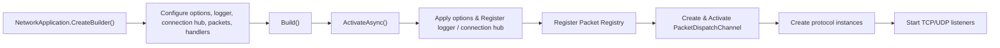

# Network Application

`Nalix.Network.Hosting` provides a Microsoft-style builder and host for Nalix servers. It simplifies the setup of protocols, listeners, dispatchers, and dependency injection into a single fluent flow.

The public API surface revolves around two main types:

- `NetworkApplication` is the runnable host.
- `INetworkApplicationBuilder` is the fluent configuration contract.

## Source mapping

- `src/Nalix.Network.Hosting/NetworkApplication.cs`
- `src/Nalix.Network.Hosting/INetworkApplicationBuilder.cs`
- `src/Nalix.Network.Hosting/NetworkApplicationBuilder.cs`

## Startup Flow



## Public members at a glance

| Type | Public members |
|---|---|
| `NetworkApplication` | `CreateBuilder()`, `ActivateAsync(...)`, `DeactivateAsync(...)`, `RunAsync(...)`, `Dispose()` |
| `INetworkApplicationBuilder` | `ConfigureLogging(...)`, `ConfigureConnectionHub(...)`, `ConfigureBufferPoolManager(...)`, `Configure<TOptions>(...)`, `AddPacket(...)`, `AddHandlers(...)`, `AddHandler(...)`, `AddMetadataProvider(...)`, `ConfigureDispatch(...)`, `AddTcp(...)`, `AddUdp(...)`, `Build()` |

## `NetworkApplication`

`NetworkApplication` manages the lifecycle of the server runtime. It handles the activation and deactivation of the packet dispatcher, protocols, and listeners in the correct order.
The hosted pipeline remains generic-friendly, so the same builder flow works for built-in packets and custom packet types.

### Lifecycle methods

- `ActivateAsync(...)`: Starts the application. It initializes the packet registry, activates the dispatcher, and starts all registered TCP and UDP listeners.
- `RunAsync(...)`: Activates the application and waits indefinitely until cancellation is requested, then deactivates it.
- `DeactivateAsync(...)`: Gracefully stops all listeners and disposes of protocols and the dispatcher.
- `Dispose()`: Synchronous cleanup that calls `DeactivateAsync`.

## `INetworkApplicationBuilder`

The builder uses a fluent API to configure the host before it is built.

### Logging and Options

- `ConfigureLogging(ILogger)`: Registers the logger into the `InstanceManager`.
- `ConfigureConnectionHub(IConnectionHub)`: Registers the shared connection hub into the `InstanceManager`.
- `ConfigureBufferPoolManager(BufferPoolManager)`: Explicitly registers a custom buffer pool manager.
- `Configure<TOptions>(Action<TOptions>)`: Configures a specific options type. This is applied during the activation phase.

> [!NOTE]
> If you do not configure a connection hub or buffer pool manager, the builder can create default instances during build/activation.
> The built-in handler set is registered automatically before user-defined handler discovery runs.

### Packet and Handler Discovery

- `AddPacket(assembly, requirePacketAttribute)`: Scans an assembly for packet types.
- `AddPacket<TMarker>(...)`: Marker-type shortcut for scanning packets.
- `AddHandlers(assembly)`: Scans an assembly for `[PacketController]` classes.
- `AddHandlers<TMarker>()`: Marker-type shortcut for scanning handlers.
- `AddHandler<THandler>()`: Manually registers a handler type.
- `AddHandler<THandler>(Func<THandler> factory)`: Registers a handler type with a custom factory.

### Metadata and Dispatch

- `AddMetadataProvider<TProvider>()`: Registers a packet metadata provider.
- `AddMetadataProvider<TProvider>(Func<TProvider> factory)`: Registers a metadata provider with a custom factory.
- `ConfigureDispatch(Action<PacketDispatchOptions<IPacket>>)`: Configures the `PacketDispatchChannel` options, including middleware and custom logic for built-in and custom packet pipelines.

### Server Bindings

- `AddTcp<TProtocol>()`: Registers a TCP server for the specified protocol.
- `AddTcp<TProtocol>(Func<IPacketDispatch, TProtocol> factory)`: Registers a TCP server with a custom protocol factory.
- `AddUdp<TProtocol>()`: Registers a UDP server for the specified protocol.
- `AddUdp<TProtocol>(Func<IPacketDispatch, TProtocol> factory)`: Registers a UDP server with a custom protocol factory.

## Basic usage

```csharp
var app = NetworkApplication.CreateBuilder()
    .ConfigureLogging(logger)
    .ConfigureConnectionHub(new ConnectionHub())
    .ConfigureBufferPoolManager(new BufferPoolManager())
    .Configure<NetworkSocketOptions>(options =>
    {
        options.Port = 57206;
    })
    .AddPacket<Handshake>()
    .AddHandlers<SampleHandlers>()
    .AddTcp<SampleProtocol>()
    .Build();

await app.RunAsync(cancellationToken);
```

## Related APIs

- [Nalix.Network.Hosting package overview](../../packages/nalix-network-hosting.md)
- [Protocol](../network/protocol.md)
- [TCP Listener](../network/tcp-listener.md)
- [UDP Listener](../network/udp-listener.md)
- [Packet Dispatch](../runtime/routing/packet-dispatch.md)
- [Packet Registry](../framework/packets/packet-registry.md)
- [Configuration & DI](../framework/runtime/configuration.md)
