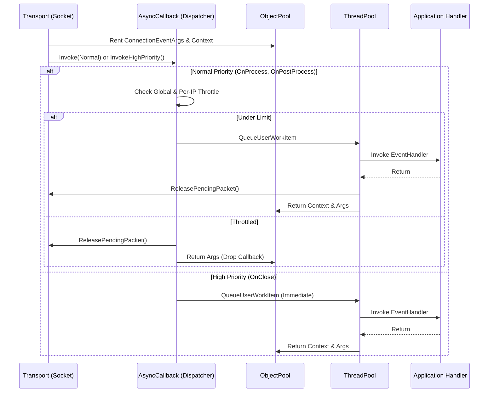

# Connection Events

In Nalix, network events are orchestrated through a high-performance, dual-lane callback system. This system ensures that critical operations (like disconnects) are never delayed by a flood of regular traffic.

## Source Mapping

- `src/Nalix.Network/Connections/Connection.EventArgs.cs`
- `src/Nalix.Network/Internal/Transport/AsyncCallback.cs`

## Event Execution Pipeline

The following diagram illustrates how event arguments are pooled and dispatched across the two processing lanes.

## Internal Responsibilities (Source-Verified)

### 1. Dual-Lane Dispatching

Nalix separates callbacks into two distinct lanes to maintain system stability under load:

- **Normal Priority**: Handles `OnProcess` and `OnPostProcess` packet events. These are subject to both global caps and per-IP fairness limits.
- **High Priority**: Handles `OnClose` and `Disconnect` events. These **bypass all backpressure limits**, ensuring that even during a heavy DDoS attack, the system can always release connection resources.

!!! important "Backpressure Enforcement"
    If the global `MaxPendingNormalCallbacks` limit is reached, Nalix will drop incoming normal-priority callbacks and log a warning. This prevents a "Callback Explosion" from crashing the server process.

### 2. Per-IP Fairness Tracking

The dispatcher enforces per-IP fairness to prevent a single attacker from monopolizing the global callback quota:

- `MaxPendingPerIp`: Maximum normal-priority callbacks pending for a single remote IP (default 64). Callbacks from that IP are dropped individually once exceeded.
- `FairnessMapSize`: Size of the fixed-size hash-map array used for per-IP tracking (default 4096). Larger values reduce hash collisions.

### 3. Zero-Allocation Pooling

Both `ConnectionEventArgs` and the internal `PooledConnectEventContext` are recyclables.

- **Two-Level Pooling**: `ConnectionEventArgs` are first attempted to be returned to a high-speed **local pool** on the `Connection` instance itself to minimize global lock contention. If the local pool is full, they fallback to the `ObjectPoolManager`.
- They are rented before being sent to the `ThreadPool`.
- They are strictly returned to the pool in a `finally` block after the user handler completes (or if the callback is throttled/dropped).

!!! warning "Handler Safety"
    Because `ConnectionEventArgs` is pooled, **you must not cache or store references to it** outside the scope of the event handler. Any data you need for long-term use should be copied into your own state objects.

### 4. Buffer Lease Reclamation

The `ConnectionEventArgs` carries a `BufferLease`.

- For `OnProcess` events, the lease is automatically managed.
- Once the callback completes throughout the entire pipeline (Normal lane), the dispatcher calls `connection.ReleasePendingPacket()`, which decrements the connection's "pending callback" counter and signals the transport layer that the next packet can be processed.

## Event Summary

| Event | Lane | Subjects | Description |
| --- | --- | --- | --- |
| `OnProcessEvent` | Normal | Packets | Logic for initial packet handling and decoding. |
| `OnPostProcessEvent` | Normal | Cleanup | Non-critical follow-up logic after processing. |
| `OnCloseEvent` | **High** | Lifecycle | Disconnect and resource cleanup logic. |

## Related Information Paths

- [Connection](./connection.md)
- [Socket Connection](../socket-connection.md)
- [Network Callback Options](../../options/network/network-callback-options.md)
- [Object Pooling](../../framework/memory/object-pooling.md)
- [Object Map](../../framework/memory/object-map.md)
- [Typed Object Pools](../../framework/memory/typed-object-pools.md)
