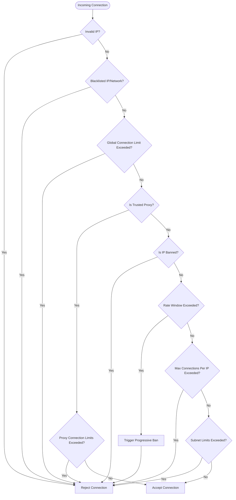

# Connection Guard

The `ConnectionGuard` is a high-performance, low-allocation concurrent connection limiter and denial-of-service (DDoS) protection engine. It filters incoming connections before they allocate socket resources, protecting the server against connection flood attacks, IP-based spam, and subnet-level resource exhaustion.

## Overview

`ConnectionGuard` operates as a gateway for TCP and WebSocket listeners. When a connection request arrives, it checks several rules:

1. **Invalid Addresses**: Rejects any requests from invalid IP addresses (e.g. `0.0.0.0` or `::`).
2. **Access Control Lists**: Rejects connections if the IP address is on the blacklisted networks defined in [Blacklist Store Options](../../options/network/connection-blacklist-store-options.md).
3. **Global Connection Limits**: Limits the maximum active connections globally (configured via `ConnectionGuardOptions.MaxConnections`).
4. **Subnet-Level Limits**: Enforces concurrent connection and rate limits per /24 (IPv4) or /48 (IPv6) subnet (configured via `ConnectionQuotaOptions.MaxConnectionsPerSubnet` and `MaxSubnetConnectionsPerWindow`). This prevents a single attacker from exhausting the server using IPs from the same subnet block.
5. **Progressive IP Banning**: If a single IP makes too many connection attempts within a short time window (`ConnectionRateWindow`), it is dynamically banned. The ban duration increases progressively on consecutive violations (e.g. 1 min, 5 min, 15 min, 1 hr, 6 hr, 24 hr).
6. **Trusted Proxies Support**: Under proxy environments (e.g. Cloudflare, Nginx), the guard checks the proxy IP against a trusted proxies list. If trusted, it applies separate limits (like `MaxConnectionsPerTrustedProxy`) and ignores progressive banning for proxy IPs.

### Architecture Interaction



## API Reference

### ConnectionGuard Class

```csharp
namespace Nalix.Network.RateLimiting;

public sealed class ConnectionGuard : IDisposable, IAsyncDisposable, IReportable
```

#### Constructors

* `public ConnectionGuard(ConnectionQuotaOptions? config = null)`  
  Initializes a guard instance. If no config is passed, default parameters are resolved from the configuration system.

#### Public Methods

* `public bool TryAccept(IPEndPoint endPoint)`
  Attempts to acquire a connection slot for the client IP. Returns `true` if accepted; `false` if rejected.

* `public void BanEndpoint(IPAddress address, TimeSpan duration)`
  Manually bans the specified IP address for the given duration.

* `public void OnConnectionClosed(object? sender, IConnectionEventArgs args)`
  Event handler triggered when a connection closes to release the slot for the client IP and decrement global metrics.


* `public string GenerateReport()`  
  Generates a formatted text diagnostics status report showing active IPs and connection counts.

* `public void WriteReportData(System.Text.Json.Utf8JsonWriter writer)`  
  Outputs structured JSON statistics.

---

### Internal Security Components

#### NetworkAccessList

Handles loading and checking of local blacklist databases and trusted proxy files from disk.

* `IsBlacklisted(IPAddress address)`: Checks if the IP is in the local blacklist hashset or CIDR ranges.
* `IsTrustedProxy(IPAddress address)`: Checks if the IP is registered in the trusted proxies configuration.
* Supports CIDR-based network matching for both IPv4 and IPv6 blacklists.

#### NetworkBanRepository
Manages persisting and recovering active progressive bans across application restarts.

* Saves active bans to a dedicated ban database file (`ban.store.dat`).
* Restores active bans on startup.

#### NetworkStore
Base helper for loading and saving binary network formats (e.g. CIDR networks lists) on disk.

## See Also

* [Connection Quota Options](../../options/network/connection-quota-options.md)
* [Connection Guard Options](../../options/network/connection-guard-options.md)
* [Trusted Proxy Options](../../options/network/trusted-proxy-options.md)
* [Connection Ban Store Options](../../options/network/connection-ban-store-options.md)
* [Connection Blacklist Store Options](../../options/network/connection-blacklist-store-options.md)
