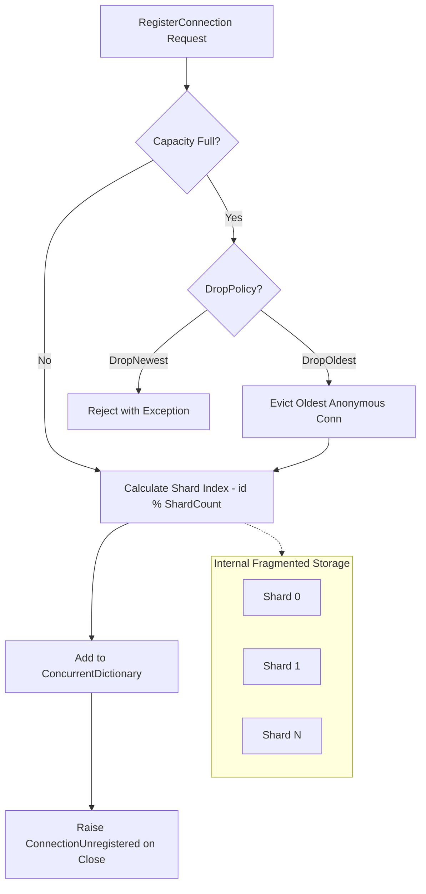

# Connection Hub

`ConnectionHub` is the central authoritative registry for all active client connections. It provides high-performance thread-safe storage, O(1) lookups, and orchestration for server-wide operations like broadcasting and bulk disconnects.

## Source Mapping

- `src/Nalix.Abstractions/Networking/IConnection.Hub.cs`
- `src/Nalix.Network/Connections/Connection.Hub.cs`

## Why This Type Exists

As a stateful server scales, managing the lifecycle of tens of thousands of concurrent connections becomes a performance bottleneck. `ConnectionHub` solves this by:

- **Shard-Aware Storage**: Fragmenting the connection pool into multiple internal dictionaries to eliminate lock contention during high-concurrency registration and removal.
- **Atomic Admission Control**: Enforcing global connection limits with configurable drop policies (Drop Oldest vs. Drop Newest).
- **Session Integration**: Acting as the gateway to the `ISessionStore` for resuming cryptographic states.

## Connection Registry Architecture

The following diagram illustrates how the Hub manages its internal shards and handles registration requests.

## Internal Responsibilities (Source-Verified)

### 1. Dictionary Fragmentation (Sharding)

The hub splits connections across `ShardCount` internal dictionaries (standard is `ProcessorCount`).

- **Hash Spreading**: The `ulong` Connection ID is hashed to determine which shard owns it.
- **Concurrency**: This allows multiple CPU cores to register or unregister connections independently without waiting for a global lock on the entire hub.

### 2. Admission and Eviction

When `MaxConnections` is enabled:

- **DropNewest**: The default behavior. Rejects new handshakes when the server is full.
- **DropOldest**: If the hub is full, it identifies the oldest **Anonymous** (not yet authenticated) connection from an internal `ConcurrentQueue` and forcibly evicts it to make room for the new arrival.

### 3. Resilience & Session Persistence

To protect the server from memory exhaustion and ensure reliable state recovery:

- **Auto-Persist on Unregister**: When a connection is closed or unregistered, the Hub automatically attempts to save its cryptographic state to the `ISessionStore`.
- **DDoS Protection**: Persistence only occurs if the connection meets a minimum complexity threshold (`MinAttributesForPersistence`). This prevents attackers from filling the session store with millions of empty, "dead" sessions from incomplete handshakes.
- **Fire-and-Forget Storage**: The storage operation is offloaded to the `ThreadPool` to ensure that unregistering a connection remains a low-latency operation.

### 4. Batched Broadcasting

Broadcasting to large numbers of clients is performed using `CaptureConnectionSnapshot()`, which rents an array from `ArrayPool<IConnection>` to avoid GC pressure.

- **Parallel Dispatch**: Broadcasts can be batched to interleave I/O operations and maintain responsive network processing for non-participating clients.

## Public APIs

- `Count`: The total number of live connections (uses `Volatile.Read` for accuracy).
- `SessionStore`: Access to the underlying session persistence layer.
- `ConnectionUnregistered`: Event raised after a connection is successfully unregistered.
- `CapacityLimitReached`: Event raised when a limit is reached and a connection is rejected.
- `RegisterConnection(conn)`: Enrolls a new connection (Thread-safe).
- `UnregisterConnection(conn)`: Removes a connection from the hub.
- `GetConnection(id)`: O(1) retrieval by Snowflake ID.
- `ListConnections()`: Returns a read-only collection of all active connections.
- `BroadcastAsync<T>(msg, sendFunc)`: High-performance fan-out.
- `BroadcastWhereAsync<T>(msg, sendFunc, predicate)`: Broadcasts only to connections matching the predicate.
- `CloseAllConnections(reason?)`: Closes all active connections with an optional reason.
- `ForceClose(INetworkEndpoint)`: Terminates all active connections from a specific IP (used by `ConnectionGuard` during DDoS detection).
- `Dispose()`: Releases all resources and closes all connections.

## Best Practices

!!! tip "Broadcast Filtering"
    Always use `BroadcastWhereAsync<T>` if you only need to send data to a subset of clients (e.g., players in the same game room). This prevents unnecessary packet serialization for clients that don't need the update.

!!! warning "Locking Caution"
    `ConnectionHub` is thread-safe, but its methods should not be called inside sensitive locks in your application code, as this could lead to deadlocks with internal Shard locks during concurrent unregistration.

## Related Information Paths

- [Connection](./connection.md)
- [Connection Hub Options](../../options/network/connection-hub-options.md)
- [Timing Wheel](../time/timing-wheel.md)
- [Session Store](../session-store.md)

