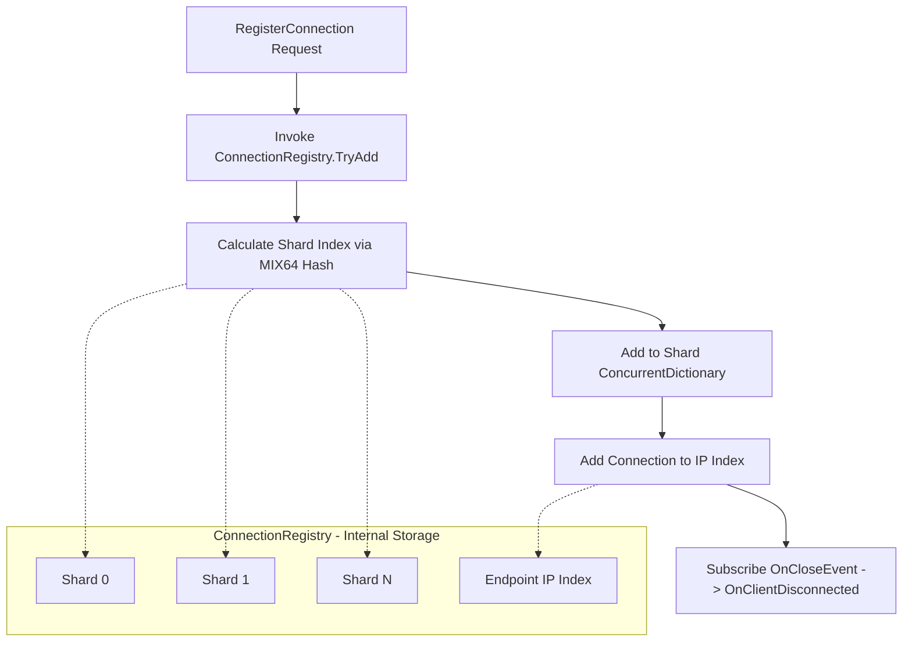

# Connection Hub

`ConnectionHub` is the central registry for all active client connections. It provides thread-safe storage, O(1) lookups, and orchestration for server-wide operations like broadcasting and bulk disconnects.

## Source Mapping

- `src/Nalix.Abstractions/Networking/IConnection.Hub.cs`
- `src/Nalix.Network/Connections/Connection.Hub.cs`
- `src/Nalix.Network/Internal/Connections/ConnectionRegistry.cs`

## Why This Type Exists

As a stateful server scales, managing the lifecycle of tens of thousands of concurrent connections becomes a performance bottleneck. `ConnectionHub` solves this by:

- **Decoupled Registry (`ConnectionRegistry`)**: Separating data storage concerns (sharding, lookup indexing) from routing, broadcasting, and event dispatch logic.
- **Shard-Aware Storage**: Splitting the connection pool into multiple internal dictionaries (`ConcurrentDictionary<ulong, IConnection>`) to eliminate lock contention during high-concurrency registration and removal.
- **Fast IP Lookup**: Maintaining a secondary endpoint index mapping client IP addresses to connection objects, facilitating efficient grouping and lookup of connections per IP.

## Architecture

The following diagram illustrates how the `ConnectionHub` leverages the `ConnectionRegistry` to manage internal shards and track connections.

```mermaid
flowchart TD
    Req[RegisterConnection Request] --> Reg[Invoke ConnectionRegistry.TryAdd]
    Reg --> ShardIdx[Calculate Shard Index via MIX64 Hash]
    ShardIdx --> AddShard[Add to Shard ConcurrentDictionary]
    AddShard --> TrackEP[Add Connection to IP Index]
    TrackEP --> Event[Subscribe OnCloseEvent -> OnClientDisconnected]

    subgraph Registry[ConnectionRegistry - Internal Storage]
        Shard0[Shard 0]
        Shard1[Shard 1]
        ShardN[Shard N]
        EPIndex[Endpoint IP Index]
    end

    ShardIdx -.-> Shard0
    ShardIdx -.-> Shard1
    ShardIdx -.-> ShardN
    TrackEP -.-> EPIndex
```

## Internal Responsibilities (Source-Verified)

### 1. Dictionary Fragmentation (Sharding)

`ConnectionRegistry` splits connections across `ShardCount` internal dictionaries (defaulting to the machine's processor count, configured in `ConnectionHubOptions`).

- **Hash Spreading**: The `ulong` Connection ID is hashed using a custom `MIX64` hash function to determine its designated storage shard.
- **Lock Reduction**: This sharding technique allows multiple CPU cores to register, unregister, or lookup connections independently, drastically reducing contention on dictionary locks.

### 2. High-Performance Snapshotting

Broadcasting and listing operations retrieve a stable snapshot using `CaptureConnectionSnapshot()`.

- **Array Renting**: The registry rents arrays from `ArrayPool<IConnection>.Shared` to collect connections from all shards without producing garbage collection (GC) pressure.
- **Thread Safety**: Snapshotting ensures that broadcasting performs network I/O outside dictionary locks, preventing deadlocks or latency spikes.

### 3. Endpoint Tracking

The registry maintains an internal dictionary mapping IP addresses to a sub-dictionary of connections.

- This allows O(1) query performance when filtering connections originating from a specific IP endpoint.
- Dynamic cleanup is performed: when the last connection from an IP address is unregistered, the IP index bucket is removed to prevent memory leaks.

### 4. Bulk Disconnect Parallelism

When the hub is disposed, it shuts down all registered connections.

- **Parallel Disconnect**: Connections are disconnected concurrently using `Parallel.ForEach` with `ParallelDisconnectDegree` (configured in `ConnectionHubOptions`) to ensure quick server shutdown.
- **Event Unsubscription**: Disconnected connections are unsubscribed from the hub events prior to disposal to prevent memory leaks.

## Public APIs

- `Count`: The total number of live connections registered in the hub.
- `ConnectionUnregistered`: Event raised after a connection is successfully unregistered from the hub.
- `RegisterConnection(conn)`: Enrolls a new connection (Thread-safe).
- `UnregisterConnection(conn)`: Removes a connection and disposes of it.
- `GetConnection(id)`: O(1) retrieval by `ulong` or `ISnowflake` ID.
- `GetConnection(ReadOnlySpan<byte> id)`: O(1) retrieval using a serialized binary ID.
- `ListConnections()`: Returns a read-only snapshot collection of all active connections.
- `ListConnections(networkEndpoint)`: Returns active connections originating from a specific remote endpoint.
- `BroadcastAsync<T>(msg, sendFunc, cancellationToken)`: High-performance parallel or batched fan-out (configured by `BroadcastBatchSize`).
- `BroadcastWhereAsync<T>(msg, sendFunc, predicate, cancellationToken)`: Broadcasts only to connections matching the filter predicate.
- `GenerateReport()`: Generates a human-readable diagnostic report of active connections, algorithm usage, and bytes statistics.
- `WriteReportData(writer)`: Writes structural JSON report data for monitoring systems.
- `Dispose()`: Releases all resources, unsubscribes events, and closes all connections in parallel.

## Best Practices

!!! tip "Broadcast Filtering"
    Always use `BroadcastWhereAsync<T>` if you only need to send data to a subset of clients (e.g., players in the same game room). This prevents unnecessary packet serialization for clients that don't need the update.

!!! warning "Avoid Locking Inside Callbacks"
    Since connection disposal and unregistration trigger event callbacks, avoid blocking or acquiring heavy application locks inside handlers subscribed to `ConnectionUnregistered` to prevent potential deadlock issues.

## Related Information Paths

- [Connection](./connection.md)
- [Connection Hub Options](../../options/network/connection-hub-options.md)
- [Timing Wheel](../time/timing-wheel.md)
- [Session Store & Service](../session-store.md)

