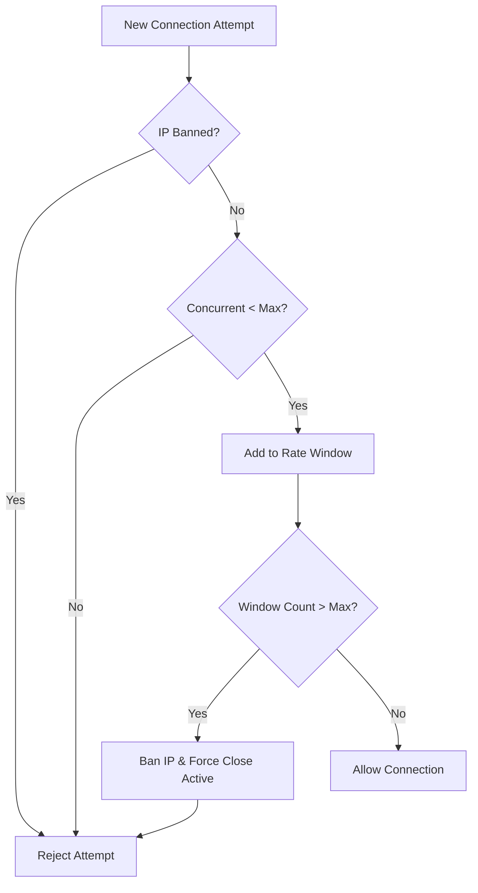

# Connection Limiter

The `ConnectionGuard` (documented here as the Connection Limiter) is a high-performance security component that gatekeeps incoming connections. It mitigates Denial of Service (DoS) attacks and resource exhaustion by enforcing per-IP and global connection limits.

## Source Mapping

- `src/Nalix.Network/RateLimiting/Connection.Guard.cs`
- `src/Nalix.Network/Options/ConnectionLimitOptions.cs`

## Why This Type Exists

Without a limiter, a single malicious client could theoretically open thousands of TCP connections, exhausting the server's file descriptors or memory. `ConnectionGuard` prevents this through:

- **Concurrent Caps**: Limiting how many active connections one IP can have.
- **Rate Limiting**: Throttling how quickly an IP can open *new* connections.
- **Automatic Banning**: Temporarily blocking IP addresses that exhibit aggressive connection behavior (DDoS detection).

## Anti-DDoS Flow

The following diagram illustrates the decision matrix used every time a new connection arrives.

## Internal Responsibilities (Source-Verified)

### 1. Sliding Window Rate Tracking

The guard uses a `ConcurrentQueue<DateTime>` per endpoint to track connection attempts within a configured `ConnectionRateWindow` (e.g., 5 seconds).

- Every new attempt "trims" old timestamps from the queue.
- If the queue exceeds `MaxConnectionsPerWindow`, the IP is flagged for DDoS.

### 2. Force Close on Ban

When an IP is banned, `ConnectionGuard` doesn't just block *new* attempts. It schedules a background worker to call `IConnectionHub.ForceClose(ip)`, which terminates all currently active sessions associated with that address, effectively neutralizing the attacker.

### 3. DDoS Log Suppression

To prevent the server's logs from being flooded during a massive attack, the guard uses a high-performance CAS (Compare-And-Swap) mechanism to suppress repeated log entries. It will only log one summary every `DDoSLogSuppressWindow`, indicating how many attempts were suppressed in the interim.

## Configuration

Settings are controlled via `ConnectionLimitOptions`:

| Option | Description | Typical Value |
| --- | --- | --- |
| `MaxConnectionsPerIpAddress` | Max active connections per single IP. | 10 - 100 |
| `MaxConnectionsPerWindow` | Max connection attempts within rate window. | 10 per 5s |
| `BanDuration` | How long to block a detected attacker. | 5 - 60 Minutes |
| `ConnectionRateWindow` | The sliding window size for rate tracking. | 1 - 10 Seconds |
| `DDoSLogSuppressWindow` | Suppresses repeated DDoS log entries from the same IP within this window. | 20 Seconds |
| `CleanupInterval` | How often expired IP tracking entries are purged from memory. | 1 Minute |
| `InactivityThreshold` | Idle time before a connection is considered inactive and eligible for cleanup. | 5 Minutes |

## Best Practices

!!! danger "Proxy Considerations"
    If your server is behind a Reverse Proxy (like Nginx), `ConnectionGuard` will see the proxy's IP for all clients by default. Ensure your load balancer is configured for **IP Transparency** or implement a custom middleware to update the `NetworkEndpoint` address before it reaches the guard.

!!! info "Memory Bounds"
    The guard automatically scavenges inactive IP entries based on `CleanupInterval`. This ensures that the memory footprint of tracking millions of unique IP addresses remains bounded.

## Related Information Paths

- [TCP Listener](../tcp-listener.md)
- [Connection Hub](../connection/connection-hub.md)
- [Security Architecture](../../../concepts/security/security-architecture.md)
