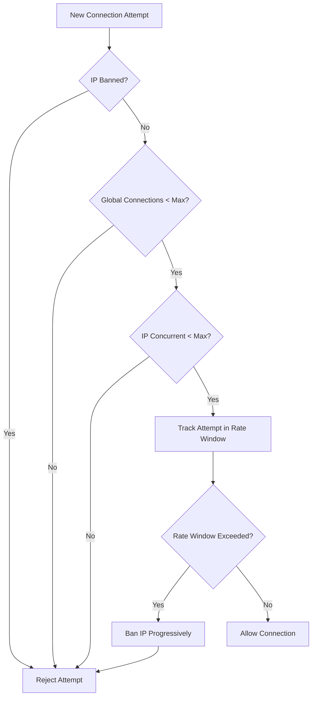

# Connection Limiter

The `ConnectionGuard` (documented here as the Connection Limiter) is a high-performance, low-allocation security component that gatekeeps incoming connections. It mitigates Denial of Service (DoS) attacks and resource exhaustion by enforcing per-IP and global connection limits.

## Source Mapping

- `src/Nalix.Network/RateLimiting/Connection.Guard.cs`
- `src/Nalix.Network/Options/ConnectionQuotaOptions.cs`
- `src/Nalix.Network/Options/ConnectionGuardOptions.cs`

## Why This Type Exists

Without a limiter, a single malicious client could opening thousands of TCP or WebSocket connections could exhaust the server's file descriptors or memory. `ConnectionGuard` prevents this through:

- **Concurrent Caps**: Limiting how many active connections a single IP address can hold concurrently.
- **Rate Limiting**: Throttling how quickly an IP address can open *new* connections.
- **Progressive Banning**: Dynamically banning IP addresses that violate connection rate thresholds.
- **Global Caps**: Enforcing a hard limit on the total number of concurrent connections across the entire server.

## Anti-DDoS Flow

The following diagram illustrates the decision matrix used by the guard when a new connection is attempted.

```mermaid
flowchart TD
    Start[New Connection Attempt] --> Banned{IP Banned?}
    
    Banned -->|Yes| Reject[Reject Attempt]
    Banned -->|No| GlobalLimitCheck{Global Connections < Max?}
    
    GlobalLimitCheck -->|No| Reject
    GlobalLimitCheck -->|Yes| PerIpLimit{IP Concurrent < Max?}
    
    PerIpLimit -->|No| Reject
    PerIpLimit -->|Yes| SlidingWindow[Track Attempt in Rate Window]
    
    SlidingWindow --> RateLimit{Rate Window Exceeded?}
    
    RateLimit -->|Yes| TriggerBan[Ban IP Progressively] --> Reject
    RateLimit -->|No| Allow[Allow Connection]
```

## Internal Responsibilities (Source-Verified)

### 1. Sliding Window Rate Tracking

The guard tracks client connection attempts within a sliding time window (`ConnectionRateWindow`).

- Incoming attempts are stored and trimmed if they fall outside the active sliding window.
- If the rate of attempts exceeds the configured `MaxConnectionsPerWindow`, a progressive ban is triggered.

### 2. Progressive IP Banning

When an IP address is banned for aggressive connection attempts, the ban duration scales progressively based on consecutive violations:

- Progressive tiers determine ban times (e.g., 1 min, 5 min, 15 min, 1 hr, 6 hr, 24 hr).
- Progressive ban states are persisted by `NetworkBanRepository` to the ban database file (`ban.store.dat`) so that bans survive application restarts.

### 3. DDoS Log Suppression

To prevent the server logs from being flooded during a massive connection flood, `ConnectionGuard` utilizes CAS (Compare-And-Swap) operations to suppress duplicate rejection log messages. It writes a single aggregated log summary showing the count of suppressed attempts periodically.

### 4. Trusted Proxy Support

Under reverse proxy environments (e.g., Cloudflare, Nginx), the guard identifies proxies via a trusted proxies list.

- Connections originating from trusted proxies bypass the progressive ban mechanism.
- Separated limits (such as `MaxConnectionsPerTrustedProxy`) are applied to proxy addresses to maintain availability.

## Configuration

Settings are controlled via `ConnectionQuotaOptions` (per-IP limits) and `ConnectionGuardOptions` (global and progressive ban limits):

### Quota Options (`ConnectionQuotaOptions`)

| Option | Description | Default Value |
| --- | --- | --- |
| `MaxConnectionsPerIpAddress` | Maximum concurrent active connections per individual IP. | `50` |
| `MaxConnectionsPerTrustedProxy` | Maximum concurrent active connections allowed from a trusted proxy IP. | `1000` |
| `MaxConnectionsPerWindow` | Maximum connection attempts allowed within the rate window. | `10` |
| `ConnectionRateWindow` | The sliding window duration for rate tracking (e.g. 5 seconds). | `00:00:05` |

### Guard Options (`ConnectionGuardOptions`)

| Option | Description | Default Value |
| --- | --- | --- |
| `MaxConnections` | Global concurrent connection limit across the entire server. | `10000` |
| `EnableProgressiveBanning` | Enables progressive scaling of ban durations on consecutive violations. | `true` |
| `BanDuration` | Base ban duration for non-progressive bans or initial progressive violation. | `00:05:00` |
| `DDoSLogSuppressWindow` | Throttling window for suppressing repeated DDoS rejection log entries. | `00:00:10` |
| `CleanupInterval` | Interval at which inactive IP tracking state is purged from memory. | `00:01:00` |

## Best Practices

!!! danger "Proxy Configurations"
    If your server operates behind a reverse proxy, the guard will see the proxy's IP address by default. You must configure trusted proxies in `TrustedProxyOptions` so that the guard can correctly resolve the true client IP and apply per-client connection limits rather than rate-limiting the proxy itself.

!!! info "Resource Scavenging"
    The guard automatically purges inactive IP state at the configured `CleanupInterval` to maintain a bounded memory footprint even under millions of unique client IPs.

## Related Information Paths

- [Connection Guard API](connection-guard.md)
- [Connection Hub](./connection-hub.md)
- [Connection Quota Options](../../options/network/connection-quota-options.md)
- [Connection Guard Options](../../options/network/connection-guard-options.md)
- [Security Architecture](../../../concepts/security/security-architecture.md)

