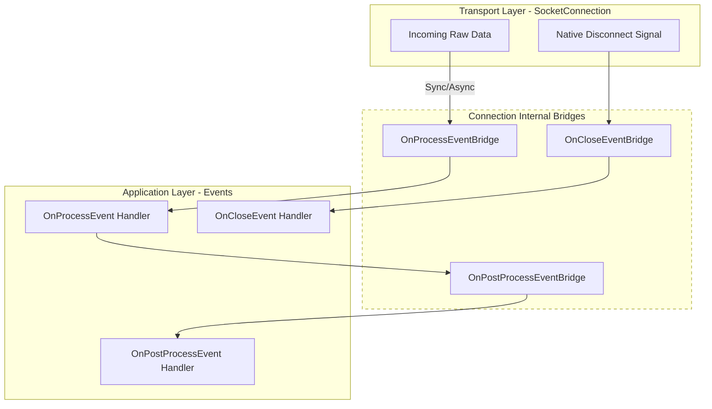

# Connection

`Connection` is the core high-level abstraction in Nalix. It acts as the owner and orchestrator for transport logic, security state (secrets/cipher suites), and the event processing pipeline.

## Source Mapping

- `src/Nalix.Common/Networking/IConnection.cs`
- `src/Nalix.Network/Connections/Connection.cs`

## Why This Type Exists

The `Connection` type provides a unified interface for specialized transport protocols (TCP/UDP) while centralizing:

- **Identity**: Every connection is assigned a unique `Snowflake` ID.
- **Security Context**: Stores the `Secret` and active `Algorithm` derived during handshake.
- **Event Orchestration**: Bridges low-level socket-read events into structured `OnProcess` and `OnPostProcess` hooks.
- **Resource Lifecycle**: Manages the cleanup of buffers, pooled metadata, and transport sockets.

## Architectural Pipeline

The following diagram illustrates how `Connection` bridges the raw `SocketConnection` events into the application-facing event system.

## Internal Responsibilities (Source-Verified)

### 1. High-Priority Event Bridging

Connection uses "Bridges" to handle events. Importantly, **Disconnect/Close events are treated as high-priority** and bypass standard backpressure queues to ensure that system resources are released immediately, even if the processing thread pool is saturated.

### 2. Error Tracking (SEC-54)

The connection maintains an internal `ErrorCount`.

- **Threshold Enforcement**: If the count exceeds `MaxErrorThreshold` (from `NetworkSocketOptions`), the connection is automatically disconnected with the reason "Exceeded maximum error threshold."
- **Noise Mitigation**: This protects the server from malformed-packet-flood attacks or buggy clients.

### 3. UDP Replay Protection

Every connection instance maintains a `SlidingWindow` (UdpReplayWindow) to track sequence numbers for incoming UDP datagrams. This prevents replay attacks by immediately rejecting any packet with a sequence ID that has already been observed or falls outside the current window.

## Public APIs

- `ID`: The 57-bit unique identifier for the session.
- `Secret / Algorithm`: Zero-allocation `Bytes32` secret and active cipher suite.
- `TCP / UDP`: Accessors to the underlying transport-specific send/receive primitives.
- `Disconnect(reason)`: Safely terminates the connection with an optional reason.
- `Attributes`: A pooled `IObjectMap` for attaching custom metadata to the connection.

## Best Practices

!!! tip "Zero-Allocation Custom Data"
    Use `connection.Attributes` to store per-client state (e.g., UserId). These attributes use a pooled object map, meaning you can store and clear data without generating GC garbage.

!!! warning "Avoid Blocking Handlers"
    `OnProcessEvent` handlers are called directly from the receive loop. To maintain high throughput and low latency, heavy processing should be offloaded using `Task.Run` or handled via `AsyncCallback` configuration.

## Related Information Paths

- [Socket Connection](../socket-connection.md)
- [Snowflake Identifiers](../../framework/runtime/snowflake.md)
- [Session Store](../session-store.md)
- [Security Architecture](../../../concepts/security/security-architecture.md)
