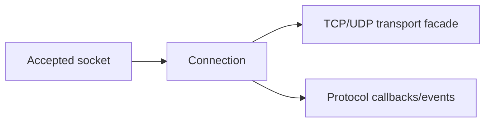

# Connection

`Connection` is the concrete `IConnection` implementation created for accepted sockets in `Nalix.Network`.

## Audit Summary

- Existing page included strong context but had source mapping references to files not present in current `Nalix.Network` tree.
- Needed tighter separation between core connection API and extension/helper docs.

## Missing Content Identified

- Correct source mapping to existing files.
- Cleaner responsibility boundary between `Connection` state and transport internals (`SocketConnection`).

## Improvement Rationale

Accurate references reduce debugging friction and keep API docs trustworthy.

## Source Mapping

- `src/Nalix.Network/Connections/Connection.cs`
- `src/Nalix.Network/Connections/Connection.EventArgs.cs`
- `src/Nalix.Network/Internal/Transport/SocketConnection.cs`

## Why This Type Exists

`Connection` provides a stable session-level abstraction around transport, identity, security state, attributes, and lifecycle events.

## Core Public Surface

- identity/endpoints: `ID`, `NetworkEndpoint`
- transports: `TCP`, `UDP`
- state: `Attributes`, `Level`, `Algorithm`, `Secret`
- metrics: `BytesSent`, `UpTime`, `LastPingTime`, `ErrorCount`
- events: `OnCloseEvent`, `OnProcessEvent`, `OnPostProcessEvent`
- lifecycle: `Close(...)`, `Disconnect(...)`, `Dispose()`

## Mental Model

## Best Practices

- Store per-session metadata in `Attributes`, not global process state.
- Use a clear owner for security fields (`Secret`, `Algorithm`, `Level`).
- Do not use transport facades after `Close/Disconnect/Dispose` begins.

## Related APIs

- [Socket Connection](../socket-connection.md)
- [Protocol](../protocol.md)
- [Connection Hub](./connection-hub.md)
- [Connection Events](./connection-events.md)
