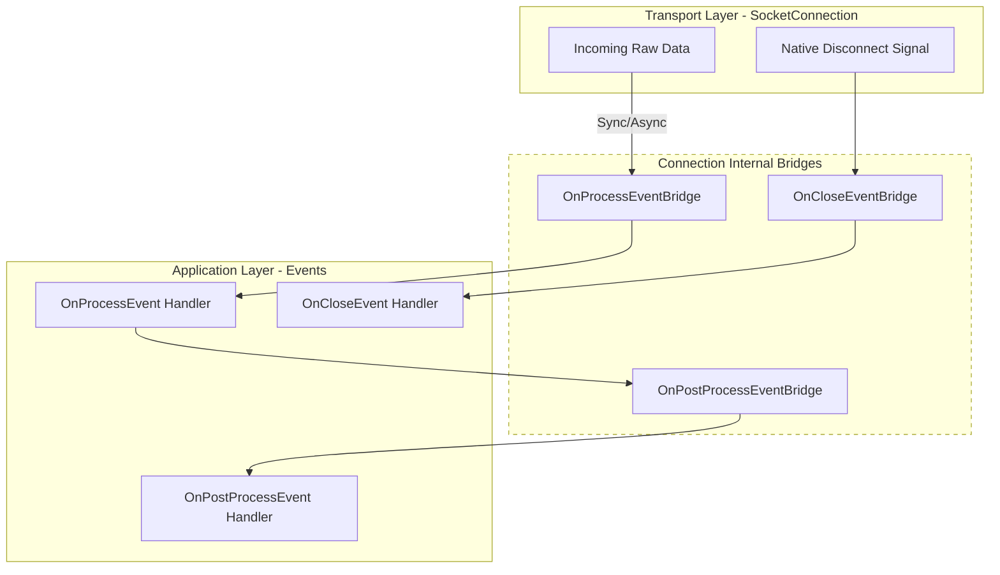

# Connection

`Connection` is the core high-level abstraction in Nalix. It acts as the owner and orchestrator for transport logic, security state (secrets/cipher suites), and the event processing pipeline.

## Source Mapping

- `src/Nalix.Abstractions/Networking/IConnection.cs`
- `src/Nalix.Network/Connections/Connection.cs`
- `src/Nalix.Network/Internal/Transport/AsyncCallback.cs`

## Why This Type Exists

The `Connection` type provides a unified interface for specialized transport protocols (TCP/UDP) while centralizing:

- **Identity**: Every connection is assigned a unique `Snowflake` ID.
- **Security Context**: Stores the `Secret` and active `Algorithm` derived during handshake.
- **Event Orchestration**: Bridges low-level socket-read events into structured `OnProcess` and `OnPostProcess` hooks.
- **Resource Lifecycle**: Manages pooled event args, attribute state, transport sockets, and teardown sequencing.

## Architectural Pipeline

The following diagram illustrates how `Connection` bridges the raw `SocketConnection` events into the application-facing event system.

```mermaid
flowchart TD
    subgraph Transport[Transport Layer - SocketConnection]
        RawData[Incoming Raw Data]
        RawClose[Native Disconnect Signal]
    end

    subgraph Hub[Connection Internal Bridges]
        ProcessBridge[OnProcessEventBridge]
        PostBridge[OnPostProcessEventBridge]
        CloseBridge[OnCloseEventBridge]
    end

    subgraph App[Application Layer - Events]
        OnProcess[OnProcessEvent Handler]
        OnPost[OnPostProcessEvent Handler]
        OnClose[OnCloseEvent Handler]
    end

    RawData -->|Sync/Async| ProcessBridge
    ProcessBridge --> OnProcess
    OnProcess --> PostBridge
    PostBridge --> OnPost
    
    RawClose --> CloseBridge
    CloseBridge --> OnClose

    style Hub stroke-dasharray: 5 5
```

## Internal Responsibilities (Source-Verified)

### 1. High-Priority Event Bridging

`Connection` wires socket callbacks into bridge methods and forwards packet/close work through `AsyncCallback`.

- **High-priority close lane**: `OnCloseEventBridge(...)` uses `AsyncCallback.InvokeHighPriority(...)` so close/disconnect callbacks are not blocked by the normal packet queue.
- **Normal packet lane**: `OnProcessEvent` and `OnPostProcessEvent` are still asynchronous work items, then each bridge disposes the pooled event args in `finally`.

### 2. Error Tracking (SEC-54)

The connection maintains an internal `ErrorCount`.

- **Threshold Enforcement**: If the count exceeds `MaxErrorThreshold` (from `ConnectionLimitOptions`), the connection is automatically disconnected with the reason "Exceeded maximum error threshold."
- **Noise Mitigation**: This protects the server from malformed-packet-flood attacks or buggy clients.

### 3. UDP Replay Protection

The connection exposes a lazily-created `UdpReplayWindow` used by UDP receive paths when replay protection is enabled. This window tracks seen sequence numbers for incoming UDP datagrams and lets the UDP pipeline reject stale or replayed packets.

## Public APIs

- `ID`: The 57-bit unique identifier for the session.
- `Secret / Algorithm`: Zero-allocation `Bytes32` secret and active cipher suite.
- `TCP / UDP`: Accessors to the underlying transport-specific send/receive primitives.
- `Disconnect(reason)`: Safely terminates the connection with an optional reason.
- `Attributes`: A pooled `IObjectMap` for attaching custom metadata to the connection.
- `NetworkEndpoint`: The remote endpoint address for this connection.
- `BytesSent`: Total number of bytes sent through this connection.
- `UpTime`: Connection uptime in milliseconds.
- `LastPingTime`: Timestamp (ms) of the last received ping.
- `Level`: The permission level of the connection (`PermissionLevel`).
- `IsRegisteredInWheel`: Whether the connection is registered in the timing wheel.
- `TimeoutVersion`: Version counter used by the timing wheel for lazy removal.
- `IsDisposed`: Whether the connection has been disposed.
- `ErrorCount`: Current cumulative error count for the connection.
- `IncrementErrorCount()`: Increments the error counter; auto-disconnects if `MaxErrorThreshold` is exceeded.
- `Dispose()`: Releases all resources used by the connection.

## Best Practices

!!! tip "Zero-Allocation Custom Data"
    Use `connection.Attributes` to store per-client state (e.g., UserId). These attributes use a pooled object map, meaning you can store and clear data without generating GC garbage.

!!! warning "Avoid Blocking Handlers"
    `OnProcessEvent` and `OnPostProcessEvent` are queued through `AsyncCallback` onto the `ThreadPool`, not invoked inline on the socket receive loop. Even so, blocking handlers still hold onto callback capacity and pooled resources longer than necessary, so keep handlers short and offload heavyweight work when needed.

## Related Information Paths

- [Socket Connection](../socket-connection.md)
- [Snowflake Identifiers](../../framework/snowflake.md)
- [Session Store](../session-store.md)
- [Security Architecture](../../../concepts/security/security-architecture.md)
