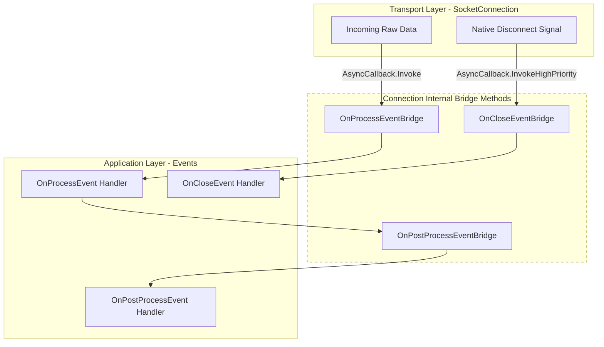

# Connection

`Connection` is the core high-level abstraction in Nalix. It acts as the owner and orchestrator for transport logic, security state (secrets/cipher suites), and the event processing pipeline.

## Source Mapping

- `src/Nalix.Abstractions/Networking/IConnection.cs`
- `src/Nalix.Abstractions/Networking/IConnection.Transmission.cs`
- `src/Nalix.Abstractions/Networking/IConnection.RateLimit.cs`
- `src/Nalix.Abstractions/Networking/IConnection.ErrorTracked.cs`
- `src/Nalix.Network/Connections/Connection.cs`

## Why This Type Exists

The `Connection` type provides a unified interface for specialized transport protocols (TCP/UDP) while centralizing:

- **Identity**: Every connection is assigned a unique `ulong` ID (derived from Snowflake).
- **Security Context**: Stores the `Secret` and active `Algorithm` derived during handshake.
- **Event Orchestration**: Bridges low-level socket-read events into structured `OnProcess` and `OnPostProcess` hooks using `AsyncCallback`.
- **Resource Lifecycle**: Manages pooled event args, attribute state, transport sockets, and teardown sequencing through an internal pooled backing store.
- **Timing Wheel Integration**: Implements `TimingWheel.ITimeoutTrackedConnection` to support low-overhead connection timeout tracking and lazy removal.

## Architectural Pipeline

The following diagram illustrates how `Connection` bridges the raw `SocketConnection` events into the application-facing event system via internal bridge methods dispatched through `AsyncCallback`.

```mermaid
flowchart TD
    subgraph Transport[Transport Layer - SocketConnection]
        RawData[Incoming Raw Data]
        RawClose[Native Disconnect Signal]
    end

    subgraph Bridge[Connection Internal Bridge Methods]
        ProcessBridge[OnProcessEventBridge]
        PostBridge[OnPostProcessEventBridge]
        CloseBridge[OnCloseEventBridge]
    end

    subgraph App[Application Layer - Events]
        OnProcess[OnProcessEvent Handler]
        OnPost[OnPostProcessEvent Handler]
        OnClose[OnCloseEvent Handler]
    end

    RawData -->|AsyncCallback.Invoke| ProcessBridge
    ProcessBridge --> OnProcess
    OnProcess --> PostBridge
    PostBridge --> OnPost

    RawClose -->|AsyncCallback.InvokeHighPriority| CloseBridge
    CloseBridge --> OnClose

    style Bridge stroke-dasharray: 5 5
```

## Internal Responsibilities (Source-Verified)

### 1. Event Bridging via AsyncCallback

`Connection` routes low-level transport frame callbacks into connection-level events using internal bridge methods dispatched through `AsyncCallback`.

- **High-priority close lane**: `OnCloseEventBridge` uses `AsyncCallback.InvokeHighPriority(...)` so close/disconnect callbacks bypass the normal queue and run immediately to ensure prompt resource teardown.
- **Normal packet lane**: `OnProcessEvent` and `OnPostProcessEvent` are queued and run asynchronously on the ThreadPool. The bridge methods dispose of the pooled `ConnectionEventArgs` in a `finally` block.

### 2. Error Tracking (SEC-54)

The connection implements `IConnectionErrorTracked` and maintains an internal `ErrorCount`.

- **Threshold Enforcement**: If the count exceeds `MaxErrorThreshold` (configured in `ConnectionGuardOptions`), the connection is automatically disconnected with the reason `"Exceeded maximum error threshold."`
- **Noise Mitigation**: This protects the server from malformed-packet-flood attacks or buggy/malicious clients.

### 3. UDP Replay Protection

The connection exposes a `UdpReplayWindow` (an instance of `SlidingWindow` sized using `DatagramGuardOptions.UdpReplayWindowSize`) to track sequence numbers on incoming UDP datagrams. This allows the UDP transport pipeline to reject stale or replayed datagrams.

### 4. Timing Wheel Tracking

`Connection` implements `TimingWheel.ITimeoutTrackedConnection`.

- It tracks `IsRegisteredInWheel` and `TimeoutVersion` to manage connection inactivity timeouts.
- During destruction, it breaks the timing wheel reference immediately to prevent the wheel from holding onto the connection object, allowing instant garbage collection.

## Public APIs

- `ID`: The unique `ulong` identifier for the connection (derived from Snowflake).
- `Secret`: Zero-allocation `Bytes32` secret derived during the handshake.
- `Algorithm`: Active cipher suite (`CipherSuiteType`).
- `Level`: The permission level of the connection (`PermissionLevel`).
- `TCP`: Accessor to the TCP transport interface (`IConnection.ITransport`).
- `UDP`: Accessor to the UDP transport interface (`IConnection.ITransport`). Throws `UdpTransportNotCreated` if UDP transport has not been established.
- `IsUdpCreated`: Boolean indicating whether UDP transport is active and safe to query.
- `NetworkEndpoint`: Remote client endpoint (`INetworkEndpoint`).
- `Attributes`: A thread-safe, pooled `IObjectMap<string, object>` for attaching custom metadata to the connection.
- `RateLimitCache`: A thread-safe cache (`ConcurrentDictionary<ushort, object>`) used for connection-level rate limiting.
- `BytesSent` / `BytesReceived`: Total raw wire bytes transmitted.
- `UpTime`: Total connection duration in milliseconds.
- `LastPingTime`: Timestamp (ms) of the last received ping from the client.
- `IsDisposed`: Returns whether the connection has been fully disposed.
- `ErrorCount`: Current cumulative error count.
- `IncrementErrorCount()`: Increments the error counter and disconnects the client if the configured limit is reached.
- `Disconnect(reason)`: Safely terminates the connection with an optional reason.

## Best Practices

!!! tip "Zero-Allocation Custom Data"
    Use `connection.Attributes` to store per-client state (e.g., UserId). These attributes use a pooled object map, meaning you can store and clear data without generating GC garbage.

!!! warning "Avoid Blocking Handlers"
    `OnProcessEvent` and `OnPostProcessEvent` are queued through `AsyncCallback` onto the `ThreadPool`, not invoked inline on the socket receive loop. Blocking handlers still hold onto callback capacity and pooled resources longer than necessary, so keep handlers short and offload heavyweight work when needed.

## Related Information Paths

- [Socket Connection](../socket-connection.md)
- [Snowflake Identifiers](../../framework/snowflake.md)
- [Session Store](../session-store.md)
- [Security Architecture](../../../concepts/security/security-architecture.md)
