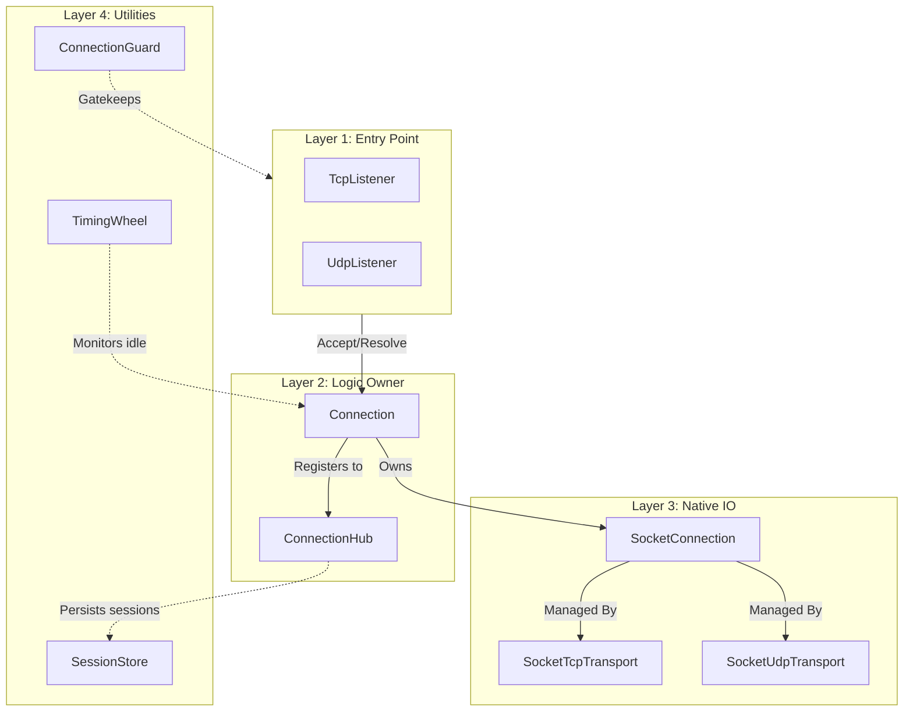

# Network API Reference

`Nalix.Network` is the server-side transport engine. It manages the lifecycle of raw sockets, performs protocol-level handshakes, and provides a structured interface for high-level application routing.

## Master Transport Landscape

The following diagram illustrates the ownership and handoff chain between the core network components.

## Progressive Reading Order

To understand the Nalix networking stack, we recommend reading the documentation in this order:

1. **[Socket Connection](./socket-connection.md)**: The lowest-level wrapper for .NET Sockets, handling Ri/Tx buffers and Layer 1 throttling.
2. **[TCP Listener](./tcp-listener.md) / [UDP Listener](./udp-listener.md)**: Entry points for accepting connections and detecting sessions.
3. **[Connection](./connection/connection.md)**: The high-level orchestrator that owns the session identity and security context.
4. **[Connection Hub](./connection/connection-hub.md)**: The central registry for looking up and managing thousands of active connections.
5. **[Timing Wheel](./time/timing-wheel.md)**: The high-efficiency timer used for cleaning up idle connections.

## Core Areas

### Connection Subsystem

- [Connection](./connection/connection.md)
- [Connection Hub](./connection/connection-hub.md)
- [Connection Events](./connection/connection-events.md)
- [Connection Extensions](./connection/connection-extensions.md)
- [Connection Limiter](./connection/connection-limiter.md)

### Protocols & Transport

- [Protocol](./protocol.md)
- [Socket Connection](./socket-connection.md)
- [TCP Listener](./tcp-listener.md)
- [UDP Listener](./udp-listener.md)
- [Session Store](./session-store.md)

### Network Options

- [Options Overview](../options/network/options.md)
- [Network Socket Options](../options/network/network-socket-options.md)
- [Connection Limit Options](../options/network/connection-limit-options.md)
- [Connection Hub Options](../options/network/connection-hub-options.md)
- [Timing Wheel Options](../options/network/timing-wheel-options.md)
- [Pooling Options](../options/network/pooling-options.md)
- [Network Callback Options](../options/network/network-callback-options.md)

## Related APIs

- [Runtime Overview](../runtime/index.md)
- [SDK Overview](../sdk/index.md)
- [API Overview](../index.md)
