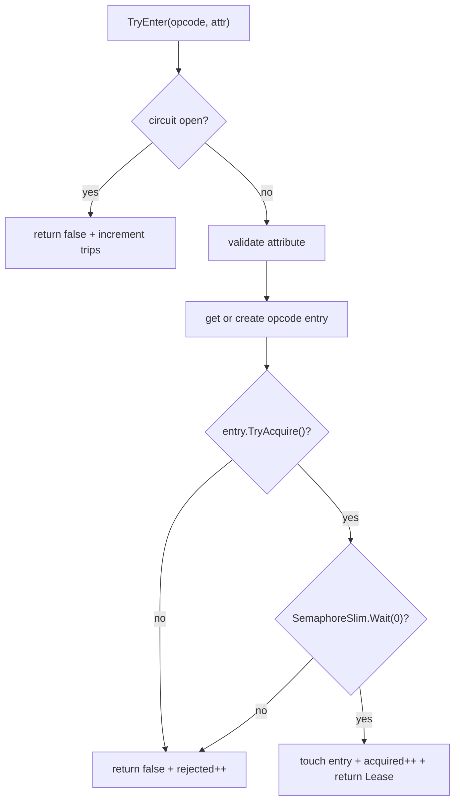

# Concurrency Options

`ConcurrencyOptions` configures the global `ConcurrencyGate` used by
`Nalix.Runtime` to enforce per-opcode packet concurrency, optional FIFO
queuing, idle-entry cleanup, and circuit-breaker behavior.

## Source Mapping

- `src/Nalix.Runtime/Options/ConcurrencyOptions.cs`
- `src/Nalix.Runtime/Throttling/ConcurrencyGate.cs`
- `src/Nalix.Network.Hosting/Bootstrap.cs`
- `src/Nalix.Common/Networking/Packets/PacketConcurrencyLimitAttribute.cs`

## Defaults and Validation

| Property | Default | Valid range | Runtime effect |
| --- | ---: | --- | --- |
| `CircuitBreakerThreshold` | `0.95` | `0.1..1.0` | Opens the gate when rejected attempts divided by total attempts is greater than this value. |
| `CircuitBreakerMinSamples` | `1000` | `10..1000000` | Minimum acquired+rejected attempts required before the circuit breaker can open. |
| `CircuitBreakerResetAfterSeconds` | `60` | `1..3600` | Duration to keep the circuit open before allowing it to close and reset counters. |
| `MinIdleAgeMinutes` | `10` | `1..1440` | Minimum age since last use before an idle opcode entry is eligible for cleanup. |
| `CleanupIntervalMinutes` | `1` | `1..60` | Recurring cleanup cadence registered with `TaskManager`. |
| `WaitTimeoutSeconds` | `20` | `1..300` | Default timeout used by `EnterAsync()` when the packet attribute enables queueing. |

`Validate()` runs DataAnnotation validation only. There are no additional cross-field
rules in the current source.

## Runtime Ownership

`ConcurrencyGate` owns a `ConcurrentDictionary<ushort, Entry>` keyed by packet opcode.
Each `Entry` contains:

- the per-opcode `SemaphoreSlim` capacity;
- whether FIFO queueing is enabled;
- the `QueueMax` limit;
- reference-count state used to avoid disposing entries while they are active;
- the last-used timestamp used by cleanup.

The entry's capacity and queue behavior come from the packet's
`PacketConcurrencyLimitAttribute`, while cleanup and circuit-breaker policies come
from `ConcurrencyOptions`.

## Construction and Cleanup Registration

The gate loads and validates options in its constructor:

```csharp
_options = ConfigurationManager.Instance.Get<ConcurrencyOptions>();
_options.Validate();
```

It then registers a recurring cleanup job with `TaskManager.ScheduleRecurring()`:

- task name: `concurrency.gate.cleanup.{hash}`;
- interval: `CleanupIntervalMinutes`;
- `NonReentrant = true`;
- tag: `TaskNaming.Tags.Service`;
- jitter: `10` seconds;
- execution timeout: `5` seconds.

!!! important "Bootstrap materialization"
    `Bootstrap.Initialize()` currently contains the `ConcurrencyOptions` materialization
    call as a commented line. In the current source, these options are loaded when a
    `ConcurrencyGate` instance is constructed, not during hosting bootstrap.

## TryEnter Flow

`TryEnter()` is the immediate, non-queueing API:



The returned `Lease` releases the semaphore and the entry reference in `Dispose()`.
Callers must dispose the lease exactly once, typically with `using` / `await using`
patterns around the protected packet handler.

## EnterAsync Flow

`EnterAsync()` uses the same circuit-breaker and attribute-validation front door. If
the entry's attribute has queueing disabled, it attempts `SemaphoreSlim.Wait(0, ct)`
and throws `ConcurrencyFailureException` when capacity is full.

If queueing is enabled, it delegates to `ENTER_WITH_QUEUE_ASYNC()` with
`WaitTimeoutSeconds` converted to a `TimeSpan`. Queue-enabled entries:

- increment the entry queue count before waiting;
- reject when `QueueCount >= QueueMax`;
- increment global `TotalQueued` when a wait is admitted;
- wait on the semaphore until capacity is available, timeout elapses, or cancellation
  is requested;
- decrement the queue count in `finally`.

On timeout or capacity rejection, the gate increments `TotalRejected` and throws the
corresponding exception (`TimeoutException` or `ConcurrencyFailureException`).

## Circuit Breaker Semantics

Every public entry path first calls the circuit-breaker check. The breaker opens only
after `TotalAcquired + TotalRejected` reaches `CircuitBreakerMinSamples`. It opens
when:

```text
TotalRejected / (TotalAcquired + TotalRejected) > CircuitBreakerThreshold
```

The comparison is strictly greater-than, not greater-than-or-equal. With the default
`0.95`, exactly `95%` rejection does not open the breaker; anything above `95%` does.

When the breaker opens, `ConcurrencyGate` stores a reset time computed from
`CircuitBreakerResetAfterSeconds`. Once that timestamp passes, the next breaker check
closes the breaker and resets `TotalAcquired` and `TotalRejected` to zero.

`CircuitBreakerTrips` is incremented when callers encounter an already-open circuit.
The open event itself is logged and tracked by the open flag/reset timestamp rather
than by that counter.

## Idle Entry Cleanup

`CLEANUP_IDLE_ENTRIES()` scans all opcode entries. An entry is eligible for removal
only when:

1. it is not disposed;
2. it has no active users;
3. its semaphore is fully available;
4. its queue count is zero;
5. `now - LastUsedUtc >= MinIdleAgeMinutes`.

Eligible entries are removed from the dictionary before disposal so new callers cannot
reuse the same entry while cleanup is disposing it. Each removal increments
`TotalCleanedEntries`.

## Diagnostics and Reporting

`GetStatistics()` exposes:

- `TotalAcquired`;
- `TotalRejected`;
- `TotalQueued`;
- `TotalCleaned`;
- `CircuitBreakerTrips`;
- `CircuitBreakerOpen`;
- `TrackedOpcodes`.

The report surface also includes `CleanupIntervalMinutes` and `MinIdleAgeMinutes`, so
runtime dumps show both operational counters and cleanup policy.

## Tuning Guidance

- Raise `WaitTimeoutSeconds` only for handlers where queueing is intentional and
  latency tolerance is known.
- Lower `CircuitBreakerThreshold` to fail fast during sustained overload; raise
  `CircuitBreakerMinSamples` if low-traffic services see noisy breaker decisions.
- Keep `CleanupIntervalMinutes` small enough to reclaim opcode entries, but not so
  small that cleanup scans become noticeable on very large opcode tables.
- Keep `MinIdleAgeMinutes` comfortably above normal burst gaps to avoid repeatedly
  disposing and recreating hot opcode entries.

## Related APIs

- [Network Options](./options.md)
- [Token Bucket Options](./token-bucket-options.md)
- [Runtime Middleware Pipeline](../../runtime/middleware/pipeline.md)
