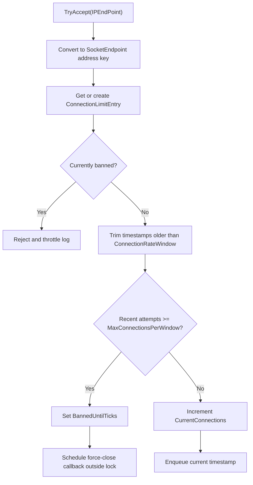

# Connection Limit Options

`ConnectionLimitOptions` configures admission control, UDP datagram limits,
connection error cutoffs, and per-endpoint cleanup behavior used by
`ConnectionGuard`, UDP listeners, UDP transports, and `Connection`.

## Source Mapping

- `src/Nalix.Network/Options/ConnectionLimitOptions.cs`
- `src/Nalix.Network/RateLimiting/Connection.Guard.cs`
- `src/Nalix.Network/Listeners/UdpListener/UdpListener.Core.cs`
- `src/Nalix.Network/Internal/Transport/SocketUdpTransport.cs`
- `src/Nalix.Network/Connections/Connection.cs`
- `src/Nalix.Network.Hosting/Bootstrap.cs`

## Defaults and Validation

| Property | Default | Validation | Runtime consumer |
| --- | ---: | --- | --- |
| `MaxConnectionsPerIpAddress` | `10` | `1..10_000` | `ConnectionGuard` concurrent slot limit per endpoint. |
| `MaxConnectionsPerWindow` | `10` | `1..10_000_000` | `ConnectionGuard` rate-window admission check. |
| `BanDuration` | `00:05:00` | `00:00:01..1.00:00:00` | Ban length after connection-attempt abuse. |
| `ConnectionRateWindow` | `00:00:05` | `00:00:01..00:10:00` | Sliding window used to trim recent connection timestamps. |
| `DDoSLogSuppressWindow` | `00:00:20` | `00:00:01..01:00:00` | Per-endpoint suppress window for reject, DDoS, and close logs. |
| `CleanupInterval` | `00:01:00` | `00:00:01..01:00:00` | Recurring cleanup interval for stale endpoint entries. |
| `InactivityThreshold` | `00:05:00` | `00:00:01..1.00:00:00` | Age cutoff for removing inactive zero-connection entries. |
| `MaxUdpDatagramSize` | `1400` | `64..65507` | Maximum UDP payload size accepted for outbound sends. |
| `MaxErrorThreshold` | `50` | `1..int.MaxValue` | Per-connection error count threshold before disconnect. |
| `UdpReplayWindowSize` | `1024` | `64..65536` | Sliding replay-protection window size allocated by `Connection`. |
| `MaxPacketPerSecond` | `128` | `1..10_000_000` | UDP listener rate limiter budget per connection. |

`Validate()` uses data annotations through
`Validator.ValidateObject(..., validateAllProperties: true)`.

## Hosting Initialization

`Bootstrap.Initialize()` loads `ConnectionLimitOptions` during server startup so the
server configuration template includes every connection-limit knob:

```csharp
_ = ConfigurationManager.Instance.Get<ConnectionLimitOptions>();
```

Runtime consumers validate the loaded instance before using it. For example,
`ConnectionGuard` validates in its constructor, and `UdpListenerBase` validates in
its static initializer.

## Admission Control Flow



`ConnectionGuard.TryAccept(...)` tracks endpoints by IP address using
`SocketEndpoint.FromIpAddress(...)`. It does not include the remote port in the key,
so the limits apply per source address.

The entry lock protects mutations to the `ConnectionLimitInfo` value snapshot. The
recent-attempt queue is a `ConcurrentQueue<DateTime>` and is trimmed against
`ConnectionRateWindow` before each admission check.

## Ban and Force-Close Behavior

When an endpoint reaches `MaxConnectionsPerWindow` within `ConnectionRateWindow`,
`ConnectionGuard`:

1. sets `BannedUntilTicks` to `now + BanDuration`;
2. emits a throttled DDoS warning;
3. rejects the connection attempt;
4. schedules a `TaskManager` worker to invoke the registered force-close callback.

The force-close callback is scheduled **after** the per-entry lock is released. This
avoids lock-ordering risks between the connection-limit entry and upstream
connection-hub or worker infrastructure.

## Release and Cleanup Behavior

`OnConnectionClosed(...)` decrements the endpoint's current connection count and
throttles close logs using `DDoSLogSuppressWindow`.

A recurring cleanup job is scheduled with:

- `interval = CleanupInterval`
- `NonReentrant = true`
- `BackoffCap = 15s`
- `Jitter = 250ms`
- `ExecutionTimeout = 2s`

Each run scans at most `1000` endpoint keys. Entries are removed only when they have
no active connections and `LastConnectionTime` is older than
`now - InactivityThreshold`. Removed entries have their timestamp queues cleared.

## UDP Integration

`UdpListenerBase` uses two values from this option set:

- `MaxPacketPerSecond` is passed to `DatagramGuard` as the per-connection UDP packet
  rate limit.
- `MaxUdpDatagramSize` is loaded through the same validated option instance used by
  UDP transport paths.

`SocketUdpTransport.Send(...)` and `SendAsync(...)` reject outbound payloads larger
than `MaxUdpDatagramSize` by throwing the cached `NetworkErrors.UdpPayloadTooLarge`.
Partial UDP sends raise `NetworkErrors.UdpPartialSend`; other non-cancellation send
failures raise `NetworkErrors.UdpSendFailed`.

## Connection Error and Replay Protection

`Connection.IncrementErrorCount()` compares the cumulative per-connection error count
against `MaxErrorThreshold`. When the threshold is reached, the connection calls
`Disconnect("Exceeded maximum error threshold.")`.

`Connection.UdpReplayWindow` lazily allocates a `SlidingWindow` using
`UdpReplayWindowSize`, so replay protection memory cost scales with active UDP
connections that actually need the replay window.

## Reporting

`ConnectionGuard` implements `IReportable`:

- `GenerateReport()` returns a human-readable status table.
- `GetReportData()` returns structured metrics including tracked endpoints,
  concurrent connections, total attempts, total rejections, total cleaned entries,
  rejection rate, and the top 50 endpoints by current load.

## Tuning Guidance

- Tune `MaxConnectionsPerWindow`, `ConnectionRateWindow`, and `BanDuration` together.
- Increase `MaxConnectionsPerIpAddress` carefully for NAT-heavy deployments.
- Keep `DDoSLogSuppressWindow` high enough to avoid log amplification during attacks.
- Keep `MaxUdpDatagramSize` conservative when targeting paths where fragmentation is
  undesirable.
- Monitor `TotalRejections` and rejection rate before tightening admission limits.

## Related APIs

- [Connection Limiter](../connection/connection-limiter.md)
- [Datagram Guard Options](./datagram-guard-options.md)
- [Network Options](./options.md)
