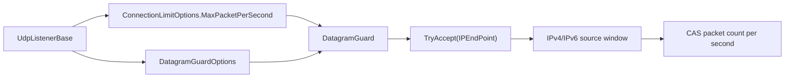

# Datagram Guard Options

`DatagramGuardOptions` configures the bounded source-window tracking used by the UDP
listener's `DatagramGuard`. The guard limits per-source packet rate through
`ConnectionLimitOptions.MaxPacketPerSecond`, while this options type controls how
many IPv4/IPv6 source windows can be tracked and how stale windows are cleaned up.

## Source Mapping

- `src/Nalix.Network/Options/DatagramGuardOptions.cs`
- `src/Nalix.Network/RateLimiting/Datagram.Guard.cs`
- `src/Nalix.Network/Listeners/UdpListener/UdpListener.Core.cs`

## UDP Listener Wiring

`UdpListenerBase` loads and validates these options in its static constructor:

```csharp
s_datagramGuardOptions = ConfigurationManager.Instance.Get<DatagramGuardOptions>();
s_datagramGuardOptions.Validate();
```

Each listener instance then constructs a `DatagramGuard` with:

- `ConnectionLimitOptions.MaxPacketPerSecond`
- `DatagramGuardOptions.IPv4Windows`
- `DatagramGuardOptions.IPv6Windows`
- `DatagramGuardOptions.CleanupInterval`
- `DatagramGuardOptions.IdleTimeout`
- `DatagramGuardOptions.IPv4Capacity`
- `DatagramGuardOptions.IPv6Capacity`



## Defaults and Validation

| Property | Default | Valid range | Source behavior |
|---|---:|---|---|
| `IPv4Windows` | `65_536` | `1..10_000_000` | Maximum number of IPv4 source windows tracked at once. |
| `IPv6Windows` | `16_384` | `1..10_000_000` | Maximum number of IPv6 source windows tracked at once. |
| `IPv4Capacity` | `1024` | `1..10_000_000` | Initial capacity hint for the IPv4 source map. |
| `IPv6Capacity` | `64` | `1..10_000_000` | Initial capacity hint for the IPv6 source map. |
| `CleanupInterval` | `00:01:00` | `00:00:01..01:00:00` | Delay between stale-window eviction passes. |
| `IdleTimeout` | `00:00:10` | `00:00:01..01:00:00` | Inactive source-window retention before eviction. |

Validation is implemented with `System.ComponentModel.DataAnnotations.Range` and
`Validate()` calls `Validator.ValidateObject(..., validateAllProperties: true)`.

## Runtime Behavior

`DatagramGuard.TryAccept(IPEndPoint)` returns `false` when:

- the guard has been disposed;
- the endpoint is `null`;
- the IPv4 or IPv6 source-window map has reached its configured limit;
- the source has already reached `MaxPacketPerSecond` in the current second.

The guard stores each source in a `WindowSlot` with a single packed `long`:

| Packed field | Meaning |
|---|---|
| high 32 bits | current second token from `Environment.TickCount64 / 1000` |
| low 32 bits | packet count in that second |

Updates use `Interlocked.CompareExchange`, so the hot path avoids locks while still
preserving a precise one-second packet counter per source.

## IPv4 and IPv6 Tracking

| Address family | Key type | Source note |
|---|---|---|
| IPv4 | `uint` from `IPAddress.Address` | Chosen to avoid `IPAddress` key allocations and hashing overhead. |
| IPv6 | `string` from `IPAddress.ToString()` | Used as the less-common fallback path for UDP DDoS scenarios. |

## Cleanup and Disposal

The constructor starts `CleanupLoopAsync` immediately. The loop waits for
`CleanupInterval`, then evicts windows whose last-seen second is older than
`IdleTimeout`.

`Dispose()` marks the guard disposed, cancels and disposes the cleanup token source,
and clears both IPv4 and IPv6 maps.

## Operational Guidance

- Increase `IPv4Windows` / `IPv6Windows` only when legitimate source cardinality is
  high enough to require it.
- Keep `IdleTimeout` short for public UDP endpoints under spoofed-source pressure.
- Tune `ConnectionLimitOptions.MaxPacketPerSecond` separately; it is the per-source
  packet-rate limit consumed by `DatagramGuard`.

## Related APIs

- [Network Options](./options.md)
- [Connection Limit Options](./connection-limit-options.md)
- [UDP Listener](../udp-listener.md)
