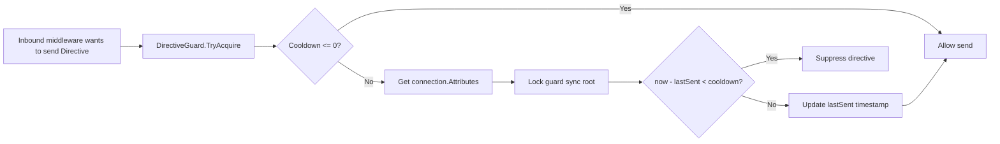

# Directive Guard Options

`DirectiveGuardOptions` configures the connection-scoped cooldown used by
`Nalix.Runtime` middleware before sending repeated inbound directive
responses such as `UNAUTHORIZED`, `RATE_LIMITED`, and `TIMEOUT`.

## Source Mapping

- `src/Nalix.Runtime/Options/DirectiveGuardOptions.cs`
- `src/Nalix.Runtime/Internal/RateLimiting/DirectiveGuard.cs`
- `src/Nalix.Runtime/Middleware/Standard/PermissionMiddleware.cs`
- `src/Nalix.Runtime/Middleware/Standard/RateLimitMiddleware.cs`
- `src/Nalix.Runtime/Middleware/Standard/ConcurrencyMiddleware.cs`
- `src/Nalix.Runtime/Middleware/Standard/TimeoutMiddleware.cs`

## Defaults and Validation

| Property | Default | Validation | Runtime effect |
| --- | ---: | --- | --- |
| `DefaultCooldownMs` | `200` | `0..60000` | Minimum cooldown, in milliseconds, between repeated directives of the same category per connection. `0` disables suppression. |

`Validate()` uses `System.ComponentModel.DataAnnotations.Range` and calls
`Validator.ValidateObject(..., validateAllProperties: true)`.

## Runtime Flow

`DirectiveGuard` loads and validates the options once through the global
configuration manager:

```csharp
private static readonly DirectiveGuardOptions s_options =
    ConfigurationManager.Instance.Get<DirectiveGuardOptions>();

static DirectiveGuard() => s_options.Validate();
```

When middleware wants to send an inbound directive, it calls:

```csharp
DirectiveGuard.TryAcquire(connection, lastSentAtAttributeKey, cooldownMs: null)
```

If `cooldownMs` is `null`, `DefaultCooldownMs` is used. If the resolved cooldown is
`0` or negative, the guard returns `true` immediately and no suppression occurs.



## Connection Attribute Storage

The guard stores cooldown state in `connection.Attributes`:

| Attribute | Purpose |
| --- | --- |
| `ConnectionAttributes.InboundDirectiveGuardSyncRoot` | Per-connection lock object used to serialize updates to directive timestamps. |
| Caller-provided `lastSentAtAttributeKey` | Stores the last sent timestamp as `long Environment.TickCount64`. |

`GET_OR_CREATE_SYNC_ROOT(...)` creates and stores the lock object in the connection
attribute map when missing. Timestamp reads and writes are performed while holding
that per-connection lock.

## Current Callers

| Middleware | Suppressed directive category | Attribute key |
| --- | --- | --- |
| `PermissionMiddleware` | Unauthorized response | `InboundDirectiveUnauthorizedLastSentAtMs` |
| `RateLimitMiddleware` | Rate-limited response | `InboundDirectiveRateLimitedLastSentAtMs` |
| `ConcurrencyMiddleware` | Rate-limited response for concurrency denial/failure | `InboundDirectiveRateLimitedLastSentAtMs` |
| `TimeoutMiddleware` | Timeout response | `InboundDirectiveTimeoutLastSentAtMs` |

## Important Semantics

- The cooldown is per connection and per attribute key, not global.
- The default cooldown only applies when callers do not pass an override.
- The guard suppresses repeated directive responses; it does not allow the blocked
  packet to continue through the middleware pipeline.
- `Environment.TickCount64` is used for elapsed-time checks, with subtraction wrapped
  in `unchecked(...)`.

## Related APIs

- [Network Options](./options.md)
- [Token Bucket Options](./token-bucket-options.md)
- [Concurrency Options](./concurrency-options.md)
