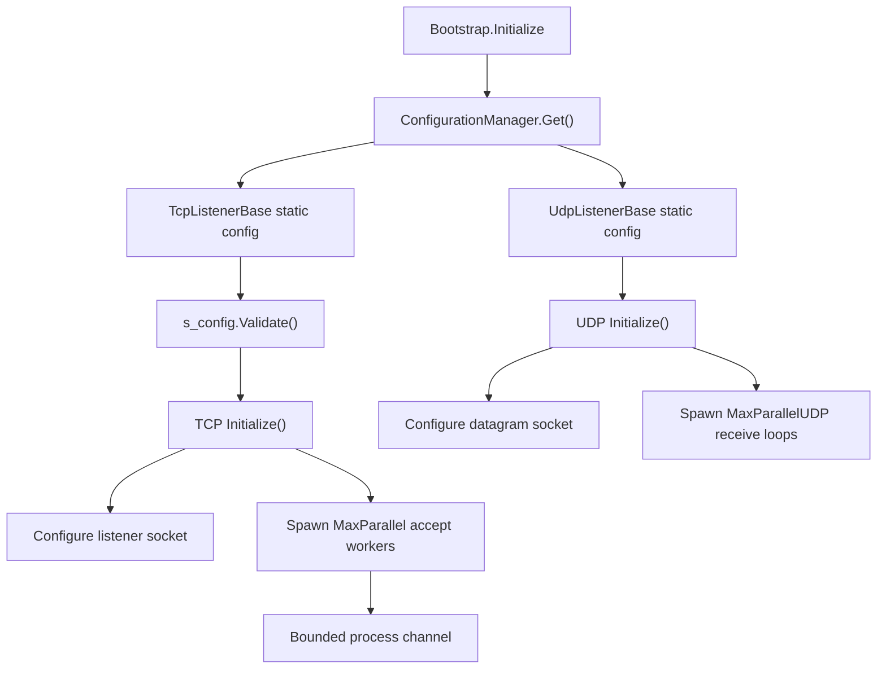

# Network Socket Options

`NetworkSocketOptions` configures the shared socket policy used by Nalix TCP and UDP
listeners. The options are loaded from `ConfigurationManager`, validated by the
listener type initializers, and then applied during listener activation and per-socket
setup.

## Source Mapping

| Source | Runtime responsibility |
| --- | --- |
| `src/Nalix.Network/Options/NetworkSocketOptions.cs` | Defines defaults, INI comments, and validation attributes. |
| `src/Nalix.Network.Hosting/Bootstrap.cs` | Materializes `NetworkSocketOptions` during bootstrap. |
| `src/Nalix.Network/Listeners/TcpListener/TcpListener.Core.cs` | Loads and validates the static TCP listener config. |
| `src/Nalix.Network/Listeners/TcpListener/TcpListener.SocketConfig.cs` | Applies TCP listener and accepted-client socket options. |
| `src/Nalix.Network/Listeners/TcpListener/TcpListener.ProcessChannel.cs` | Uses `ProcessChannelCapacity` for the bounded accept-processing channel. |
| `src/Nalix.Network/Listeners/UdpListener/UdpListener.Core.cs` | Loads the UDP listener config and default port. |
| `src/Nalix.Network/Listeners/UdpListener/UdpListener.SocketConfig.cs` | Applies UDP socket options, dual-mode, buffers, and Windows UDP reset handling. |
| `src/Nalix.Network/Internal/Transport/SocketUdpTransport.cs` | Reuses the configured buffer size for UDP transport receive paths. |

## Defaults and Validation

| Property | Default | Validation | Runtime effect |
| --- | ---: | --- | --- |
| `Port` | `57206` | `1..65535`; setter rejects `0` | Default TCP/UDP listen port for constructors that do not pass an explicit port. |
| `Backlog` | `512` | `1..65535` | Passed to TCP `Socket.Listen(backlog)`. |
| `EnableTimeout` | `true` | none | Enables TCP idle-timeout registration/removal with the shared `TimingWheel`. |
| `EnableIPv6` | `false` | none | Chooses IPv6 listener sockets; otherwise IPv4 sockets are used. |
| `NoDelay` | `true` | none | Applied to accepted TCP client sockets to disable Nagle's algorithm. |
| `MaxParallel` | `5` | `1..1024` | Number of TCP accept-worker loops scheduled at activation. |
| `MaxParallelUDP` | `2` | `1..1024` | Number of UDP receive loops scheduled at activation. |
| `BufferSize` | `65536` | `2048..10_485_760` | Applied to TCP listener receive buffer, TCP client send/receive buffers, UDP send/receive buffers, and UDP transport buffer usage. |
| `KeepAlive` | `true` | none | Enables TCP keep-alive on accepted client sockets. |
| `ReuseAddress` | `true` | none | Controls `ExclusiveAddressUse = !ReuseAddress` and socket-level `ReuseAddress`. |
| `MaxGroupConcurrency` | `8` | `1..1024` | Reported by UDP diagnostics as the configured group-concurrency limit. |
| `DualMode` | `true` | none | Enables IPv4-mapped traffic on IPv6 listener sockets when `EnableIPv6` is true and the platform supports it. |
| `ProcessChannelCapacity` | `256` | `1..int.MaxValue` | Capacity of the bounded TCP accept-processing channel. |

`Validate()` runs `Validator.ValidateObject(..., validateAllProperties: true)`. TCP
listeners call validation in the static constructor and again during instance
construction. UDP listener static initialization currently validates its guard options
but does not call `s_options.Validate()` directly; bootstrap materialization and TCP
listener construction still validate the same source type when those paths are used.

!!! note "Process channel capacity default"
    The `ProcessChannelCapacity` INI comment says default `128`, but the source default is
    `256`. Treat `256` as the source-of-truth runtime value.

## Construction and Ownership Flow



The options object is configuration-owned. Listener instances read it through static
fields and do not dispose or mutate it.

## TCP Listener Socket Behavior

During `TcpListenerBase.Initialize()`:

- if `EnableIPv6` is true, the listener first attempts an IPv6 `Socket` with
  `DualMode = s_config.DualMode` before binding;
- failed IPv6/DualMode setup is logged and falls back to IPv4;
- `ExclusiveAddressUse` is set to `!ReuseAddress`;
- `ReuseAddress` is set before bind;
- the listener receive buffer is set to `BufferSize`;
- the socket binds to `IPv6Any` or `Any` and calls `Listen(Backlog)`.

Accepted TCP client sockets are configured by `InitializeOptions(Socket)`:

- `Blocking = true`;
- `NoDelay = s_config.NoDelay`;
- `SendBufferSize = BufferSize`;
- `ReceiveBufferSize = BufferSize`;
- when `KeepAlive` is true, TCP keep-alive is enabled.

Keep-alive tuning attempts the cross-platform TCP options first:

| Option | Value |
| --- | ---: |
| `TcpKeepAliveTime` | `3` seconds |
| `TcpKeepAliveInterval` | `1` second |
| `TcpKeepAliveRetryCount` | `3` probes |

If that fails on Windows, the code falls back to `IOControlCode.KeepAliveValues` with a
12-byte little-endian payload: enabled, `3000 ms` time, `1000 ms` interval. On
non-Windows platforms where the cross-platform call fails, the fallback is skipped.

## TCP Accept and Processing Flow

`MaxParallel` controls how many accept-worker recurring tasks are scheduled. The TCP
listener also creates a bounded process channel with:

```text
capacity = ProcessChannelCapacity
SingleReader = true
SingleWriter = false
FullMode = BoundedChannelFullMode.Wait
```

This means accept workers apply backpressure instead of dropping accepted sockets when
the process channel is full. Tune `ProcessChannelCapacity` with `Backlog`, accept-worker
count, and protocol handshake latency.

When `EnableTimeout` is true, TCP connections are registered with the shared
`TimingWheel` after initialization and removed from it during shutdown/cleanup. The
option does not affect UDP listener timeout behavior.

## UDP Listener Socket Behavior

During `UdpListenerBase.Initialize()`:

- `EnableIPv6` selects `AddressFamily.InterNetworkV6` and `IPAddress.IPv6Any`; otherwise
  IPv4 `AddressFamily.InterNetwork` and `IPAddress.Any` are used;
- if the socket is IPv6 and `DualMode` is true, `_socket.DualMode = true` is attempted
  as best effort;
- UDP sockets are configured before bind;
- the listener binds to the selected wildcard address and configured port;
- `_anyEndPoint` is reset to the same address family for `ReceiveFromAsync` reuse.

`ConfigureSocket(Socket)` applies UDP-specific tuning:

- `Blocking = false`;
- `ExclusiveAddressUse = !ReuseAddress`;
- `SendBufferSize = BufferSize`;
- `ReceiveBufferSize = BufferSize`;
- socket-level `ReuseAddress` when enabled;
- `DontFragment = true` as best effort;
- on Windows, disables `SIO_UDP_CONNRESET` so ICMP port-unreachable messages do not
  surface as disruptive receive exceptions.

`NoDelay` and `KeepAlive` are intentionally TCP-only and are not applied to UDP sockets.

## Diagnostics

TCP reports expose values such as `EnableIPv6`, `DualMode`, `Backlog`, `BufferSize`,
`KeepAlive`, `ReuseAddress`, `EnableTimeout`, and `MaxParallelAccepts`.

UDP reports expose the configured port, socket buffer size, IPv6 mode, and
`GroupConcurrencyLimit = MaxGroupConcurrency`. In the current source,
`MaxGroupConcurrency` is diagnostic/configuration metadata for UDP reports; receive-loop
parallelism is controlled by `MaxParallelUDP`.

## Tuning Guidance

- Increase `Backlog` and `ProcessChannelCapacity` together for bursty TCP handshakes.
- Increase `MaxParallel` only when accept workers are saturated; too many accept loops
  can add scheduling overhead.
- Keep `MaxParallelUDP` proportional to datagram volume and CPU budget.
- Size `BufferSize` for throughput, but remember it is applied per accepted TCP socket
  and to UDP sockets, so high values multiply memory pressure under many connections.
- Use `EnableIPv6 + DualMode` when a single IPv6 socket should also accept IPv4-mapped
  traffic; keep IPv4 fallback behavior in mind for platforms without dual-stack support.
- Enable `KeepAlive` for long-lived TCP sessions behind NAT/firewalls; the hard-coded
  keep-alive probe profile detects dead peers quickly.

## Related APIs

- [TCP Listener](../tcp-listener.md)
- [UDP Listener](../udp-listener.md)
- [Connection Limit Options](./connection-limit-options.md)
- [Timing Wheel Options](./timing-wheel-options.md)
