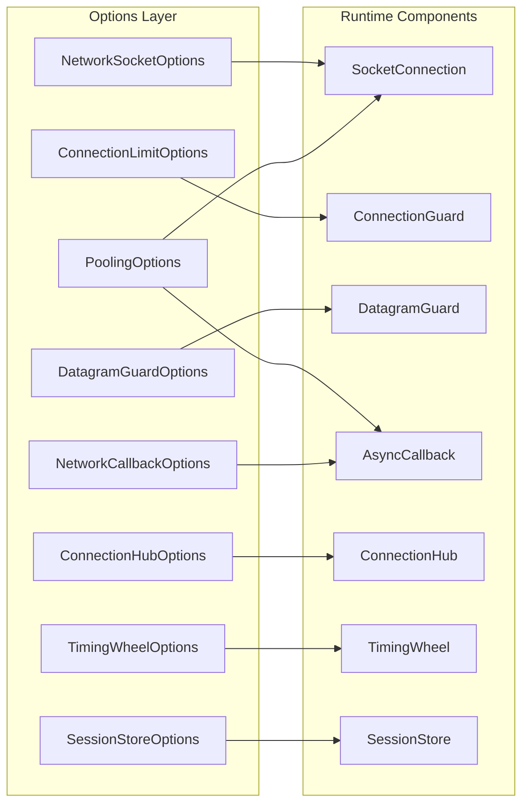

# Network Options

Network options represent the "tunable knobs" of the Nalix networking stack. They control everything from raw socket behavior and buffer pooling to administrative limits and security policies.

## Configuration Topology

The following diagram illustrates how various Options classes map to the core runtime components they configure.

## Option Ownership Matrix

Nalix uses a modular configuration system. Depending on the packages you have installed, different options become available.

| Option type | Package | Primary Role | Tuning Impact |
| --- | --- | --- | --- |
| `NetworkSocketOptions` | `Nalix.Network` | Low-level OS socket settings. | Throughput / Latency |
| `PoolingOptions` | `Nalix.Network` | Memory and object pool limits. | GC Pressure |
| `ConnectionLimitOptions` | `Nalix.Network` | Anti-DDoS, per-IP caps, UDP datagram size, and replay window. | Security |
| `DatagramGuardOptions` | `Nalix.Network` | Bounded UDP source-window tracking. | Security / Memory |
| `ConnectionHubOptions` | `Nalix.Network` | Hub sharding and total capacity. | Concurrency |
| `TimingWheelOptions` | `Nalix.Network` | Idle cleanup granularity. | CPU Overhead |
| `NetworkCallbackOptions` | `Nalix.Network` | ThreadPool dispatch pressure. | Stability |
| `SessionStoreOptions` | `Nalix.Network` | Token TTL and persistence. | Reliability |
| `DispatchOptions` | `Nalix.Runtime` | Internal message routing. | Parallelism |
| `CompressionOptions` | `Nalix.Framework` | LZ4 threshold settings. | Bandwidth |
| `TokenBucketOptions` | `Nalix.Network.Pipeline` | Token-bucket traffic shaping. | QoS |
| `ConcurrencyOptions` | `Nalix.Network.Pipeline` | Global concurrency gate and circuit-breaker thresholds. | Resilience |
| `DirectiveGuardOptions` | `Nalix.Network.Pipeline` | Inbound directive cooldown suppression. | Anti-spam |

## Internal Guidelines (Source-Verified)

### 1. Hub Sharding

`ConnectionHubOptions.ShardCount` defaults to `max(1, Environment.ProcessorCount)` and must be at least `1`. It controls how many internal connection dictionary shards the hub uses to reduce contention during registration, lookup, broadcast, and disconnect operations.

### 2. Callback Backpressure

`NetworkCallbackOptions.MaxPendingNormalCallbacks` acts as the server's circuit breaker. If Nalix cannot keep up with the incoming packet rate, it will drop callbacks rather than allowing the `ThreadPool` queue to grow indefinitely, preventing an "Out of Memory" event.

### 3. Startup Validation

All Nalix options implement `Validate()`. The framework strongly recommends calling `options.Validate()` during your application's bootstrap phase to catch configuration errors (like negative timeouts or zero-capacity pools) before the network starts.

!!! tip "Operational Recommendation"
    In production deployments, prioritize tuning `NetworkCallbackOptions` and `ConnectionLimitOptions` first. These provide the highest protection against noisy or malicious traffic.

## Related Information Paths

- [Configuration System](../../framework/runtime/configuration.md)
- [Instance Manager (DI)](../../framework/runtime/instance-manager.md)
- [TCP Listener](../tcp-listener.md)
- [UDP Listener](../udp-listener.md)
- [Connection Hub](../connection/connection-hub.md)
