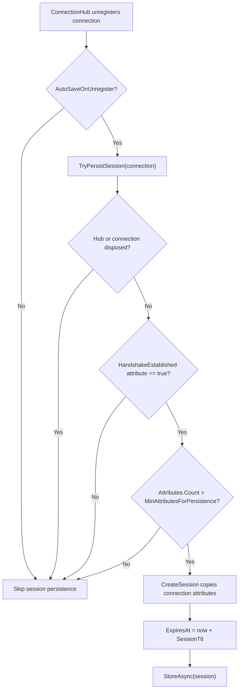

# Session Store Options

`SessionStoreOptions` controls resumable-session retention and the automatic
persistence policy used when connections leave `ConnectionHub`.

## Source Mapping

- `src/Nalix.Network/Options/SessionStoreOptions.cs`
- `src/Nalix.Network/Sessions/SessionStoreBase.cs`
- `src/Nalix.Network/Sessions/InMemorySessionStore.cs`
- `src/Nalix.Network/Connections/Connection.Hub.cs`
- `src/Nalix.Network.Hosting/Bootstrap.cs`

## Defaults and Validation

| Property | Default | Validation | Runtime consumer |
| --- | ---: | --- | --- |
| `SessionTtl` | `00:30:00` | Required and `> TimeSpan.Zero` | `SessionStoreBase.CreateSession(...)` sets `ExpiresAtUnixMilliseconds`. |
| `AutoSaveOnUnregister` | `true` | None | `ConnectionHub.TryUnregisterCore(...)` gates automatic persistence. |
| `MinAttributesForPersistence` | `4` | `0..int.MaxValue` | `ConnectionHub.TryPersistSession(...)` rejects low-value sessions. |

`Validate()` first runs data-annotation validation through
`Validator.ValidateObject(..., validateAllProperties: true)`, then explicitly
rejects non-positive `SessionTtl` values.

## Hosting Initialization

`Bootstrap.Initialize()` materializes this option set during server startup:

```csharp
_ = ConfigurationManager.Instance.Get<SessionStoreOptions>();
```

This ensures `server.ini` contains the resumable-session retention and persistence
policy alongside the other network-level options.

## Session Creation Flow



`SessionStoreBase.CreateSession(...)` snapshots the connection into a `SessionEntry`:

- `SessionToken` is derived from `connection.ID.Toulong()`.
- `CreatedAtUnixMilliseconds` uses `Clock.UnixMillisecondsNow()`.
- `ExpiresAtUnixMilliseconds` is `now + SessionTtl.TotalMilliseconds`.
- `Secret`, `Algorithm`, and `Level` are copied from the connection.
- Connection attributes are copied into a rented `ObjectMap<string, object>`.

## Automatic Persistence Contract

`ConnectionHub.TryUnregisterCore(...)` attempts persistence before disposing the
removed connection. Persistence is intentionally guarded:

1. automatic persistence must be enabled;
2. the hub and connection must still be active;
3. `ConnectionAttributes.HandshakeEstablished` must exist and be `true`;
4. `connection.Attributes.Count` must be greater than `MinAttributesForPersistence`.

The attribute threshold is an anti-abuse filter. It avoids retaining handshake-only
or nearly empty sessions that could otherwise be created in bulk by short-lived
connections.

If `StoreAsync(...)` completes synchronously and successfully, the session is owned
by the store. If storing throws immediately, the newly created `SessionEntry` is
returned. If storing completes asynchronously, `PersistSessionAsync(...)` awaits it
without blocking unregistration and returns the session only if persistence fails.

## In-Memory Store Behavior

`InMemorySessionStore` is the default store used by `ConnectionHub` when no custom
`ISessionStore` is injected.

### Storage and Replacement

`StoreAsync(...)` uses a `ConcurrentDictionary<ulong, SessionEntry>` keyed by the
session token:

- first insert wins when the token is absent;
- storing the same `SessionEntry` reference again is a no-op;
- replacing an existing token uses `TryUpdate(...)` and returns the old entry.

### Expiration

Expiration is enforced in two places:

- a background scavenger runs every minute and removes expired entries;
- `RetrieveAsync(...)` and `ConsumeAsync(...)` also perform lazy TTL checks.

Expired entries are removed from the dictionary and returned to their backing pools
through `SessionEntry.Return()`.

### Consume Semantics

`ConsumeAsync(...)` uses `ConcurrentDictionary.TryRemove(...)`, so a session token is
atomic one-shot state: only one concurrent caller can successfully consume and resume
it. Expired consumed entries are returned and reported as `null`.

### Disposal

`InMemorySessionStore.Dispose()` cancels the scavenger token, cancels the scheduled
cleanup worker through `TaskManager`, disposes the worker handle, and suppresses
finalization. Cleanup errors are handled best-effort for non-fatal exceptions.

## Memory Management Notes

- Session snapshots own a rented `ObjectMap<string, object>` containing copied
  connection attributes.
- Store implementations must return replaced, removed, expired, or failed-to-store
  `SessionEntry` instances.
- The default in-memory store returns entries on replacement, removal, lazy
  expiration, consumption expiration, and background scavenging.
- Automatic persistence avoids blocking connection unregistration on asynchronous
  stores.

## Tuning Guidance

- Keep `SessionTtl` aligned with authentication token lifetime and key rotation.
- Lower `SessionTtl` to reduce retained state and replay-token lifetime.
- Raise `MinAttributesForPersistence` when public endpoints see many handshake-only
  disconnects.
- Lower `MinAttributesForPersistence` only if legitimate resumable sessions carry
  few attributes.
- Disable `AutoSaveOnUnregister` when session persistence is handled explicitly or by
  a custom lifecycle policy.
- Use a distributed `ISessionStore` for multi-node deployments and preserve the same
  TTL and one-shot consume semantics.

## Related APIs

- [Session Store](../session-store.md)
- [Session Resume](../../security/session-resume.md)
- [Network Options](./options.md)

