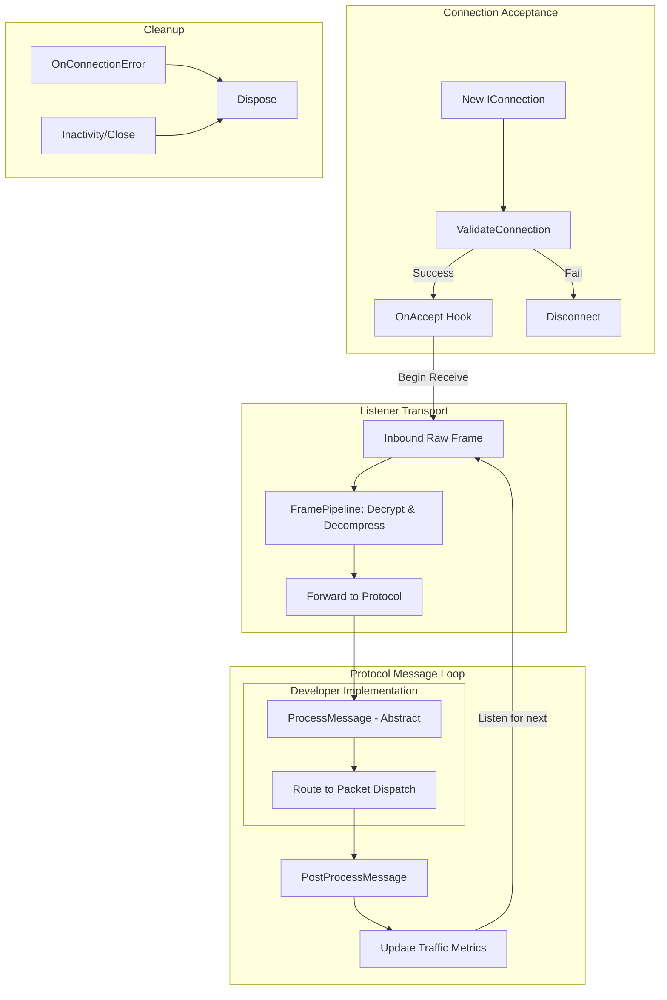

# Protocol

`Protocol` is the abstract base used by `TcpListenerBase` and `UdpListenerBase` to validate new connections, handle processed messages, and run post-processing logic.

## Source Mapping

- `src/Nalix.Network/Protocols/Protocol.Core.cs`
- `src/Nalix.Network/Protocols/Protocol.PublicMethods.cs`
- `src/Nalix.Network/Protocols/Protocol.Lifecycle.cs`
- `src/Nalix.Network/Protocols/Protocol.Metrics.cs`

## Why This Type Exists

`Protocol` centralizes shared application-level protocol concerns (acceptance, error accounting, post-processing) so derived protocols only provide message logic. 

!!! important
    Transport-level concerns like decryption and decompression, as well as **connection registration with the ConnectionHub**, are now handled by the **Listener** layer before the protocol is invoked.



## Core Contract

```csharp
public abstract void ProcessMessage(object? sender, IConnectEventArgs args);
```

Runtime default flow:

1. The **Listener** receives a raw frame and applying the `FramePipeline` (decrypt/decompress).
2. `ProcessMessage(...)` (derived implementation) handles payload semantics. **This must be implemented.**
3. `PostProcessMessage(...)` updates counters and optional disconnect behavior.

## Implementation Contract

To create a custom protocol, you must inherit from `Protocol` and provide the following:

```csharp
public class MyProtocol : Protocol
{
    public override void ProcessMessage(object? sender, IConnectEventArgs args)
    {
        // 1. Read packet data from args.Lease (already decrypted/decompressed)
        // 2. Perform business routing (e.g., call a Dispatcher)
        // 3. The lease is disposed automatically after this method returns
    }
}
```

## Key Public Members

- `ProcessMessage(object? sender, IConnectEventArgs args)`
- `PostProcessMessage(object? sender, IConnectEventArgs args)`
- `OnAccept(IConnection connection, CancellationToken cancellationToken = default)`
- `SetConnectionAcceptance(bool isEnabled)`
- `GenerateReport()` / `GetReportData()`
- `IsAccepting`
- `KeepConnectionOpen`
- `TotalMessages`
- `TotalErrors`

## Extensibility Points

- `ValidateConnection(IConnection connection)`: Called during the accept phase. Return `false` to reject a connection immediately.
- `OnAccept(IConnection connection, CancellationToken cancellationToken = default)`: Called when a connection is successfully admitted (after registration to the Hub). Useful for sending initial "Welcome" packets or setting session state.
- `OnPostProcess(IConnectEventArgs args)`: Runs after `ProcessMessage`.
- `OnConnectionError(IConnection connection, Exception exception)`: Capture transport layer failures or protocol violations.
- `Dispose(bool disposing)`: Standard lifecycle cleanup.

## Best Practices

- Keep protocol code focused on transport/protocol rules; route business logic to packet handlers.
- Use `ValidateConnection` for admission checks only.
- Use `GenerateReport()` / `GetReportData()` when debugging acceptance and post-process failures.

## Related APIs

- [TCP Listener](./tcp-listener.md)
- [Connection](./connection/connection.md)
- [Packet Dispatch](../runtime/routing/packet-dispatch.md)
