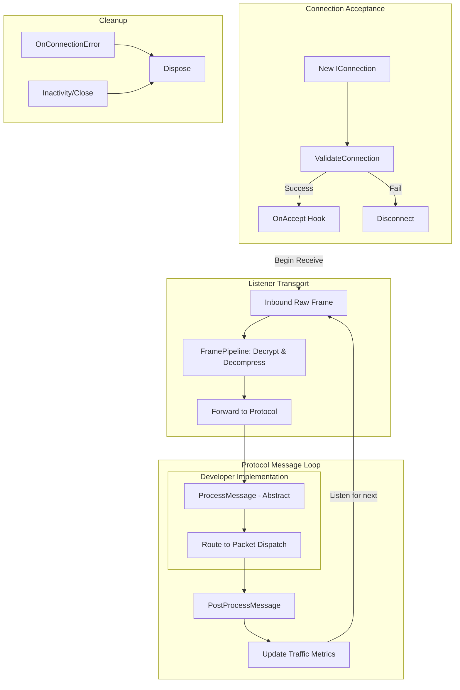

# Protocol

`Protocol` is the abstract base used by Nalix listeners to validate accepted TCP connections, process already-transformed message payloads, and run shared post-processing logic.

## Source Mapping

- `src/Nalix.Network/Protocols/Protocol.Core.cs`
- `src/Nalix.Network/Protocols/Protocol.PublicMethods.cs`
- `src/Nalix.Network/Protocols/Protocol.Lifecycle.cs`
- `src/Nalix.Network/Protocols/Protocol.Metrics.cs`

## Why This Type Exists

`Protocol` centralizes shared application-level protocol concerns (acceptance, error accounting, post-processing) so derived protocols only provide message logic.

!!! important
    Transport-level concerns like decryption and decompression are handled by the listener layer before `ProcessMessage(...)` is invoked.


```mermaid
flowchart TD
    subgraph AcceptPhase[Connection Acceptance]
        NewConn[New IConnection] --> Validate[ValidateConnection]
        Validate -->|Success| OnAccept[OnAccept Hook]
        Validate -->|Fail| Drop[Disconnect]
    end

    subgraph ListenLayer[Listener Transport]
        Raw[Inbound Raw Frame] --> Pipeline[FramePipeline: Decrypt & Decompress]
        Pipeline --> ProcMsgGate[Forward to Protocol]
    end

    subgraph ProcessingLoop[Protocol Message Loop]
        ProcMsgGate --> ProcMsg[ProcessMessage - Abstract]
        
        subgraph Impl[Developer Implementation]
            ProcMsg --> Route[Route to Packet Dispatch]
        end
        
        Route --> PostProc[PostProcessMessage]
        PostProc --> Metrics[Update Traffic Metrics]
    end

    OnAccept -->|Begin Receive| Raw
    Metrics -->|Listen for next| Raw
    
    subgraph Termination[Cleanup]
        Err[OnConnectionError] --> Cleanup[Dispose]
        MetricTrigger[Inactivity/Close] --> Cleanup
    end
```

## Core Contract

```csharp
public abstract void ProcessMessage(object? sender, IConnectEventArgs args);
```

Runtime default flow:

1. The listener receives a raw frame and applies the `FramePipeline` transform path.
2. `ProcessMessage(...)` in the derived protocol handles payload semantics. This is the required override.
3. `PostProcessMessage(...)` runs `OnPostProcess(...)`, updates counters, and optionally disconnects if `KeepConnectionOpen` is `false`.

## WebSocket Protocol Integration

When using WebSocket transport instead of raw TCP/UDP, the protocol processing integrates with the listener as follows:

1. **Frame Capture**: `WebSocketListenerBase` listens for upgraded WebSocket connections and starts receiving payload messages.
2. **Process Frame**: The listener triggers the `ProcessFrame(sender, args)` method when a WebSocket message is received.
3. **Decryption and Decompression**: The active subclass (e.g., `WebSocketServerListener`) executes `FramePipeline.ProcessInbound(...)` on the incoming frame's `IBufferLease` using the derived connection `Secret` and `Algorithm`.
4. **Sequence Verification**: The sequence number parsed from the frame is verified against `connection.TCP.ReceiveSequence` using the configured TCP sequence window size.
5. **Protocol Hand-off**: If sequence verification succeeds, the decrypted/decompressed lease is exchanged in the event args and forwarded to `Protocol.ProcessMessage(sender, args)`.

## Implementation Contract

To create a custom protocol, you must inherit from `Protocol` and provide the following:

```csharp
public class MyProtocol : Protocol
{
    public override void ProcessMessage(object? sender, IConnectEventArgs args)
    {
        // 1. Read packet data from args.Lease (already decrypted/decompressed)
        // 2. Perform business routing (e.g., call a Dispatcher)
        // 3. The lease is disposed automatically after this method returns
    }
}
```

## Key Public Members

- `ProcessMessage(object? sender, IConnectEventArgs args)`
- `PostProcessMessage(object? sender, IConnectEventArgs args)`
- `OnAccept(IConnection connection, CancellationToken cancellationToken = default)`
- `SetConnectionAcceptance(bool isEnabled)`
- `GenerateReport()` / `WriteReportData(Utf8JsonWriter)`
- `IsAccepting`
- `KeepConnectionOpen`
- `TotalMessages`
- `TotalErrors`

## Extensibility Points

- `ValidateConnection(IConnection connection)`: Called during the accept phase. Return `false` to reject a connection immediately.
- `OnAccept(IConnection connection, CancellationToken cancellationToken = default)`: Called for accepted TCP connections. The default implementation checks `IsAccepting`, calls `ValidateConnection(...)`, and starts `connection.TCP.BeginReceive(...)`.
- `SetConnectionAcceptance(bool isEnabled)`: Convenience API from `src/Nalix.Network/Protocols/Protocol.Core.cs` for toggling the acceptance state while also emitting the built-in log message.
- `OnPostProcess(IConnectEventArgs args)`: Runs after `ProcessMessage`.
- `OnConnectionError(IConnection connection, Exception exception)`: Capture transport layer failures or protocol violations.
- `Dispose(bool disposing)`: Standard lifecycle cleanup.

## Best Practices

- Keep protocol code focused on protocol-level routing; route business logic to packet handlers or dispatch code.
- Use `ValidateConnection` for admission checks only.
- Use `GenerateReport()` / `WriteReportData(Utf8JsonWriter)` when debugging acceptance and post-process failures.

## Related APIs

- [TCP Listener](./tcp-listener.md)
- [Connection](./connection/connection.md)
- [Packet Dispatch](../runtime/routing/packet-dispatch.md)
