# Network Hosting

`Nalix.Network.Hosting` wraps the normal Nalix TCP server bootstrap into a single builder-to-host flow. The public API surface is intentionally small:

- `NetworkHost` is the runnable host
- `INetworkBuilder` is the fluent configuration contract
- `NetworkBuilder` is the default implementation returned by `NetworkHost.CreateBuilder()`

## Source mapping

- `src/Nalix.Network.Hosting/NetworkHost.cs`
- `src/Nalix.Network.Hosting/INetworkBuilder.cs`
- `src/Nalix.Network.Hosting/NetworkBuilder.cs`

## Runtime flow

```mermaid
flowchart LR
    A["NetworkHost.CreateBuilder()"] --> B["Configure logger, options, packets, handlers"]
    B --> C["Build()"]
    C --> D["StartAsync()"]
    D --> E["Register logger + apply options"]
    E --> F["Create packet registry + metadata providers"]
    F --> G["Create PacketDispatchChannel"]
    G --> H["Create protocol instances"]
    H --> I["Start TCP listeners"]
```



## Public members at a glance

| Type | Public members |
|---|---|
| `NetworkHost` | `CreateBuilder()`, `StartAsync(...)`, `StopAsync(...)`, `RunAsync(...)`, `Activate(...)`, `Deactivate(...)`, `ActivateAsync(...)`, `DeactivateAsync(...)`, `Dispose()` |
| `INetworkBuilder` | `UseLogger(...)`, `Configure<TOptions>(...)`, `AddPacketsFromAssembly(...)`, `AddPacketsFromAssemblyContaining<TMarker>(...)`, `AddPacketHandlersFromAssembly(...)`, `AddPacketHandlersFromAssemblyContaining<TMarker>(...)`, `AddPacketHandler<THandler>(...)`, `AddPacketMetadataProvider<TProvider>(...)`, `ConfigurePacketDispatcher(...)`, `AddTcpServer<TProtocol>(...)`, `Build()` |
| `NetworkBuilder` | concrete implementation of `INetworkBuilder` |

## `NetworkHost`

`NetworkHost` owns the startup and shutdown order for the hosted server runtime.

Startup currently does this in order:

1. registers the configured `ILogger` into `InstanceManager`
2. applies every registered `ConfigurationLoader` mutation
3. builds and registers an `IPacketRegistry`
4. registers packet metadata providers
5. creates and activates `PacketDispatchChannel`
6. creates each configured protocol
7. wraps each protocol in a TCP listener host and starts it

Shutdown currently does the reverse:

1. stops and disposes listeners
2. disposes protocols
3. deactivates the packet dispatcher

### Lifecycle methods

- `StartAsync(...)` starts the host once and is idempotent while already running.
- `RunAsync(...)` starts the host, waits until cancellation, then always calls `StopAsync(...)`.
- `StopAsync(...)` attempts best-effort cleanup and logs warnings if listener, protocol, or dispatcher shutdown throws.
- `Activate(...)` / `Deactivate(...)` and async counterparts forward to `StartAsync(...)` / `StopAsync(...)` so the host can participate in Nalix activation contracts.

### Important behavior

- `CreateBuilder()` always returns `NetworkBuilder`
- protocols are created per registered TCP server entry
- if a protocol exposes a single-parameter constructor accepting `IPacketDispatch`, the host uses that constructor automatically
- packet registry creation combines explicit packet assemblies with packet discovery from handler assemblies
- metadata providers are registered only once per host instance, even if `StartAsync(...)` is called again after a stop

### Failure modes worth knowing

- calling `Build()` without any `AddTcpServer(...)` registration produces a host that starts the dispatcher but does not open a TCP listener
- repeated `Configure<TOptions>(...)` calls stack and apply in registration order
- handler assembly scanning only includes concrete classes marked with `[PacketController]`
- shutdown is resilient, but cleanup exceptions are logged and then swallowed so later teardown steps can continue

## `INetworkBuilder` and `NetworkBuilder`

The builder is a composition surface over the normal Nalix runtime pieces.

### Logger and options

- `UseLogger(ILogger)` sets the logger registered into `InstanceManager`
- `Configure<TOptions>(Action<TOptions>)` mutates a `ConfigurationLoader` instance before startup and calls its public `Validate()` method when present

### Packet and handler discovery

- `AddPacketsFromAssembly(assembly, requirePacketAttribute)` scans an assembly for packet types
- `AddPacketsFromAssemblyContaining<TMarker>(...)` is the marker-type shortcut
- `AddPacketHandlersFromAssembly(assembly)` scans for `[PacketController]` classes
- `AddPacketHandlersFromAssemblyContaining<TMarker>()` is the marker-type shortcut
- `AddPacketHandler<THandler>()` registers one controller type through the default Nalix activator
- `AddPacketHandler<THandler>(factory)` registers one controller type through an explicit factory

### Metadata and dispatch

- `AddPacketMetadataProvider<TProvider>()` registers a metadata provider through the default activator
- `AddPacketMetadataProvider<TProvider>(factory)` registers a metadata provider through an explicit factory
- `ConfigurePacketDispatcher(...)` layers extra `PacketDispatchOptions<IPacket>` configuration on top of the host defaults

The host always applies `WithLogging(logger)` before your dispatcher callbacks run.

### TCP hosting

- `AddTcpServer<TProtocol>()` registers one TCP protocol using the default activator
- `AddTcpServer<TProtocol>(Func<IPacketDispatch, TProtocol>)` registers one TCP protocol using an explicit factory
- `Build()` materializes the `NetworkHost`

Each `AddTcpServer(...)` call creates one hosted TCP listener entry. If you register multiple protocols, the host starts them all during `StartAsync(...)`.

## Basic usage

```csharp
NetworkHost host = NetworkHost.CreateBuilder()
    .UseLogger(logger)
    .Configure<NetworkSocketOptions>(options =>
    {
        options.Port = 57206;
        options.Backlog = 512;
    })
    .AddPacketsFromAssemblyContaining<Handshake>()
    .AddPacketHandlersFromAssemblyContaining<SampleHandlers>()
    .AddTcpServer<SampleProtocol>()
    .Build();

await host.RunAsync(cancellationToken);
```

## When to reach for it

Use `Nalix.Network.Hosting` when you want:

- one repeatable bootstrap path for a TCP server
- assembly-driven packet and handler discovery
- a host lifecycle that matches service or worker processes
- less direct wiring of `PacketRegistryFactory`, `PacketDispatchChannel`, and TCP listener startup

Stay with raw `Nalix.Network` composition when you need:

- manual control over the exact startup graph
- a custom listener or dispatch shape that does not fit the builder
- non-hosted orchestration around transport startup

## Related APIs

- [Nalix.Network.Hosting package overview](../../../packages/nalix-network-hosting.md)
- [Protocol](./protocol.md)
- [TCP Listener](./tcp-listener.md)
- [Packet Dispatch](../../routing/packet-dispatch.md)
- [Packet Registry](../../framework/packets/packet-registry.md)
- [Configuration & DI](../../framework/runtime/configuration.md)
