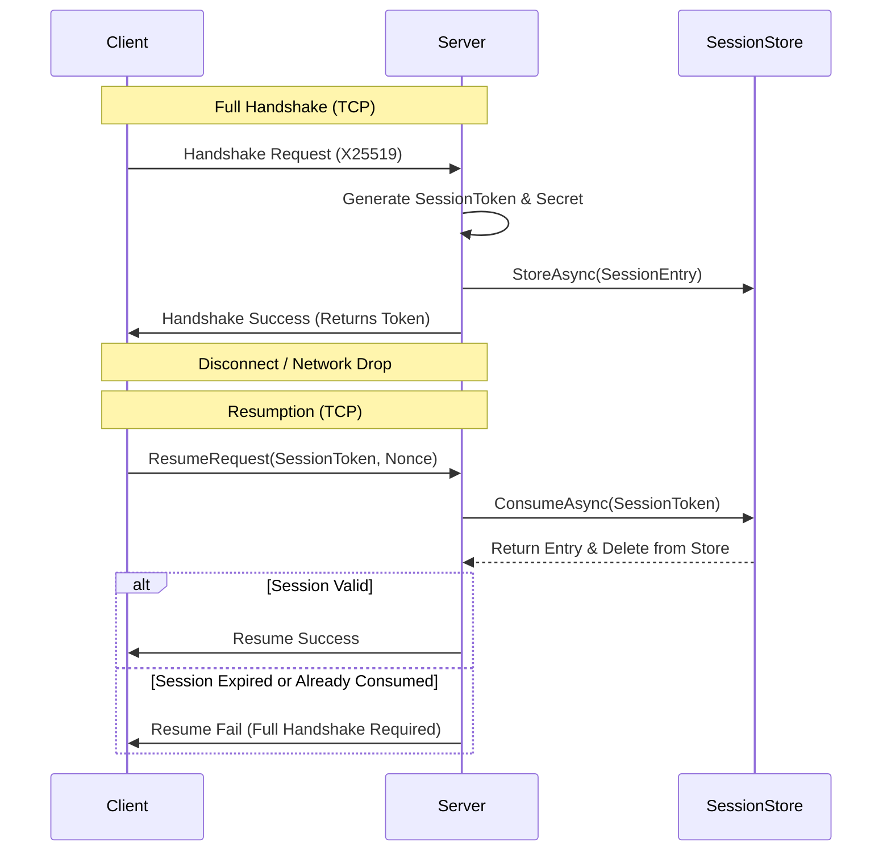

# Session Store

`ISessionStore` is the state management layer responsible for persisting, retrieving, and expiring resumable session data. In the Nalix architecture, a "Session" represents the cryptographic state (Session Token, Symmetric Secret) that allows a client to disconnect and reconnect without performing a full X25519 handshake.

## Source Mapping

- `src/Nalix.Common/Networking/Sessions/ISessionStore.cs`
- `src/Nalix.Network/Sessions/InMemorySessionStore.cs`

## Why This Type Exists

Maintaining session state across disconnects requires a storage mechanism that is:

- **Fast**: Session retrieval happens during the connection "Hot Path" (Resume).
- **Atomic**: Prevents multiple clients from attempting to resume the same session simultaneously.
- **Auto-Cleaning**: Expired sessions must be evicted to prevent memory leaks or replay window bloat.

## Session Persistence Flow

The following diagram illustrates how a session is created during a full handshake and subsequently consumed during a resumption.

## Internal Responsibilities (Source-Verified)

### 1. Atomic Consumption (SEC-33)

The most critical method in the store is `ConsumeAsync(ulong sessionToken)`.

- It retrieves the session entry and **immediately removes it** from the store in a single atomic operation.
- This prevents "Resumption Replay" where a stolen token could be used by two different clients to gain access simultaneously. Only the first caller succeeds.

!!! danger "Security Requirement"
    Custom implementations of `ISessionStore` (e.g., Redis implementations) **MUST** implement `ConsumeAsync` as an atomic operation (e.g., using a Lua script in Redis) to comply with SEC-33.

### 2. Lazy and Active Expiration

The `InMemorySessionStore` employs a dual-layered expiration strategy:

- **Active Scavenger**: A background task (`PeriodicTimer`) runs every minute to scan the `ConcurrentDictionary` and evict keys where `ExpiresAtUnixMilliseconds <= now`.
- **Lazy Check**: Every time `RetrieveAsync` or `ConsumeAsync` is called, the TTL is checked immediately. If the session has expired, it is treated as "NotFound" and removed even if the scavenger hasn't reached it yet.

### 3. Session Entry Pooling

To keep the resumption path zero-allocation, `SessionEntry` objects are tracked by the `ObjectPoolManager`. When a session is removed or expires, the system calls `entry.Return()` to reclaim the resources.

## Public APIs

- `StoreAsync(entry)`: Adds a new resumable entry to the store.
- `RetrieveAsync(token)`: Peeks at a session without removing it (useful for diagnostics).
- `ConsumeAsync(token)`: Atomically retrieves and removes the session. **Primary method for Resumption logic.**
- `RemoveAsync(token)`: Explicitly terminates a session.

## Configuration

Control the session lifecycle via `SessionStoreOptions`:

| Option | Description | Typical Value |
| :---: | :---: | :---: |
| `SessionExpirationHours` | How long a session remains resumable after creation. | 24 - 48 Hours |
| `ScavengeIntervalMinutes` | How often the background cleanup task runs. | 1 - 5 Minutes |

!!! tip
    For multi-node (Distributed) deployments, you should replace the default `InMemorySessionStore` with a custom implementation bridging to a persistent store like Redis or Aerospike to ensure session state is shared across all shards.

## Related Information Paths

- [Handshake Protocol](../security/handshake.md)
- [Session Resumption](../security/session-resume.md)
- [Snowflake Identifiers (ulong)](../framework/runtime/snowflake.md)
- [Object Pooling](../framework/memory/object-pooling.md)
- [Object Map](../framework/memory/object-map.md)

