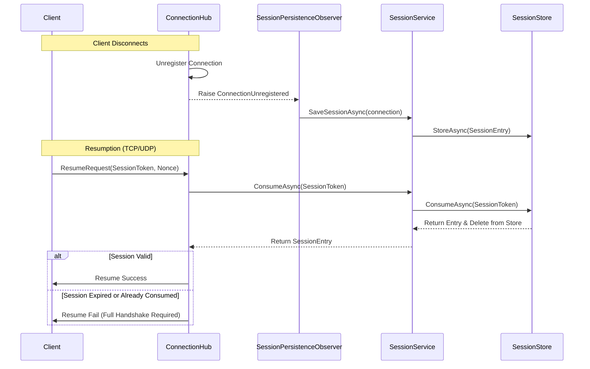

# Session Store & Service

`ISessionService`, `ISessionFactory`, and `ISessionStore` form the core state management layer responsible for persisting, retrieving, and expiring resumable session data. In the Nalix architecture, a "Session" represents the cryptographic state (Session Token, Symmetric Secret) that allows a client to disconnect and reconnect without performing a full X25519 handshake.

## Source Mapping

- `src/Nalix.Abstractions/Networking/Sessions/ISessionService.cs`
- `src/Nalix.Abstractions/Networking/Sessions/ISessionFactory.cs`
- `src/Nalix.Abstractions/Networking/Sessions/ISessionStore.cs`
- `src/Nalix.Runtime/Sessions/SessionService.cs`
- `src/Nalix.Runtime/Sessions/SessionFactory.cs`
- `src/Nalix.Runtime/Sessions/InMemorySessionStore.cs`
- `src/Nalix.Runtime/Sessions/SessionPersistenceObserver.cs`

## Why These Types Exist

Maintaining session state across disconnects requires a storage mechanism that is:

- **Decoupled**: Clean separation of concerns between lifecycle policy, serialization snapshots, and low-level data storage.
- **Fast**: Session retrieval happens during the connection "Hot Path" (Resume).
- **Atomic**: Prevents multiple clients from attempting to resume the same session simultaneously.
- **Auto-Cleaning**: Expired sessions must be evicted to prevent memory leaks or replay window bloat.

## Session Persistence Flow

The following diagram illustrates how a session is saved on disconnection (via `SessionPersistenceObserver`) and subsequently consumed during a resumption.

```mermaid
sequenceDiagram
    participant C as Client
    participant H as ConnectionHub
    participant OBS as SessionPersistenceObserver
    participant SSV as SessionService
    participant ST as SessionStore

    Note over C,H: Client Disconnects
    H->>H: Unregister Connection
    H-->>OBS: Raise ConnectionUnregistered
    OBS->>SSV: SaveSessionAsync(connection)
    SSV->>ST: StoreAsync(SessionEntry)

    Note over C,H: Resumption (TCP/UDP)
    C->>H: ResumeRequest(SessionToken, Nonce)
    H->>SSV: ConsumeAsync(SessionToken)
    SSV->>ST: ConsumeAsync(SessionToken)
    ST-->>SSV: Return Entry & Delete from Store
    SSV-->>H: Return SessionEntry
    
    alt Session Valid
        H->>C: Resume Success
    else Session Expired or Already Consumed
        H->>C: Resume Fail (Full Handshake Required)
    end
```

## Internal Responsibilities (Source-Verified)

### 1. Hub Decoupling via SessionPersistenceObserver

Instead of the `ConnectionHub` maintaining direct references to `ISessionService` and executing save policies, the `SessionPersistenceObserver` bridges the two layers.

- The observer subscribes to `IConnectionHub.ConnectionUnregistered`.
- When triggered, it schedules a background, fire-and-forget `PersistBackgroundAsync` task on `ISessionService` for the closed connection.
- This decoupling allows the core connection management layer to remain clean and free of session persistence logic.

### 2. Atomic Consumption (SEC-33)

The most critical security method in the lifecycle is `ConsumeAsync(ulong sessionToken)`.

- `SessionService.ConsumeAsync(...)` delegates to the underlying `ISessionStore.ConsumeAsync(...)`.
- The store retrieves the session entry and **immediately removes it** from the storage medium in a single atomic operation (e.g., using `ConcurrentDictionary.TryRemove` in-memory).
- This prevents "Resumption Replay" where a stolen token could be used by two different clients to gain access simultaneously. Only the first caller succeeds.

!!! danger "Security Requirement"
    Custom implementations of `ISessionStore` (e.g., Redis implementations) **MUST** implement `ConsumeAsync` as an atomic operation (e.g., using a Lua script in Redis) to comply with SEC-33.

### 3. Active Expiration via Hosted Workers

The `InMemorySessionStore` employs a dual-layered expiration strategy:

- **Active Scavenger (`IWorker`)**: The store directly implements `IWorker`. When instantiated, the `SessionService` schedules this worker via the global `TaskManager`. The scavenger runs a loop that ticks every minute, scanning the store and evicting expired keys.
- **Lazy Check**: Every time `ConsumeAsync` is called, the TTL is checked immediately. If the session has expired, the entry resources are reclaimed, and it returns `null` even if the active scavenger has not run yet.

### 4. Session Entry Pooling

To keep the resumption path zero-allocation, `SessionEntry` objects are tracked by the `ObjectPoolManager`. When a session is removed or expires, the system calls `entry.Return()` to reclaim the resources.

## Public APIs

### `ISessionService`
- `SaveSessionAsync(connection)`: Persists the session for the specified connection, enforcing handshake-state and minimum-attribute policies.
- `ConsumeAsync(token)`: Atomically retrieves and removes the session. **Primary method for Resumption logic.**

### `ISessionStore`
- `StoreAsync(entry)`: Direct, low-level persistence of a `SessionEntry`, bypassing connection-level policy checks.
- `ConsumeAsync(token)`: Atomically retrieves and removes a session from storage.

### `SessionPersistenceObserver`
- Listens to connection hubs and triggers background session saving when connections are unregistered. Implements `IDisposable` to unsubscribe.

## Configuration

Control the session lifecycle via `SessionStoreOptions`:

| Option | Description | Default Value |
| :---: | :---: | :---: |
| `SessionTtl` | How long a session remains resumable after creation. | `00:05:00` (5 minutes) |
| `MinAttributesForPersistence` | Minimum attribute count required to persist a session (anti-DDoS filter). Persistence is skipped when `Attributes.Count <= MinAttributesForPersistence`. | `10` |

!!! tip
    For multi-node (Distributed) deployments, you should replace the default `InMemorySessionStore` with a custom implementation bridging to a persistent store like Redis or Aerospike to ensure session state is shared across all shards.

## Related Information Paths

- [Handshake Protocol](../security/handshake.md)
- [Session Resumption](../security/session-resume.md)
- [Snowflake Identifiers (ulong)](../framework/snowflake.md)
- [Object Pooling](../framework/memory/object-pooling.md)
- [Object Map](../framework/memory/object-map.md)
- [Session Store Options](../options/network/session-store-options.md)

