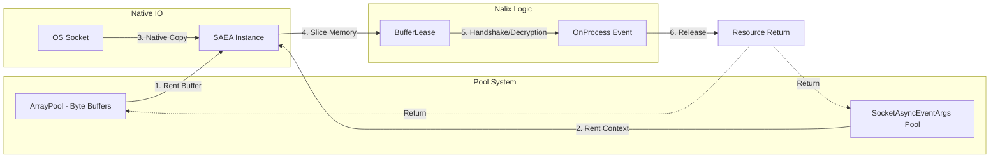
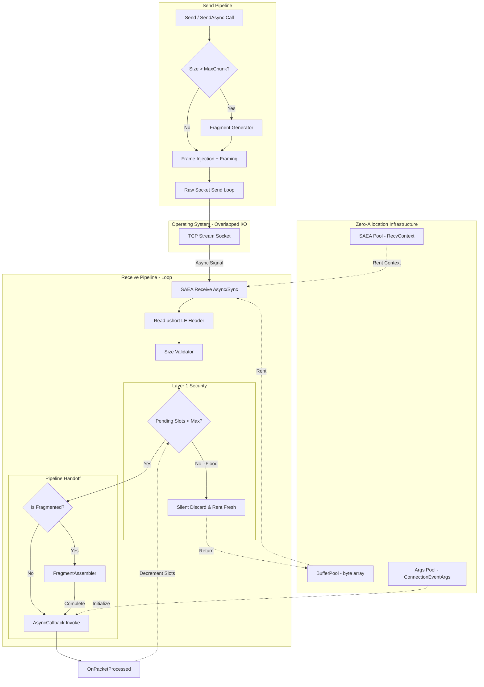

# Socket Connection

`SocketConnection` is the high-performance, **internal sealed** framed TCP transport implementation that powers `Connection.TCP`. It is specifically optimized for zero-allocation hotspots, capable of handling 10,000+ concurrent connections with minimal GC impact.

!!! warning "Not Public API"
    `SocketConnection` is `internal sealed` and is not part of the public API surface. It is documented here for framework developers and contributors only. Application code should interact with connections through `IConnection` and `Connection`.

## Zero-Allocation Data Path

To achieve maximum throughput, Nalix ensures that the data path from the native network buffer to your application handler involves **zero heap allocations**. The following diagram illustrates this lifecycle.

## Architectural Pipeline (Source-Verified)

The following diagram illustrates the exact internal state-machine and data flow within the `SocketConnection` runtime.

## Internal Responsibilities (Technical Breakdown)

### 1. Nalix Framing

TCP is a byte-stream protocol and does not guarantee frame boundaries. `SocketConnection` enforces framing by:

- Prepending a **2-byte little-endian `ushort`** representing the total length of the frame.
- Performing **Exact Receives** (`SAEA_RECEIVE_EXACTLY_ASYNC`) to ensure partial TCP bundles don't corrupt the protocol state.

### 2. DDoS Protection (Layer 1 Throttle)

Before any heavy processing (like decryption or large memory slices) occurs, the receive loop checks `_pendingProcessCallbacks`.

- If a connection has more than `MaxPerConnectionPendingPackets` (configured in `NetworkCallbackOptions`) in-flight, subsequent packets are **immediately dropped**.
- The buffer is returned to the pool, and the connection remains open, protecting the global ThreadPool from starvation.

### 3. Automatic Fragmentation

For payloads exceeding `MaxChunkSize`:

- **Send**: Automatically splits the payload into a `FragmentStream`, injecting `FragmentHeaders` into individual frames.
- **Receive**: The `FragmentAssembler` manages memory segments and reassembles them into a single `BufferLease` before the application handler ever sees it.

### 4. Memory Ownership and SAEA

- **Ownership Transfer**: Uses `Interlocked.Exchange` to hand over the rented buffer to the application layer, preventing double-returns or races during teardown.
- **SAEA Lifecycle**: Pooled contexts are only returned to the `ObjectPoolManager` after the receive loop task has fully terminated and the socket is confirmed closed.

## Operating Guidelines

!!! tip "Zero-Copy Principles"
    When implementing custom protocols or middleware, always favor `Span<byte>` or `ReadOnlySequence<byte>` to interact with the connection buffer. This maintains the zero-allocation data path established by `SocketConnection`.

!!! danger "Async Safety"
    `SocketConnection` ensures that even if you block an `OnMessage` handler, the Layer 1 Throttle will protect the server. However, to maintain high throughput, always ensure your processing is non-blocking.

## Related Information Paths

- [Connection Documentation](./connection/connection.md)
- [Protocol Lifecycle](./protocol.md)
- [TCP Listener Implementation](./tcp-listener.md)
