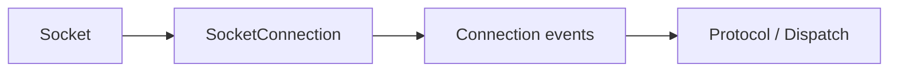

# Socket Connection

`SocketConnection` is the internal framed TCP transport implementation behind `Connection.TCP`.

## Audit Summary

- Existing page was detailed and mostly accurate, but needed clearer boundary language because this type is internal-facing infrastructure.
- Source mapping remains correct.

## Missing Content Identified

- Explicit statement of when to use `Connection` docs vs `SocketConnection` internals.
- Sharper summary of callback wiring and receive/send responsibilities.

## Improvement Rationale

This helps contributors debug transport behavior without confusing it with application-facing APIs.

## Source Mapping

- `src/Nalix.Network/Internal/Transport/SocketConnection.cs`
- `src/Nalix.Network/Internal/Transport/SocketConnection.Send.cs`

## Why This Type Exists

`SocketConnection` encapsulates framed send/receive logic, callback bridging, and transport resource lifecycle so `Connection` can expose a stable higher-level contract.

## Responsibilities

- framed TCP receive loop
- framed send path (sync/async)
- callback registration (`SetCallback(...)`)
- fragment assembly support
- connection-local pending callback pressure control
- socket and receive-context teardown

## Mental Model

## Best Practices

- Start from [Connection](./connection/connection.md) unless you are debugging transport internals.
- Keep callback handlers lightweight to avoid receive-loop backpressure.
- Treat disposal as terminal: no further send/receive usage is valid after teardown.

## Related APIs

- [Connection](./connection/connection.md)
- [Protocol](./protocol.md)
- [TCP Listener](./tcp-listener.md)
