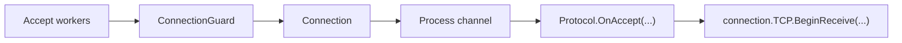

# TCP Listener

`TcpListenerBase` is the core server listener abstraction for accepted TCP sockets in `Nalix.Network`.

## Usage Patterns

A common question is whether to use this class directly or through the Hosting layer. 

| Layer | Type | Recommended Use Case |
|---|---|---|
| **Hosting** | `NetworkApplicationBuilder` | **Standard Application Development**. Use this for most production services to benefit from DI, automated handlers, and multi-protocol management. |
| **Transport** | `TcpListenerBase` | **Library & Infrastructure Development**. Use this when building standalone networking utilities or if you need total control over the raw socket lifecycle. |

## Audit Summary

- Existing page captured lifecycle well but had some path/name drift and mixed internal detail with conceptual guidance.
- Source mapping is still valid.

## Missing Content Identified

- Explicit lifecycle boundary between accept workers, process channel, and protocol handoff.
- Clear list of public methods/properties from current implementation.

## Improvement Rationale

A clearer transport lifecycle model improves production tuning and incident diagnosis.

## Source Mapping

- `src/Nalix.Network/Listeners/TcpListener/TcpListener.Core.cs`
- `src/Nalix.Network/Listeners/TcpListener/TcpListener.PublicMethods.cs`
- `src/Nalix.Network/Listeners/TcpListener/TcpListener.Handle.cs`
- `src/Nalix.Network/Listeners/TcpListener/TcpListener.ProcessChannel.cs`
- `src/Nalix.Network/Listeners/TcpListener/TcpListener.SocketConfig.cs`
- `src/Nalix.Network/Listeners/TcpListener/TcpListener.Metrics.cs`

## Why This Type Exists

`TcpListenerBase` isolates socket accept/connection admission concerns from packet runtime execution. It is infrastructure, not business logic.

## Mental Model

## Public Surface

- `Activate(CancellationToken cancellationToken = default)`
- `Deactivate(CancellationToken cancellationToken = default)`
- `GenerateReport()`
- `GetReportData()`
- `Dispose()`
- `Metrics`

## System Dependencies

When initializing `TcpListenerBase` outside of the Hosting layer (`NetworkApplicationBuilder`), you must manually register the following services in the `InstanceManager`:

- **`ILogger`**: Used for infrastructure diagnostics and error reporting.
- **`IConnectionHub`**: Manages the global set of active connections.
- **`TimingWheel`**: Required if `NetworkSocketOptions.EnableTimeout` is true (handles connection/handshake timeouts).
- **`TaskManager`**: Manages the lifecycle of accept workers.
- **`ConnectionGuard`**: Required for admission control and connection limiting.
- **`ObjectPoolManager`**: Manages pools for `IBufferLease` and `SocketAsyncEventArgs`.

## Operational Notes

- Startup transitions listener state and schedules accept workers.
- Accepted connections are fed through a bounded process channel before protocol handoff.
- `ConnectionGuard` admission checks run before protocol processing.
- `TimingWheel` integration is controlled by network timeout options.

## Best Practices

- Keep protocol/dispatch behavior out of listener subclasses.
- Tune channel capacity and `MaxParallel` together with connection limits.
- Treat channel drops/rejections as backpressure signals, not silent transport bugs.

## Related APIs

- [Protocol](./protocol.md)
- [Connection](./connection/connection.md)
- [Connection Hub](./connection/connection-hub.md)
- [Timing Wheel](./timing-wheel.md)
