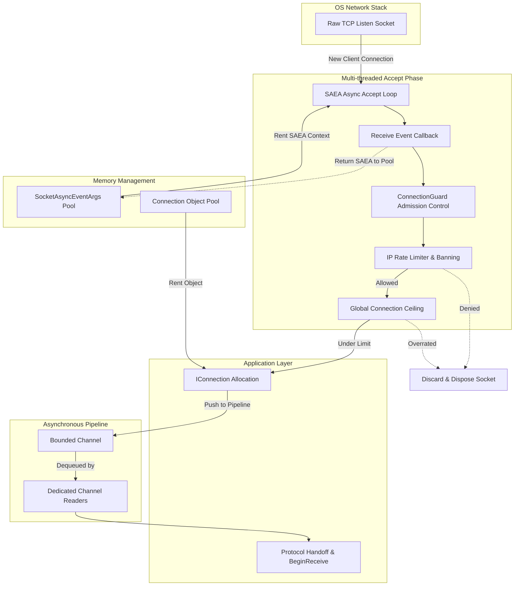

# TCP Listener (Low-Level Transport)

`TcpListenerBase` is the core foundation for TCP connection acceptance and lifecycle management in the Nalix framework. It operates at the lowest transport level to ensure zero-allocation accept loops, DoS protection, and high-performance threading via system channels.

!!! note "Use Case"
    Application developers should use `NetworkApplicationBuilder` (the Hosting layer) which automatically orchestrates the TCP Listener. `TcpListenerBase` is primarily manipulated by framework developers building middleware or transport hooks.

---

## 1. Architectural Model

The `TcpListenerBase` avoids standard `async/await` overhead on the hot accept path. Instead, it utilizes pre-allocated `SocketAsyncEventArgs` (SAEA) coupled with a multi-worker accept queue system.

## 2. Low-Level Mechanics

### 2.1. Zero-Allocation Accept Pipeline
Instead of `await socket.AcceptAsync()`, Nalix employs **Pooled `SocketAsyncEventArgs`**. When the listener activates, it pre-binds `MaxParallel` accept workers. Each worker operates continuously in a tight loop:
- When a connection arrives, the SAEA callback triggers synchronously or asynchronously.
- The thread context immediately verifies system limits before accepting.
- Once accepted, the worker instantly requests another connection without returning to the task scheduler, preserving thread-pool continuity.

### 2.2. Admission Control (`ConnectionGuard`)
Before a `Socket` is promoted to a `Connection` object, it traverses the `ConnectionGuard`.
- **IP Rate Limiting**: Drops rapid reconnects from identical IPs to prevent SYN/Connection flooding.
- **Global connection limits**: Enforces an absolute ceiling on active `ConnectionHub` entries.
- Dropped sockets at this phase incur **zero object allocation** (garbage collector is untouched).

### 2.3. The Process Channel
To prevent "Slowloris" or blocking socket reading from exhausting the worker threads, `TcpListenerBase` hands off connected sockets to an asynchronous `BoundedChannel`.
- Incoming connections are pushed to the channel.
- If the channel is full (Application is saturated), backpressure is naturally applied to network ingestion.
- Background worker tasks (`TaskCreationOptions.LongRunning`) continuously pull from this channel and initiate the asynchronous frame-reading loops (`BeginReceive`) on the Protocol transport layer.

## 3. Public API Surface

| Method | Description |
|---|---|
| `Activate()` | Binds the socket, begins listening, and spins up parallel accept loop workers. |
| `Deactivate()` | Gracefully stops accepting new connections but allows existing connections to drain. |
| `Dispose()` | Actively terminates the listening socket and all pending accept args. |

### Diagnostic Properties
- `Metrics`: Exposes counters for `TotalConnectionsAccepted`, `DroppedConnections`, and `CurrentBacklog`.
- `GenerateReport()`: Creates a diagnostic summary string of the transport's real-time health.

## 4. Tuning for Production

To optimize TCP Listener behavior at the OS level, Nalix dynamically sets the following flags (if supported):
- `DontFragment = true`: Optimizes MTU path discovery.
- `NoDelay = true`: Disables Nagle's Algorithm for real-time responsiveness.
- `KeepAlive = true`: Configured closely to the system routing table to prune severed connections at the OS level before they hit the application layer.

!!! warning
    Backpressure is intentional. If your `ProcessChannel` metrics show it is frequently full, you must scale the internal Protocol Processing layer or optimize packet handlers instead of merely increasing connection limits.
